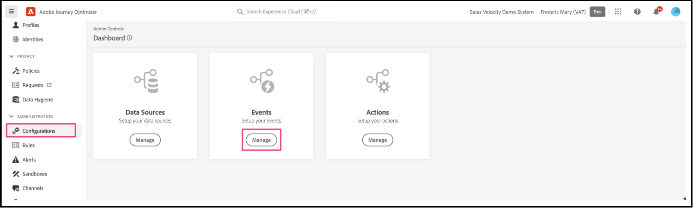

# 使用Adobe Journey Optimizer傳送捨棄的購物車電子郵件

瞭解如何在購物車或瀏覽器工作階段已放棄時傳遞個人化重新參與電子郵件或通知。 在本文中，您會使用客戶產生的資料，這些客戶已檢視許多產品和類別、參與產品或花費在頁面上。

## 我應考慮使用哪些資料？

使用店面和後台事件的資料，建立捨棄的購物車、瀏覽電子郵件或通知。

| 資料型別 | 店面資料（行為事件） | 後台資料（伺服器端事件） |
|---|---|---|
| **定義** | 客戶在您網站上採取的點按或動作。 | 生命週期相關資訊和每個訂單（過去和目前）的詳細資訊。 |
| **Adobe Commerce擷取的事件** | [pageView](https://experienceleague.adobe.com/en/docs/commerce-merchant-services/data-connection/event-forwarding/events#pageview)<br>[productPageView](https://experienceleague.adobe.com/en/docs/commerce-merchant-services/data-connection/event-forwarding/events)<br>[addToCart](https://experienceleague.adobe.com/en/docs/commerce-merchant-services/data-connection/event-forwarding/events#addtocart)<br>[openCart](https://experienceleague.adobe.com/en/docs/commerce-merchant-services/data-connection/event-forwarding/events#opencart)<br>[startCheckout](https://experienceleague.adobe.com/en/docs/commerce-merchant-services/data-connection/event-forwarding/events#startcheckout)<br>[completeCheckout](https://experienceleague.adobe.com/en/docs/commerce-merchant-services/data-connection/event-forwarding/events#completecheckout) | [orderPlaced](https://experienceleague.adobe.com/en/docs/commerce-merchant-services/data-connection/event-forwarding/events-backoffice#orderplaced)<br>[訂單歷史記錄](https://experienceleague.adobe.com/en/docs/commerce-merchant-services/data-connection/fundamentals/connect-data#send-historical-order-data) |

### 其他客戶都取得了哪些成就？

Adobe [!DNL Commerce] 客戶透過Adobe來實施個人化的放棄行銷活動，已獲得顯著的業務影響 [!DNL Commerce]，Adobe [!DNL Journey Optimizer]，和Adobe [!DNL Real-Time CDP].

一家全球多品牌服裝零售商達成：

- 來自新行銷活動的1.9倍點選轉換
- 來自全頻道放棄歷程的收入增加57%
- 重新參與行銷活動的轉換率增加41%
- 每週有1000多名新購物者參與

一家全球飲料公司達成：

- 36%重新參與電子郵件開啟率
- 點進率提升21%
- 轉換率提升8.5%
- 89%的重新參與放棄者轉換

## 讓我們開始吧

此特定使用案例著重於使用來自的資料建立放棄的購物車電子郵件 [!DNL Commerce] 執行個體並傳送給Adobe [!DNL Journey Optimizer].

### 什麼是Adobe Journey Optimizer？

[Adobe Journey Optimizer](https://experienceleague.adobe.com/docs/journey-optimizer/using/get-started/get-started.html) 協助您為購物者打造個人化的商務體驗。 例如，您可以使用Journey Optimizer建立並傳送排程行銷活動（例如零售商店的每週促銷活動），或如果客戶將產品加入購物車但未完成結帳程式，則產生放棄的購物車電子郵件。

在此主題中，您將瞭解如何透過聆聽 `checkout` 事件產生自 [!DNL Commerce] 執行個體和回應該Journey Optimizer事件。

>[!IMPORTANT]
>
>為了示範，請使用 [!DNL Commerce] 沙箱環境，這樣您就不會用傳送給Experience Platform的店面和後台事件資料稀釋生產事件資料。

### 必要條件

開始這些步驟之前，請確定：

- 您已布建為可使用Adobe [!DNL Journey Optimizer]. 如果您不確定，請洽詢您的系統整合商或管理專案和環境的開發團隊。
- 您 [已安裝](install.md) 和 [已設定](connect-data.md) 此 [!DNL Data Connection] 中的擴充功能 [!DNL Commerce].
- 您 [已確認](connect-data.md#confirm-that-event-data-is-collected) 您的 [!DNL Commerce] 事件資料已送達Experience Platform邊緣。

## 步驟1：在中建立使用者 [!DNL Commerce] 沙箱環境

在您的沙箱環境中建立使用者，並確認該使用者帳戶資訊會顯示在Experience Platform中。 請確認您指定的電子郵件有效，如同稍後在本節中用來傳送捨棄的購物車電子郵件一樣。

1. 在您的中登入或建立帳戶 [!DNL Commerce] 沙箱環境。

   {width="700" zoomable="yes"}

   使用 [!DNL Data Connection] 已安裝並設定擴充功能，此帳戶資訊會以設定檔形式傳送至Experience Platform。

1. 確認您的使用者帳戶資訊出現在 **[!UICONTROL Profile]** 區段的Experience Platform。

   前往 **[!UICONTROL Profiles]** Adobe Experience Platform中。 按一下 **[!UICONTROL Detail]** 在設定檔中，以檢視您建立的設定檔。

   {width="700" zoomable="yes"}

## 步驟2：在Journey Optimizer中檢視事件

在您的 [!DNL Commerce] 沙箱環境，檢視產品頁面、將專案新增至購物車並完成購物者將執行的各種其他活動來觸發店面上的事件。 然後，確認這些事件正在流入Journey Optimizer。

1. Launch [Adobe Journey Optimizer](https://experienceleague.adobe.com/docs/journey-optimizer/using/get-started/user-interface.html).
1. 選取 **[!UICONTROL Profiles]**.
1. 設定 **[!UICONTROL Identity namespace]** 至 `Email`.
1. 設定 **[!UICONTROL Identity value]** 至您的電子郵件地址。
1. 選取您的設定檔，然後選取 **[!UICONTROL Events]** 標籤。

   {width="700" zoomable="yes"}

   尋找 `commerce.checkouts` 事件並檢查事件裝載：

   ```json
   "personID": "84281643067178465783746543501073369488", 
   "eventType": "commerce.checkouts", 
   "_id": "4b41703f-e42e-485b-8d63-7001e3580856-0", 
   "commerce": { 
       "cart": {}, 
       "checkouts": { 
           "value": 1 
       } 
   ```

   如您所見，完整的事件裝載包含豐富的事件資料。 在下一節中，您將設定Journey Optimizer中的事件以監聽和回應 `commerce.checkouts` 事件產生自 [!DNL Commerce] 店面。

## 步驟3：在Journey Optimizer中設定事件

在Journey Optimizer中設定兩個事件：一個事件監聽 `commerce.checkouts` 來自Commerce的事件，另一個是基本逾時事件，會等待經過特定時間量後，才觸發捨棄的購物車電子郵件。

### 建立監聽器事件

1. Launch [Adobe Journey Optimizer](https://experienceleague.adobe.com/docs/journey-optimizer/using/get-started/user-interface.html).

1. 按一下 **[!UICONTROL Configurations]** 在 **[!UICONTROL Administration]** 區段。

1. 在 **[!UICONTROL Events]** 圖磚，按一下 **[!UICONTROL Manage]**.

   {width="700" zoomable="yes"}

1. 在 **[!UICONTROL Events]** 頁面，按一下 **[!UICONTROL Create Event]**.

1. 在右側導覽區域中，設定您的事件，如下所示：

   1. 設定 **[!UICONTROL Name]** 至： `firstname_lastname_checkout`.
   1. 設定 **[!UICONTROL Type]** 至 **[!UICONTROL Unitary]**.
   1. 設定 **[!UICONTROL Event id typ]è** 至 **[!UICONTROL Rule based]**.
   1. 設定 **[!UICONTROL Schema]** 至您的 [!DNL Commerce] [綱要](update-xdm.md).
   1. 選取 **[!UICONTROL Fields]** 以開啟 **[!UICONTROL Fields]** 頁面。 然後，選取對此事件有用的欄位。 例如，選取「 」下 **[!UICONTROL Product list items]**， **[!UICONTROL Commerce]**， **[!UICONTROL eventType]**、和 **[!UICONTROL Web]**.
   1. 按一下 **[!UICONTROL OK]** 以儲存選取的欄位。
   1. 按一下 **[!UICONTROL Event id condition]** 欄位。 然後，建立條件： `eventType` 等於 `commerce.checkouts` 和 `personalEmail.address` 等於您在上一節建立設定檔時使用的電子郵件地址。

      {width="700" zoomable="yes"}

   1. 按一下 **[!UICONTROL OK]**.
   1. 按一下 **[!UICONTROL Save]** 以儲存您的事件。

### 建立逾時事件

1. 在Journey Optimizer中建立事件，就像您之前做的那樣。

1. 在右側導覽區域中，設定您的事件，如下所示：

   1. 設定 **[!UICONTROL Name]** 至： `firstname_lastname_timeout`.
   1. 設定 **[!UICONTROL Type]** 至 **[!UICONTROL Unitary]**.
   1. 設定 **[!UICONTROL Event id type]** 至 **[!UICONTROL Rule based]**.
   1. 設定 **[!UICONTROL Schema]** 至您的 [!DNL Commerce] [綱要](update-xdm.md).
   1. 設定 **[!UICONTROL Schema]**， **[!UICONTROL Fields]**、和 **[!UICONTROL Event id condition]** 與上述相同。
   1. 按一下 **[!UICONTROL Save]** 以儲存您的事件。

在設定這兩個事件後，建立傳送捨棄購物車電子郵件的歷程。

## 步驟4：建立結帳歷程

建立聆聽的歷程 `commerce.checkouts` 事件，然後在指定的時間流逝後傳送捨棄的購物車電子郵件。

1. 在Journey Optimizer中，選取 **[!UICONTROL Journeys]** 在 **J[!UICONTROL OURNEY MANAGEMENT]**.
1. 按一下 **[!UICONTROL Create Journey]**.
1. 指定歷程的名稱。
1. 按一下 **[!UICONTROL OK]** 以儲存歷程。
1. 在左側導覽列中的 **[!UICONTROL EVENTS]** 區段，搜尋您先前建立的結帳事件： `firstname_lastname_checkout` 並將它拖放到畫布上。

   >[!TIP]
   >
   >連按兩下事件會自動將其新增至畫布。

1. 搜尋逾時事件並將其新增至畫布。
1. 按兩下逾時事件。

   1. 在 **[!UICONTROL Timeout]** 區段，選取 **[!UICONTROL Define the event time]** 核取方塊。
   1. 在 **[!UICONTROL Wait for]** 欄位輸入 `1` 和 `Minute`.
   1. 選取 **[!UICONTROL Set a timeout path]** 核取方塊。

   透過此逾時設定，執行結帳但未在一分鐘內完成訂單的購物者會觸發此逾時分支。 在實際生產環境中，您可以設定較長的時間，例如24小時。

1. 在左側導覽列中的 **[!UICONTROL ACTIONS]**，新增 **[!UICONTROL Email]** 逾時分支的動作。 您的歷程應如下所示：

   {width="700" zoomable="yes"}

### 建立捨棄的購物車電子郵件

建立捨棄的購物車電子郵件，在偵測到捨棄的購物車時傳送。

1. 在您上述建立的歷程中，按兩下 **[!UICONTROL Email]** 圖示來識別。

1. 請遵循 [步驟](https://experienceleague.adobe.com/docs/journey-optimizer/using/content-management/personalization/personalization-use-cases/personalization-use-case-helper-functions.html#configure-email) 在Journey Optimizer指南中，建立捨棄的購物車電子郵件。

您現在在Journey Optimizer中有一個聆聽 `commerce.checkouts` 來自您的的事件 [!DNL Commerce] 商店和一段時間後傳送的捨棄購物車電子郵件。 下一節將說明如何測試歷程。

## 步驟5：即時觸發結帳事件

在本節中，您將即時測試事件。

1. 在Journey Optimizer中，切換為測試模式。

   {width="700" zoomable="yes"}

1. 若要即時測試此歷程，請開啟另一個瀏覽器索引標籤，並前往 [!DNL Commerce] 網站的問題。

   1. 新增產品至購物車。
   1. 前往結帳頁面。
   1. 從結帳頁面，返回首頁面或關閉標籤以捨棄購物車。

      歷程現在已觸發。 若要確認，請在Journey Optimizer中開啟擁有您歷程的標籤。 您應該會看到綠色箭頭，顯示使用者瀏覽的路徑。

1. 檢查您的收件匣中是否有電子郵件。
