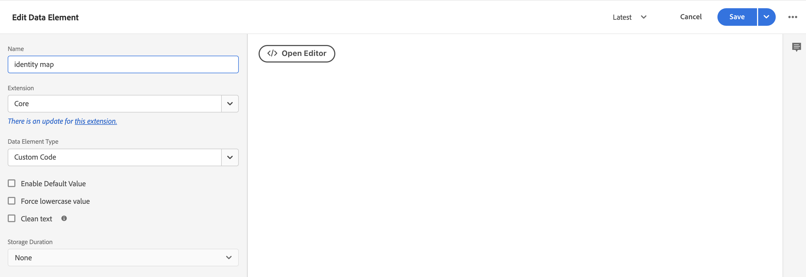

# 使用Adobe Experience Platform標籤收集商務資料

雖然您可以使用Experience Platform連接器來發佈和訂閱店面事件，但某些商戶可能已使用資料收集解決方案，例如 [Adobe Experience Platform標籤](https://experienceleague.adobe.com/docs/platform-learn/data-collection/tags/create-a-property.html). 對於這些商家，Adobe Commerce僅在使用Adobe Commerce事件SDK的Experience Platform連接器中提供發佈選項。


_Experience Platform連接器資料流與標籤_

在本主題中，您將學習如何將Experience Platform連接器提供的店面事件值對應至您已使用的Adobe Experience Platform標籤解決方案。

## 從Adobe Commerce收集事件資料

收集商務事件資料：

- 安裝 [Adobe Commerce事件SDK](https://github.com/adobe/commerce-events/tree/main/packages/commerce-events-sdk). 有關PHP店面，請參見 [安裝](install.md) 主題。 如需PWA Studio店面，請參閱 [PWA Studio指南](https://developer.adobe.com/commerce/pwa-studio/integrations/adobe-commerce/aep/).

   >[!NOTE]
   >
   > 做 **not** [設定](connect-data.md) 組織ID和資料流ID。

## 將商務店面資料對應至Adobe Experience Platform

若要將Commerce Storefront資料對應至Adobe Experience Platform，請在Adobe Experience Platform標籤中設定並安裝下列項目：

1. [設定標籤屬性](https://experienceleague.adobe.com/docs/platform-learn/implement-in-websites/configure-tags/create-a-property.html) Adobe Experience Platform資料收集。

1. 在 **製作**，選取 **擴充功能** 和安裝及設定下列擴充功能：

   - [Adobe用戶端資料層](https://experienceleague.adobe.com/docs/experience-platform/tags/extensions/adobe/client-data-layer/overview.html)

   - [Adobe Experience Platform Web SDK](https://experienceleague.adobe.com/docs/experience-platform/edge/fundamentals/installing-the-sdk.html)

1. [發佈標籤](https://experienceleague.adobe.com/docs/experience-platform/tags/publish/overview.html) 至您的開發環境。

1. 關注 **事件對應** 以下步驟來設定特定事件的資料元素和規則。

### 事件對應

由於使用標籤的資料收集與使用Adobe Commerce Event SDK的資料收集不同，因此請務必了解這兩個架構中使用的相同辭彙。

| Adobe Experience Platform標籤詞 | Adobe Commerce事件SDK術語 |
|---|---|
| _資料元素_ | 內容 |
| _規則_ | 事件 |
|  | _規則條件_  — 事件偵聽器（來自ACDL）<br><br>_規則動作_  — 事件處理程式(傳送至Adobe Experience Platform) |

當您使用Adobe Commerce專屬事件資料更新Adobe Experience Platform標籤中的資料元素和規則時，會執行一些常見步驟。

例如，新增Adobe Commerce `signOut` 事件至Adobe Experience Platform標籤。 下列步驟（您設定的特定值除外）說明如何新增 [資料元素](https://experienceleague.adobe.com/docs/experience-platform/collection/e2e.html#data-element) 和 [規則](https://experienceleague.adobe.com/docs/experience-platform/collection/e2e.html#create-a-rule)，這會套用至您新增至標籤的所有Adobe Commerce事件。

1. 建立資料元素：

   
   _建立新資料元素_

1. 設定 **名稱** to `sign out`.

1. 設定 **擴充功能** to `Adobe Experience Platform Web SDK`.

1. 設定 **資料元素類型** to `XDM object`.

1. 選取 **沙箱** 和 **結構** 要更新的。

1. 在 **userAccount** > **註銷**，請設定 **value** in **訪客登出** to `1`.

   
   _更新登出值_

1. 選擇 **儲存**.

1. 建立規則：

   
   _建立新規則_

1. 選擇 **新增** 在 **事件**.

1. 設定 **擴充功能** to `Adobe Client Data Layer`.

1. 設定 **事件類型** to `Data Pushed`.

1. 選擇 **特定事件** 並設定 **要註冊的事件/密鑰** to `sign-out`.

1. 選擇 **保留變更** 來儲存新規則。

1. 新增動作。

1. 設定 **擴充功能** to `Adobe Experience Platform Web SDK`.

1. 設定 **動作類型** to `Send Event`.

1. 設定 **例項** to `Alloy`.

1. 設定 **類型** to `userAccount.logout`.

1. 設定 **XDM資料** to `%sign out%`.

1. 按一下 **儲存**.

   您在結構中為 `signOut` 事件。 此外，您已建立規則，其中包含從Adobe Commerce店面引發該事件時應發生的特定動作。

針對下述每個Adobe Commerce事件，在標籤中重複上述步驟。

## 可用事件

請依照上述步驟，將下列每個事件的Adobe Commerce事件對應至您的XDM。

- [&#39;signOut&#39;](#signout)
- [&#39;signIn&#39;](#signin)
- [&#39;createAccount&#39;](#createaccount)
- [&#39;editAccount&#39;](#editaccount)
- [&#39;pageView&#39;](#pageview)
- [&#39;productView&#39;](#productview)
- [&#39;searchRequestSent&#39;](#searchrequestsent)
- [&#39;searchResponseReceived&#39;](#searchresponsereceived)
- [&#39;addToCart&#39;](#addtocart)
- [&#39;openCart&#39;](#opencart)
- [&#39;viewCart&#39;](#viewcart)
- [&#39;removeFromCart&#39;](#removefromcart)
- [&#39;initiateCheckout&#39;](#initiatecheckout)
- [&#39;placeOrder&#39;](#placeorder)

### 登出

當購物者嘗試登出時觸發。

#### 資料元素

建立下列資料元素：

1. 登出：

   - **名稱**: `Sign out`
   - **擴充功能**: `Adobe Experience Platform Web SDK`
   - **資料元素類型**: `XDM object`
   - **欄位組**: `userAccount` > `logout`
   - **訪客登出**: **值** = `1`

#### 規則 

- **名稱**: `Sign out`
- **擴充功能**: `Adobe Client Data Layer`
- **事件類型**: `Data Pushed`
- **特定事件**: `sign-out`

##### 動作

- **擴充功能**: `Adobe Experience Platform Web SDK`
- **動作類型**: `Send event`
- **類型**: `userAccount.logout`
- **XDM資料**: `%sign-out%`

### 登入

購物者嘗試登入時觸發。

#### 資料元素

建立下列資料元素：

1. 帳戶電子郵件：

   - **名稱**: `account email`
   - **擴充功能**: `Adobe Client Data Layer`
   - **資料元素類型**: `Data Layer Computed State`
   - **[可選] 路徑**: `accountContext.emailAddress`

1. 帳戶類型：

   - **名稱**: `account type`
   - **擴充功能**: `Adobe Client Data Layer`
   - **資料元素類型**: `Data Layer Computed State`
   - **[可選] 路徑**: `accountContext.accountType`

1. 帳戶ID:

   - **名稱**: `account id`
   - **擴充功能**: `Adobe Client Data Layer`
   - **資料元素類型**: `Data Layer Computed State`
   - **[可選] 路徑***: `accountContext.accountId`

1. 登入：

   - **名稱**: `sign in`
   - **擴充功能**: `Adobe Experience Platform Web SDK`
   - **資料元素類型**: `XDM object`
   - **欄位組**: `person` > `accountID`
   - **帳戶ID**: **值** = `%account id%`
   - **欄位組**: `person` > `accountType`
   - **帳戶類型**: **值** = `%account type%`
   - **欄位組**: `person` > `personalEmailID`
   - **個人電子郵件地址**: **值** = `%account email%`
   - **欄位組**: `personalEmail` > `address`
   - **地址**: **值** = `%account email%`
   - **欄位組**: `userAccount` > `login`
   - **訪客登入**: **值** = `1`

#### 規則 

- **名稱**: `sign in`
- **擴充功能**: `Adobe Client Data Layer`
- **事件類型**: `Data Pushed`
- **特定事件**: `sign-in`

##### 動作

- **擴充功能**: `Adobe Experience Platform Web SDK`
- **動作類型**: `Send event`
- **類型**: `userAccount.login`
- **XDM資料**: `%sign in%`

### createAccount

購物者嘗試建立帳戶時觸發。

#### 資料元素

建立下列資料元素：

1. 帳戶電子郵件：

   - **名稱**: `account email`
   - **擴充功能**: `Adobe Client Data Layer`
   - **資料元素類型**: `Data Layer Computed State`
   - **[可選] 路徑**: `accountContext.emailAddress`

1. 帳戶類型：

   - **名稱**: `account type`
   - **擴充功能**: `Adobe Client Data Layer`
   - **資料元素類型**: `Data Layer Computed State`
   - **[可選] 路徑**: `accountContext.accountType`

1. 帳戶ID:

   - **名稱**: `account id`
   - **擴充功能**: `Adobe Client Data Layer`
   - **資料元素類型**: `Data Layer Computed State`
   - **[可選] 路徑**: `accountContext.accountId`

1. 建立帳戶：

   - **名稱**: `Create account`
   - **擴充功能**: `Adobe Experience Platform Web SDK`
   - **資料元素類型**: `XDM object`
   - **欄位組**: `person` > `accountID`
   - **帳戶ID**: **值** = `%account id%`
   - **欄位組**: `person` > `accountType`
   - **帳戶類型**: **值** = `%account type%`
   - **欄位組**: `person` > `personalEmailID`
   - **個人電子郵件地址**: **值** = `%account email%`
   - **欄位組**: `personalEmail` > `address`
   - **地址**: **值** = `%account email%`
   - **欄位組**: `userAccount` > `createProfile`
   - **帳戶設定檔建立**: **值** = `1`

#### 規則 

- **名稱**: `Create account`
- **擴充功能**: `Adobe Client Data Layer`
- **事件類型**: `Data Pushed`
- **特定事件**: `create-account`

##### 動作

- **擴充功能**: `Adobe Experience Platform Web SDK`
- **動作類型**: `Send event`
- **類型**: `userAccount.createProfile`
- **XDM資料**: `%create account%`

### editAccount

購物者嘗試編輯帳戶時觸發。

#### 資料元素

建立下列資料元素：

1. 帳戶電子郵件：

   - **名稱**: `account email`
   - **擴充功能**: `Adobe Client Data Layer`
   - **資料元素類型**: `Data Layer Computed State`
   - **[可選] 路徑**: `accountContext.emailAddress`

1. 帳戶類型：

   - **名稱**: `account type`
   - **擴充功能**: `Adobe Client Data Layer`
   - **資料元素類型**: `Data Layer Computed State`
   - **[可選] 路徑**: `accountContext.accountType`

1. 帳戶ID:

   - **名稱**: `account id`
   - **擴充功能**: `Adobe Client Data Layer`
   - **資料元素類型**: `Data Layer Computed State`
   - **[可選] 路徑**: `accountContext.accountId`

1. 編輯帳戶：

   - **名稱**: `Edit account`
   - **擴充功能**: `Adobe Experience Platform Web SDK`
   - **資料元素類型**: `XDM object`
   - **欄位組**: `person` > `accountID`
   - **帳戶ID**: **值** = `%account id%`
   - **欄位組**: `person` > `accountType`
   - **帳戶類型**: **值** = `%account type%`
   - **欄位組**: `person` > `personalEmailID`
   - **個人電子郵件地址**: **值** = `%account email%`
   - **欄位組**: `personalEmail` > `address`
   - **地址**: **值** = `%account email%`
   - **欄位組**: `userAccount` > `updateProfile`
   - **帳戶設定檔建立**: **值** = `1`

#### 規則

- **名稱**: `Edit account`
- **擴充功能**: `Adobe Client Data Layer`
- **事件類型**: `Data Pushed`
- **特定事件**: `edit-account`

##### 動作

- **擴充功能**: `Adobe Experience Platform Web SDK`
- **動作類型**: `Send event`
- **類型**: `userAccount.updateProfile`
- **XDM資料**: `%edit account%`

### pageView

在任何頁面載入時觸發。

#### 資料元素

建立下列資料元素：

1. 頁面名稱：

   - **名稱**: `page name`
   - **擴充功能**: `Adobe Client Data Layer`
   - **資料元素類型**: `Data Layer Computed State`
   - **[可選] 路徑**: `pageContext.pageName`

#### 規則 

- **名稱**: `page view`
- **擴充功能**: `Adobe Client Data Layer`
- **事件類型**: `Data Pushed`
- **特定事件**: `page-view`

##### 動作

- **擴充功能**: `Adobe Experience Platform Web SDK`
- **動作類型**: `Send event`
- **類型**: `web.webPageDetails.pageViews`
- **XDM資料**: `%page view%`

### productView

任何產品頁面載入時觸發。

#### 資料元素

建立下列資料元素：

1. 產品名稱：

   - **名稱**: `product name`
   - **擴充功能**: `Adobe Client Data Layer`
   - **資料元素類型**: `Data Layer Computed State`
   - **[可選] 路徑**: `productContext.name`

1. 產品SKU:

   - **名稱**: `product sku`
   - **擴充功能**: `Adobe Client Data Layer`
   - **資料元素類型**: `Data Layer Computed State`
   - **[可選] 路徑**: `productContext.sku`

1. 產品影像URL:

   - **名稱**: `product image`
   - **擴充功能**: `Adobe Client Data Layer`
   - **資料元素類型**: `Data Layer Computed State`
   - **[可選] 路徑**: `productContext.mainImageUrl`

1. 產品貨幣：

   - **名稱**: `product currency`
   - **擴充功能**: `Adobe Client Data Layer`
   - **資料元素類型**: `Data Layer Computed State`
   - **[可選] 路徑**: `productContext.pricing.currencyCode`

1. 貨幣代碼：

   - **名稱**: `currency code`
   - **擴充功能**: `Core`
   - **資料元素類型**: `Custom Code`
   - **開啟編輯器**:

   ```bash
   return _satellite.getVar('product currency') || _satellite.getVar('storefront').storeViewCurrencyCode
   ```

1. 特價：

   - **名稱**: `special price`
   - **擴充功能**: `Adobe Client Data Layer`
   - **資料元素類型**: `Data Layer Computed State`
   - **[可選] 路徑**: `productContext.pricing.specialPrice`

1. 定價：

   - **名稱**: `regular price`
   - **擴充功能**: `Adobe Client Data Layer`
   - **資料元素類型**: `Data Layer Computed State`
   - **[可選] 路徑**: `productContext.pricing.regularPrice`

1. 產品價格：

   - **名稱**: `product price`
   - **擴充功能**: `Core`
   - **資料元素類型**: `Custom Code`
   - **開啟編輯器**:

   ```bash
   return _satellite.getVar('product regular price') || _satellite.getVar('product special price')
   ```

1. 產品檢視：

   - **名稱**: `product view`
   - **擴充功能**: `Adobe Experience Platform Web SDK`
   - **資料元素類型**: `XDM object`
   - **欄位組**: `productListItems`. 選擇 **提供個別項目** 並按一下 **新增項目** 按鈕。 因為此視圖是用於PDP，所以您可以填入單一項目。
   - **欄位組**: `productListItems` > `name`
   - **名稱**: **值** = `%product name%`
   - **欄位組**: `productListItems` > `SKU`
   - **SKU**: **值** = `%product sku%`
   - **欄位組**: `productListItems` > `priceTotal`
   - **總價**: **值** = `%product price%`
   - **欄位組**: `productListItems` > `currencyCode`
   - **貨幣代碼**: **值** = `%currency code%`
   - **欄位組**: `productListItems` > `ProductImageUrl`
   - **ProductImageUrl**: **值** = `%product image%`
   - **欄位組**: `commerce` > `productViews` > `value`
   - **value**: **值** = `1`

#### 規則 

- **名稱**: `product view`
- **擴充功能**: `Adobe Client Data Layer`
- **事件類型**: `Data Pushed`
- **特定事件**: `product-page-view`

##### 動作

- **擴充功能**: `Adobe Experience Platform Web SDK`
- **動作類型**: `Send event`
- **類型**: `commerce.productViews`
- **XDM資料**: `%product view%`

### searchRequestSent

由「當您輸入時搜尋」彈出視窗中的事件和搜尋結果頁面上的事件觸發。

#### 資料元素

建立下列資料元素：

1. 搜尋輸入

   - **名稱**: `search input`
   - **擴充功能**: `Adobe Client Data Layer`
   - **資料元素類型**: `Data Layer Computed State`
   - **[可選] 路徑**: `searchInputContext.units[0]`

1. 搜尋輸入片語

   - **名稱**: `search input phrase`
   - **擴充功能**: `Core`
   - **資料元素類型**: `Custom Code`
   - **開啟編輯器**:

   ```bash
   return _satellite.getVar('search input').phrase;
   ```

1. 搜索輸入排序

   - **名稱**: `search input sort`
   - **擴充功能**: `Core`
   - **資料元素類型**: `Custom Code`
   - **開啟編輯器**:

   ```bash
   const searchInput = _satellite.getVar('search input');
   const sortFromInput = searchInput ? searchInput.sort : [];
   const sort = sortFromInput.map((searchSort) => {
       return {
           attribute: searchSort.attribute,
           order: searchSort.direction,
       };
   });
   return sort;
   ```

1. 搜尋輸入篩選

   - **名稱**: `search input filters`
   - **擴充功能**: `Core`
   - **資料元素類型**: `Custom Code`
   - **開啟編輯器**:

   ```bash
   const searchInput = _satellite.getVar('search input');
   const filtersFromInput = searchInput ? searchInput.filter : [];
   const filters = filtersFromInput.map(
       (searchFilter) => {
           let value = [];
           let isRange = false;
           if (searchFilter.eq) {
               value.push(searchFilter.eq);
           } else if (searchFilter.in) {
               value = searchFilter.in;
           } else if (searchFilter.range) {
               isRange = true;
               value.push(String(searchFilter.range.from));
               value.push(String(searchFilter.range.to));
           }
           return {
               attribute: searchFilter.attribute,
               value,
               isRange,
           };
       }
   );
   
   return filters;
   ```

1. 搜尋請求：

   - **名稱**: `search request`
   - **擴充功能**: `Adobe Experience Platform Web SDK`
   - **資料元素類型**: `XDM object`
   - **欄位組**: `siteSearch` > `phrase`
   - **value**:尚未提供
   - **欄位組**: `siteSearch` > `sort`. 選擇 **提供整個物件**.
   - **欄位組**: `siteSearch` > `filter`. 選擇 **提供整個物件**.
   - **欄位組**: `searchRequest` > `id`
   - **唯一識別碼**: **值** = `%search request ID%`
   - **欄位組**: `searchRequest` > `value`
   - **value**: **值** = `1`

#### 規則 

- **名稱**: `search request sent`
- **擴充功能**: `Adobe Client Data Layer`
- **事件類型**: `Data Pushed`
- **特定事件**: `search-request-sent`

##### 動作

- **擴充功能**: `Adobe Experience Platform Web SDK`
- **動作類型**: `Send event`
- **類型**: `searchRequest`
- **XDM資料**: `%search request%`

### searchResponseReceived

在「即時搜尋」傳回彈出視窗或搜尋結果頁面的「依您輸入時搜尋」結果時觸發。

#### 資料元素

建立下列資料元素：

1. 搜索結果：

   - **名稱**: `search results`
   - **擴充功能**: `Adobe Client Data Layer`
   - **資料元素類型**: `Data Layer Computed State`
   - **[可選] 路徑**: `searchResultsContext.units[0]`

1. 產品的搜索結果編號：

   - **名稱**: `search result number of products`
   - **擴充功能**: `Core`
   - **資料元素類型**: `Custom Code`
   - **開啟編輯器**:

   ```bash
   return _satellite.getVar('search result').products.length;
   ```

1. 搜索結果產品：

   - **名稱**: `search result products`
   - **擴充功能**: `Core`
   - **資料元素類型**: `Custom Code`
   - **開啟編輯器**:

   ```bash
   const searchResult = _satellite.getVar('search result');
   const productsFromResult = searchResult.products ? searchResult.products : [];
   const products = productsFromResult.map(
       (product) => {
           return { SKU: product.sku, name: product.name };
       }
   );
   return products;
   ```

1. 搜索結果建議：

   - **名稱**: `search result products`
   - **擴充功能**: `Core`
   - **資料元素類型**: `Custom Code`
   - **開啟編輯器**:

   ```bash
   const searchResult = _satellite.getVar('search result');
   const suggestionsFromResult = searchResult.suggestions ? searchResult.suggestions : [];
   const suggestions = suggestionsFromResult.map((suggestion) => suggestion.suggestion);
   return suggestions;
   ```

1. 產品影像URL:

   - **名稱**: `product image`
   - **擴充功能**: `Adobe Client Data Layer`
   - **資料元素類型**: `Data Layer Computed State`
   - **[可選] 路徑**: `productContext.mainImageUrl`

1. 搜索響應：

   - **名稱**: `search response`
   - **擴充功能**: `Adobe Experience Platform Web SDK`
   - **資料元素類型**: `XDM object`
   - **欄位組**: `siteSearch` > `suggestions`. 選擇 **提供整個物件**.
   - **資料元素**: `%search result suggestions%`
   - **欄位組**: `siteSearch` > `numberOfResults`
   - **value**: `%search result number of products%`
   - **欄位組**: `productListItems`. 選擇 **提供整個物件**.
   - **欄位組**: `productListItems` > `ProductImageUrl`
   - **ProductImageUrl**: **值** = `%product image%`
   - **資料元素**: `%search result products%`
   - **欄位組**: `searchResponse` > `id`
   - **唯一識別碼**: **值** = `%search response ID%`
   - **欄位組**: `searchResponse` > `value`
   - **value**: **值** = `1`

#### 規則 

- **名稱**: `search response received`
- **擴充功能**: `Adobe Client Data Layer`
- **事件類型**: `Data Pushed`
- **特定事件**: `search-response-received`

##### 動作

- **擴充功能**: `Adobe Experience Platform Web SDK`
- **動作類型**: `Send event`
- **類型**: `searchResponse`
- **XDM資料**: `%search response%`

### addToCart

在產品新增至購物車時，或每次購物車中的產品數量增加時觸發。

#### 資料元素

建立下列資料元素：

1. 產品名稱：

   - **名稱**: `product name`
   - **擴充功能**: `Adobe Client Data Layer`
   - **資料元素類型**: `Data Layer Computed State`
   - **[可選] 路徑**: `productContext.name`

1. 產品SKU:

   - **名稱**: `product sku`
   - **擴充功能**: `Adobe Client Data Layer`
   - **資料元素類型**: `Data Layer Computed State`
   - **[可選] 路徑**: `productContext.sku`

1. 貨幣代碼：

   - **名稱**: `currency code`
   - **擴充功能**: `Adobe Client Data Layer`
   - **資料元素類型**: `Data Layer Computed State`
   - **[可選] 路徑**: `productContext.pricing.currencyCode`

1. 產品特價：

   - **名稱**: `product special price`
   - **擴充功能**: `Adobe Client Data Layer`
   - **資料元素類型**: `Data Layer Computed State`
   - **[可選] 路徑**: `productContext.pricing.specialPrice`

1. 產品影像URL:

   - **名稱**: `product image`
   - **擴充功能**: `Adobe Client Data Layer`
   - **資料元素類型**: `Data Layer Computed State`
   - **[可選] 路徑**: `productContext.mainImageUrl`

1. 產品定價：

   - **名稱**: `product regular price`
   - **擴充功能**: `Adobe Client Data Layer`
   - **資料元素類型**: `Data Layer Computed State`
   - **[可選] 路徑**: `productContext.pricing.regularPrice`

1. 產品價格：

   - **名稱**: `product price`
   - **擴充功能**: `Core`
   - **資料元素類型**: `Custom Code`
   - **開啟編輯器**:

   ```bash
   return _satellite.getVar('product regular price') || _satellite.getVar('product special price') 
   ```

1. 購物車：

   - **名稱**: `cart`
   - **擴充功能**: `Adobe Client Data Layer`
   - **資料元素類型**: `Data Layer Computed State`
   - **[可選] 路徑**: `shoppingCartContext`

1. 購物車ID:

   - **名稱**: `cart id`
   - **擴充功能**: `Core`
   - **資料元素類型**: `Custom Code`
   - **開啟編輯器**:

   ```bash
   return _satellite.getVar('cart').id
   ```

1. 添加到購物車：

   - **名稱**: `add to cart`
   - **擴充功能**: `Adobe Experience Platform Web SDK`
   - **資料元素類型**: `XDM object`
   - **欄位組**: `productListItems`. 選擇 **提供個別項目** 並按一下 **新增項目** 按鈕。 因為此視圖是用於PDP，所以您可以填入單一項目。
   - **欄位組**: `productListItems` > `name`
   - **名稱**: **值** = `%product name%`
   - **欄位組**: `productListItems` > `SKU`
   - **SKU**: **值** = `%product sku%`
   - **欄位組**: `productListItems` > `priceTotal`
   - **總價**: **值** = `%product price%`
   - **欄位組**: `productListItems` > `currencyCode`
   - **欄位組**: `productListItems` > `ProductImageUrl`
   - **ProductImageUrl**: **值** = `%product image%`
   - **貨幣代碼**: **值** = `%currency code%`
   - **欄位組**: `commerce` > `cart` > `cartID`
   - **購物車ID**: **值** = `%cart id%`
   - **欄位組**: `commerce` > `productListAdds` > `value`
   - **value**: **值** = `1`

#### 規則 

- **名稱**: `add to cart`
- **擴充功能**: `Adobe Client Data Layer`
- **事件類型**: `Data Pushed`
- **特定事件**: `add-to-cart`

##### 動作

- **擴充功能**: `Adobe Experience Platform Web SDK`
- **動作類型**: `Send event`
- **類型**: `commerce.productListAdds`
- **XDM資料**: `%add to cart%`

### openCart

建立新購物車時觸發，當產品新增至空購物車時即會觸發。

#### 資料元素

建立下列資料元素：

1. 開啟購物車：

   - **名稱**: `open cart`
   - **擴充功能**: `Adobe Experience Platform Web SDK`
   - **資料元素類型**: `XDM object`
   - **欄位組**: `commerce` > `productListOpens` > `value`
   - **value**: **值** = `1`
   - **欄位組**: `commerce` > `cart` > `cartID`
   - **購物車ID**: **值** = `%cart id%`
   - **欄位組**: `productListItems`. 針對 `productListItems`，可預先計算多個項目。 選擇 **productListItems** > **提供整個陣列**.

#### 規則 

- **名稱**: `open cart`
- **擴充功能**: `Adobe Client Data Layer`
- **事件類型**: `Data Pushed`
- **特定事件**: `open-cart`

##### 動作

- **擴充功能**: `Adobe Experience Platform Web SDK`
- **動作類型**: `Send event`
- **類型**: `commerce.productListOpens`
- **XDM資料**: `%open cart%`

### viewCart

任何購物車頁面載入時觸發。

#### 資料元素

建立下列資料元素：

1. 店面：

   - **名稱**: `storefront`
   - **擴充功能**: `Adobe Client Data Layer`
   - **資料元素類型**: `Data Layer Computed State`
   - **[可選] 路徑**: `storefrontInstanceContext`

1. 產品影像URL:

   - **名稱**: `product image`
   - **擴充功能**: `Adobe Client Data Layer`
   - **資料元素類型**: `Data Layer Computed State`
   - **[可選] 路徑**: `productContext.mainImageUrl`
   1. 購物車：
   - **名稱**: `cart`
   - **擴充功能**: `Adobe Client Data Layer`
   - **資料元素類型**: `Data Layer Computed State`
   - **[可選] 路徑**: `shoppingCartContext`


1. 購物車ID:

   - **名稱**: `cart id`
   - **擴充功能**: `Core`
   - **資料元素類型**: `Custom Code`
   - **開啟編輯器**:

   ```bash
   return _satellite.getVar('cart').id
   ```

1. 產品清單項目：

   - **名稱**: `product list items:`
   - **擴充功能**: `Core`
   - **資料元素類型**: `Custom Code`
   - **開啟編輯器**:

   ```bash
   const storefrontContext = _satellite.getVar('storefront');
   const cart = _satellite.getVar('cart');
   
   const returnList = [];
   cart.items.forEach(item => {
       const selectedOptions = [];
       item.configurableOptions?.forEach(option => {
           selectedOptions.push({
               attribute: option.optionLabel,
               value: option.valueLabel,
           });
       });
   
       const productListItem = {
           SKU: item.product.sku,
           name: item.product.name,
           quantity: item.quantity,
           priceTotal: item.prices.price.value * item.quantity,
           currencyCode: item.prices.price.currency ? item.prices.price.currency : storefrontContext.storeViewCurrencyCode,
           selectedOptions: selectedOptions,
       };
   
       returnList.push(productListItem);
   });
   return returnList;
   ```

1. 查看購物車：

   - **名稱**: `view cart`
   - **擴充功能**: `Adobe Experience Platform Web SDK`
   - **資料元素類型**: `XDM object`
   - **欄位組**: `productListItems`. 針對 `productListItems`，可以預先計算多個項目。 選擇 **productListItems** > **填入整個陣列**.
   - **資料元素**: `%product list items%`
   - **欄位組**: `productListItems` > `ProductImageUrl`
   - **ProductImageUrl**: **值** = `%product image%`
   - **欄位組**: `commerce` > `cart` > `cartID`
   - **購物車ID**: **值** = `%cart id%`
   - **欄位組**: `commerce` > `productListViews` > `value`
   - **value**: **值** = `1`

#### 規則

- **名稱**: `view cart`
- **擴充功能**: `Adobe Client Data Layer`
- **事件類型**: `Data Pushed`
- **特定事件**: `shopping-cart-view`

##### 動作

- **擴充功能**: `Adobe Experience Platform Web SDK`
- **動作類型**: `Send event`
- **類型**: `commerce.productListViews`
- **XDM資料**: `%view cart%`

### removeFromCart

從購物車移除產品或每次購物車中產品數量減少時觸發。

#### 資料元素

建立下列資料元素：

1. 產品名稱：

   - **名稱**: `product name`
   - **擴充功能**: `Adobe Client Data Layer`
   - **資料元素類型**: `Data Layer Computed State`
   - **[可選] 路徑**: `productContext.name`

1. 產品SKU:

   - **名稱**: `product sku`
   - **擴充功能**: `Adobe Client Data Layer`
   - **資料元素類型**: `Data Layer Computed State`
   - **[可選] 路徑**: `productContext.sku`

1. 貨幣代碼：

   - **名稱**: `currency code`
   - **擴充功能**: `Adobe Client Data Layer`
   - **資料元素類型**: `Data Layer Computed State`
   - **[可選] 路徑**: `productContext.pricing.currencyCode`

1. 產品特價：

   - **名稱**: `product special price`
   - **擴充功能**: `Adobe Client Data Layer`
   - **資料元素類型**: `Data Layer Computed State`
   - **[可選] 路徑**: `productContext.pricing.specialPrice`

1. 產品定價：

   - **名稱**: `product regular price`
   - **擴充功能**: `Adobe Client Data Layer`
   - **資料元素類型**: `Data Layer Computed State`
   - **[可選] 路徑**: `productContext.pricing.regularPrice`

1. 產品價格：

   - **名稱**: `product price`
   - **擴充功能**: `Core`
   - **資料元素類型**: `Custom Code`
   - **開啟編輯器**:

   ```bash
   return _satellite.getVar('product regular price') || _satellite.getVar('product special price') 
   ```

1. 購物車：

   - **名稱**: `cart`
   - **擴充功能**: `Adobe Client Data Layer`
   - **資料元素類型**: `Data Layer Computed State`
   - **[可選] 路徑**: `shoppingCartContext`

1. 購物車ID:

   - **名稱**: `cart id`
   - **擴充功能**: `Core`
   - **資料元素類型**: `Custom Code`
   - **開啟編輯器**:

   ```bash
   return _satellite.getVar('cart').id
   ```

1. 從購物車中移除：

   - **名稱**: `remove from cart`
   - **擴充功能**: `Adobe Experience Platform Web SDK`
   - **資料元素類型**: `XDM object`
   - **欄位組**: `productListItems`. 選擇 **提供個別項目** 並按一下 **新增項目** 按鈕。 因為此視圖是用於PDP，所以您可以填入單一項目。
   - **欄位組**: `productListItems` > `name`
   - **名稱**: **值** = `%product name%`
   - **欄位組**: `productListItems` > `SKU`
   - **SKU**: **值** = `%product sku%`
   - **欄位組**: `productListItems` > `priceTotal`
   - **總價**: **值** = `%product price%`
   - **欄位組**: `productListItems` > `currencyCode`
   - **貨幣代碼**: **值** = `%currency code%`
   - **欄位組**: `commerce` > `cart` > `cartID`
   - **購物車ID**: **值** = `%cart id%`
   - **欄位組**: `commerce` > `productListRemovals` > `value`
   - **value**: **值** = `1`

#### 規則 

- **名稱**: `remove from cart`
- **擴充功能**: `Adobe Client Data Layer`
- **事件類型**: `Data Pushed`
- **特定事件**: `remove-from-cart`

##### 動作

- **擴充功能**: `Adobe Experience Platform Web SDK`
- **動作類型**: `Send event`
- **類型**: `commerce.productListRemovals`
- **XDM資料**: `%remove from cart%`

### initiateCheckout

購物者按一下結帳按鈕時觸發。

#### 資料元素

建立下列資料元素：

1. 店面：

   - **名稱**: `storefront`
   - **擴充功能**: `Adobe Client Data Layer`
   - **資料元素類型**: `Data Layer Computed State`
   - **[可選] 路徑**: `storefrontInstanceContext`

1. 產品影像URL:

   - **名稱**: `product image`
   - **擴充功能**: `Adobe Client Data Layer`
   - **資料元素類型**: `Data Layer Computed State`
   - **[可選] 路徑**: `productContext.mainImageUrl`

1. 購物車：

   - **名稱**: `cart`
   - **擴充功能**: `Adobe Client Data Layer`
   - **資料元素類型**: `Data Layer Computed State`
   - **[可選] 路徑**: `shoppingCartContext`

1. 購物車ID:

   - **名稱**: `cart id`
   - **擴充功能**: `Core`
   - **資料元素類型**: `Custom Code`
   - **開啟編輯器**:

   ```bash
   return _satellite.getVar('cart').id
   ```

1. 產品清單項目：

   - **名稱**: `product list items`
   - **擴充功能**: `Core`
   - **資料元素類型**: `Custom Code`
   - **開啟編輯器**:

   ```bash
   const storefrontContext = _satellite.getVar('storefront');
   const cart = _satellite.getVar('cart');
   
   const returnList = [];
   cart.items.forEach(item => {
       const selectedOptions = [];
       item.configurableOptions?.forEach(option => {
           selectedOptions.push({
               attribute: option.optionLabel,
               value: option.valueLabel,
           });
       });
   
       const productListItem = {
           SKU: item.product.sku,
           name: item.product.name,
           quantity: item.quantity,
           priceTotal: item.prices.price.value * item.quantity,
           currencyCode: item.prices.price.currency ? item.prices.price.currency : storefrontContext.storeViewCurrencyCode,
           selectedOptions: selectedOptions,
       };
   
       returnList.push(productListItem);
   });
   return returnList;
   ```

1. 開始結帳：

   - **名稱**: `initiate checkout`
   - **擴充功能**: `Adobe Experience Platform Web SDK`
   - **資料元素類型**: `XDM object`
   - **欄位組**: `productListItems`. 針對 `productListItems`，可以預先計算多個項目。 選擇 **productListItems** > **填入整個陣列**.
   - **資料元素**: `%product list items%`
   - **欄位組**: `productListItems` > `ProductImageUrl`
   - **ProductImageUrl**: **值** = `%product image%`
   - **欄位組**: `commerce` > `cart` > `cartID`
   - **購物車ID**: **值** = `%cart id%`
   - **欄位組**: `commerce` > `checkouts` > `value`
   - **value**: **值** = `1`

#### 規則 

- **名稱**: `initiate checkout`
- **擴充功能**: `Adobe Client Data Layer`
- **事件類型**: `Data Pushed`
- **特定事件**: `initiate-checkout`

##### 動作

- **擴充功能**: `Adobe Experience Platform Web SDK`
- **動作類型**: `Send event`
- **類型**: `commerce.checkouts`
- **XDM資料**: `%initiate checkout%`

### placeOrder

購物者下訂單時觸發。

#### 資料元素

建立下列資料元素：

1. 帳戶電子郵件：

   - **名稱**: `account email`
   - **擴充功能**: `Adobe Client Data Layer`
   - **資料元素類型**: `Data Layer Computed State`
   - **[可選] 路徑**: `accountContext.emailAddress`

1. 店面：

   - **名稱**: `storefront`
   - **擴充功能**: `Adobe Client Data Layer`
   - **資料元素類型**: `Data Layer Computed State`
   - **[可選] 路徑**: `storefrontInstanceContext`

1. 產品影像URL:

   - **名稱**: `product image`
   - **擴充功能**: `Adobe Client Data Layer`
   - **資料元素類型**: `Data Layer Computed State`
   - **[可選] 路徑**: `productContext.mainImageUrl`

1. 購物車：

   - **名稱**: `cart`
   - **擴充功能**: `Adobe Client Data Layer`
   - **資料元素類型**: `Data Layer Computed State`
   - **[可選] 路徑**: `shoppingCartContext`

1. 購物車ID:

   - **名稱**: `cart id`
   - **擴充功能**: `Core`
   - **資料元素類型**: `Custom Code`
   - **開啟編輯器**:

   ```bash
   return _satellite.getVar('cart').id
   ```

1. 順序：

   - **名稱**: `order`
   - **擴充功能**: `Adobe Client Data Layer`
   - **資料元素類型**: `Data Layer Computed State`
   - **[可選] 路徑**: `orderContext`

1. 商務訂單：

   - **名稱**: `commerce order`
   - **擴充功能**: `Core`
   - **資料元素類型**: `Custom Code`
   - **開啟編輯器**:

   ```bash
   const order = _satellite.getVar('order');
   const storefront = _satellite.getVar('storefront');
   
   if (order.payments && order.payments.length) {
       payments = order.payments.map(payment => {
           return {
               paymentAmount: payment.total,
               paymentType: payment.paymentMethodCode,
               transactionID: order.orderId.toString(),
           };
       });
   } else {
       payments = [
           {
               paymentAmount: order.grandTotal,
               paymentType: order.paymentMethodCode,
               transactionID: order.orderId.toString(),
           },
       ];
   }
   
   return {
       purchaseID: order.orderId.toString(),
       currencyCode: storefront.storeViewCurrencyCode,
       payments,
   };
   ```

1. 訂單發運：

   - **名稱**: `order shipping`
   - **擴充功能**: `Core`
   - **資料元素類型**: `Custom Code`
   - **開啟編輯器**:

   ```bash
   const order = _satellite.getVar('order');
   return {
       shippingMethod: order.shipping.shippingMethod,
       shippingAmount: order.shipping.shippingAmount || 0,
   }
   ```

1. 促銷活動ID:

   - **名稱**: `promotion id`
   - **擴充功能**: `Core`
   - **資料元素類型**: `Custom Code`
   - **開啟編輯器**:

   ```bash
   return _satellite.getVar('order').appliedCouponCode
   ```

1. 產品清單項目：

   - **名稱**: `product list items`
   - **擴充功能**: `Core`
   - **資料元素類型**: `Custom Code`
   - **開啟編輯器**:

   ```bash
   const storefrontContext = _satellite.getVar('storefront');
   const cart = _satellite.getVar('cart');
   
   const returnList = [];
   cart.items.forEach(item => {
       const selectedOptions = [];
       item.configurableOptions?.forEach(option => {
           selectedOptions.push({
               attribute: option.optionLabel,
               value: option.valueLabel,
           });
       });
   
       const productListItem = {
           SKU: item.product.sku,
           name: item.product.name,
           quantity: item.quantity,
           priceTotal: item.prices.price.value * item.quantity,
           currencyCode: item.prices.price.currency ? item.prices.price.currency : storefrontContext.storeViewCurrencyCode,
           selectedOptions: selectedOptions,
       };
   
       returnList.push(productListItem);
   });
   return returnList;
   ```

1. 下單：

   - **名稱**: `place order`
   - **擴充功能**: `Adobe Experience Platform Web SDK`
   - **資料元素類型**: `XDM object`
   - **欄位組**: `productListItems`. 針對 `productListItems`，可以預先計算多個項目。 選擇 **productListItems** > **填入整個陣列**.
   - **資料元素**: `%product list items%`
   - **欄位組**: `productListItems` > `ProductImageUrl`
   - **ProductImageUrl**: **值** = `%product image%`
   - **欄位組**: `commerce` > `order`
   - **唯一識別碼**: **值** = `%commerce order%`
   - **欄位組**: `commerce` > `shipping`
   - **唯一識別碼**: **值** = `%order shipping%`
   - **欄位組**: `commerce` > `promotionID`
   - **促銷活動ID**: **值** = `%promotion id%`
   - **欄位組**: `commerce` > `purchases` > `value`
   - **value**: **值** = `1`
   - **個人電子郵件地址**: **值** = `%account email%`
   - **欄位組**: `personalEmail` > `address`
   - **地址**: **值** = `%account email%`

#### 規則 

- **名稱**: `place order`
- **擴充功能**: `Adobe Client Data Layer`
- **事件類型**: `Data Pushed`
- **特定事件**: `place-order`

##### 動作

- **擴充功能**: `Adobe Experience Platform Web SDK`
- **動作類型**: `Send event`
- **類型**: `commerce.order`
- **XDM資料**: `%place order%`

## 在店面事件中設定身分

店面事件包含的設定檔資訊是根據 `personalEmail` （適用於帳戶事件）和 `identityMap` （適用於所有其他店面事件）欄位。 Experience Platform連接器會結合併根據這兩個欄位產生描述檔。 不過，每個欄位有不同的步驟可依循以建立設定檔：

>[!NOTE]
>
>如果您先前的設定需仰賴不同欄位，則可繼續使用這些欄位。

- `personalEmail`  — 僅適用於帳戶事件。 請遵循概述的步驟、規則和動作 [abos](#createaccount)
- `identityMap`  — 套用至所有其他店面事件。 請參閱下列範例。

### 範例

下列步驟顯示如何設定 `pageView` 事件 `identityMap` 在Experience Platform連接器中：

1. 使用ECID的自訂程式碼設定資料元素：

   
   _使用自訂程式碼設定資料元素_

1. 選擇 [!UICONTROL Open Editor] 並新增下列自訂程式碼：

   ```javascript
   return alloy("getIdentity").then((result) => {
       var identityMap = {
           ECID: [
           {
               id: ecid,
               primary: true
           }
           ],
           email: [
           {
               id: email,
               primary: false
           }
           ]
       };
     _satelite.setVar("identityMap", identityMap);
   });
   ```

1. 使用更新XDM結構 `identityMap` 設為ECID:

   
   _將identityMap設為ECID_

1. 定義可擷取ECID的規則動作：

   
   _擷取ECID_

## 在後台事件中設定標識

與使用ECID來識別和連結設定檔資訊的店面事件不同，後台事件資料是以SaaS為基礎，因此沒有ECID可用。 對於後台活動，您需要使用電子郵件來唯一識別購物者。 在本節中，您將學習如何使用電子郵件將後台事件資料連結至ECID。

1. 建立身分對應元素。

   
   _建立後台標識映射_

1. 選擇 [!UICONTROL Open Editor] 並新增下列自訂程式碼：

```javascript
const IdentityMap = {
  "ECID": [
    {
      id:  _satellite.getVar('ECID'),
      primary: true,
    },
  ],
};
 
if (_satellite.getVar('account email')) {
    IdentityMap.email = [
        {
            id: _satellite.getVar('account email'),
            primary: false,
        },
    ];
}
return IdentityMap;
```

1. 將此新元素新增至每個 `identityMap` 欄位。

   
   _更新每個identityMap_

## 設定同意

Adobe Commerce和Experience Platform連接器資料收集同意預設為啟用。 選擇退出可透過 [`mg_dnt` cookie](https://experienceleague.adobe.com/docs/commerce-admin/start/compliance/privacy/compliance-cookie-law.html). 如果您選擇使用 `mg_dnt` 管理同意。 此 [Adobe Experience Platform Web SDK檔案](https://experienceleague.adobe.com/docs/experience-platform/edge/consent/supporting-consent.html) 有數個管理同意的其他選項。

1. 建立 **核心自訂程式碼** 資料元素(`%do not track cookie%`) `mg_dnt` cookie:

   
   _建立不追蹤資料元素_

1. 建立 **核心自訂程式碼** 資料元素(`%consent%`)傳回 `out` 如果已設定cookie，則和 `in` 否則：

   
   _建立同意資料元素_

1. 使用設定Adobe Experience Platform Web SDK擴充功能 `%consent%` 資料元素：

   
   _同意更新SDK_

## 警告

- 未執行步驟來關閉Experience Platform收集，會導致重複計算事件
- 如本主題所述，未設定對應/事件可能會影響Adobe Analytics展示板
- 如果資料收集已停用，則無法透過Experience Platform連接器設定Target
