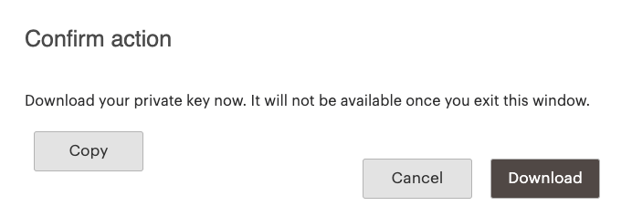

# [!DNL Commerce Services Connector]

部分Adobe Commerce和Magento Open Source功能由[!DNL Commerce Services]提供支援，並部署為SaaS （軟體即服務）。 若要使用這些服務，您必須使用生產及沙箱API金鑰連線您的[!DNL Commerce]執行個體，並在[設定](#saas-configuration)中指定資料空間。 您只需要為每個Commerce執行個體設定一次連線。

## 可用的服務 {#availableservices}

以下列出您可以透過[!DNL Commerce Services Connector]存取的[!DNL Commerce]功能：

| 服務 | 可用性 |
| ---|--- |
| [[!DNL Product Recommendations]](/help/product-recommendations/overview.md) powered by Adobe Sensei | Adobe Commerce |
| [[!DNL Live Search]](/help/live-search/overview.md) powered by Adobe Sensei | Adobe Commerce |
| [[!DNL Payment Services]](/help/payment-services/overview.md) | Adobe Commerce和Magento Open Source |
| [[!DNL Site-Wide Analysis Tool]](https://experienceleague.adobe.com/en/docs/commerce-operations/tools/site-wide-analysis-tool/intro) | Adobe Commerce |
| [[!DNL Catalog Service]](/help/catalog-service/overview.md) | Adobe Commerce |
| [[!DNL Data Connection]](/help/data-connection/overview.md) | Adobe Commerce |

## 架構

從高層次來看，[!DNL Commerce Services Connector]由下列核心元素組成：

以下各節會更詳細地討論這些元素。

## 認證 {#apikey}

從[授權擁有者](https://experienceleague.adobe.com/en/docs/commerce-cloud-service/start/onboarding)的[!DNL Commerce]帳戶產生生產和沙箱API金鑰。 Commerce帳戶由唯一的[!DNL Commerce] ID (MageID)識別。 只要帳戶處於良好狀態，商家組織的授權擁有者可以為產品Recommendations或Live Search等服務產生API金鑰。

這些金鑰可在「需知」基礎上與系統整合商或開發團隊分享，後者代表授權持有人管理專案和環境。 已獲授權擁有者授予[!DNL Shared Access]的開發人員，無法代表其產生金鑰，即使商家組織出現在其帳戶的[!DNL Switch Accounts]下拉式清單中。

此外，解決方案整合經銷商也有權使用[!DNL Commerce Services]。 如果您是解決方案整合商，[!DNL Commerce]合作夥伴合約的簽署者應該產生API金鑰。

>[!NOTE]
>
>授權擁有者通常是Adobe Commerce帳戶的主要聯絡人，並不一定與雲端基礎結構專案的Adobe Commerce專案擁有者相同。

### 產生生產和沙箱API金鑰 {#genapikey}

1. 在[https://account.magento.com](https://account.magento.com/customer/account/login){:target="_blank"}登入您的[!DNL Commerce]帳戶。

1. 在&#x200B;**Magento**&#x200B;標籤下，選取側邊欄上的&#x200B;**API入口網站**。

1. 從&#x200B;_環境_&#x200B;功能表，選取&#x200B;**生產**&#x200B;或&#x200B;**沙箱**。

1. 在&#x200B;_API金鑰_&#x200B;區段中輸入名稱，然後按一下&#x200B;**新增**&#x200B;以開啟對話方塊下載新金鑰。

   

   >[!WARNING]
   >
   > 此對話方塊提供您複製或下載金鑰的唯一機會。

1. 按一下&#x200B;**下載**，然後按一下&#x200B;**取消**。

1. 對每個環境（生產和沙箱）重複上述步驟。

   **API金鑰**&#x200B;區段現在會顯示您的API （公開）金鑰。 當您[選取或建立SaaS專案](#createsaasenv)時，需要生產金鑰和沙箱金鑰（公用+私用）。

## SaaS設定 {#saasenv}

[!DNL Commerce]執行個體必須設定有SaaS專案和SaaS資料空間，這樣[!DNL Commerce Services]才能將資料傳送到正確的位置。 SaaS專案會將所有SaaS資料空間分組。 SaaS資料空間用於收集和儲存可讓[!DNL Commerce Services]運作的資料。 某些資料可從[!DNL Commerce]執行個體匯出，而某些資料可從店面的購物者行為收集。 然後，這些資料會持續儲存以保護雲端儲存空間。

針對[!DNL Product Recommendations]，SaaS資料空間包含目錄和行為資料。 您可以在[!DNL Commerce]設定中選取[執行個體](https://docs.magento.com/user-guide/configuration/services/saas.html)，以將[!DNL Commerce]執行個體指向SaaS資料空間。

>[!WARNING]
>
> 請僅在生產[!DNL Commerce]安裝時使用您的生產SaaS資料空間，以避免資料衝突。 否則，您可能會使用測試資料汙染生產網站資料，進而導致部署延遲。 例如，中繼資料（例如中繼URL）可能會錯誤地覆寫您的生產產品資料。
> 如果發生這種狀況，[請提交支援要求](https://experienceleague.adobe.com/en/docs/commerce-knowledge-base/kb/overview)以要求清除資料。

### SaaS資料空間布建

所有Adobe Commerce商戶都可以存取每個SaaS專案一個生產資料空間和兩個測試資料空間。

只要不同時在多個環境中使用相同的資料空間，您就可以在任何非生產環境中使用測試資料空間。 若要在不同的環境中使用測試資料空間，請先執行資料清理，然後再在該環境中選取和設定資料空間。

對於具有多個中繼環境的Adobe Commerce Cloud Pro專案，您可以透過[提交支援要求](https://experienceleague.adobe.com/en/docs/commerce-knowledge-base/kb/overview)，為每個中繼環境要求額外的測試資料空間。 不過，如果您只有一個測試環境，且需要額外的測試資料空間，您有以下選項：
- 請聯絡客戶成功團隊或您指派的客戶成功案例經理，以要求額外的測試環境。 另外需要額外付費。
- [提交支援要求](https://experienceleague.adobe.com/en/docs/commerce-knowledge-base/kb/overview)以取得額外的測試資料空間，並說明額外資料空間的商業理由。 此請求有待核准。

### 選取或建立SaaS專案 {#createsaasenv}

若要選取或建立SaaS專案，請向商店的[!DNL Commerce]授權擁有者要求[!DNL Commerce] API金鑰：

>[!NOTE]
>
> 如果您在[!DNL Commerce]設定中沒有看到&#x200B;**[!UICONTROL Commerce Services Connector]**&#x200B;區段，則必須為所需的[[!DNL Commerce] 服務](#availableservices)安裝[!DNL Commerce]模組。

1. 在&#x200B;_管理員_&#x200B;側邊欄上，前往&#x200B;**系統** >服務> **Commerce服務聯結器**。

   如果您在[!DNL Commerce]設定中沒有看到&#x200B;**[!UICONTROL Commerce Services Connector]**&#x200B;區段，請為所需的[[!DNL Commerce] 服務](#availableservices)安裝[!DNL Commerce]模組。 此外，請確定已安裝`magento/module-services-id`套件。

1. 在&#x200B;_[!UICONTROL Sandbox API Keys]_和_[!UICONTROL Production API Keys]_&#x200B;區段中，貼上您的金鑰值。

   私密金鑰必須在金鑰開頭包含`----BEGIN PRIVATE KEY---`，並在金鑰結尾包含`----END PRIVATE KEY----`。

1. 按一下&#x200B;**儲存**。

任何與您的金鑰相關聯的SaaS專案都會顯示在&#x200B;**SaaS識別碼**&#x200B;區段的&#x200B;**專案**&#x200B;欄位中。

1. 如果沒有SaaS專案，請按一下&#x200B;**建立專案**。 然後在&#x200B;**專案**&#x200B;欄位中，輸入您的SaaS專案名稱。

1. 選取&#x200B;**資料空間**，以用於您[!DNL Commerce]存放區的目前組態。

>[!NOTE]
>
>如果您有要與Commerce服務整合的個別執行個體，請[提交支援票證](https://experienceleague.adobe.com/en/docs/commerce-knowledge-base/kb/help-center-guide/magento-help-center-user-guide#submit-ticket)，為每個額外的執行個體請求新的SaaS專案。 在支援建立SaaS專案後，請使用相同的API金鑰為例項設定Commerce Services整合，並為資料空間選取新的SaaS專案。

>[!WARNING]
>
> 如果您在「我的帳戶」的「API入口網站」區段中產生新金鑰，請立即更新「管理員」設定中的API金鑰。 如果您產生新金鑰，但未在Admin中更新，您的SaaS擴充功能即無法運作，而您會遺失寶貴資料。

若要變更SaaS專案或資料空間的名稱，請按一下其中任何一個專案旁邊的&#x200B;**重新命名**。 變更名稱不會影響您的服務，因為名稱只是一個標籤，可協助您識別並區分專案和資料空間。

## IMS組織（選用） {#organizationid}

若要將您的Adobe Commerce執行個體連結至Adobe Experience Platform，請使用您的Adobe ID登入您的Adobe帳戶。 登入後，與您的Adobe帳戶相關聯的IMS組織會顯示在此區段中。

## SaaS資料匯出

當您的[!DNL Commerce]執行個體成功連線至[!DNL Commerce Services]時，SaaS資料匯出程式會將Commerce資料從您的[!DNL Commerce]伺服器匯出至[!DNL Commerce SaaS Services]，以便同步處理至連線的Commerce服務。 在Admin中，您可以使用[資料管理儀表板](https://experienceleague.adobe.com/en/docs/commerce-admin/systems/data-transfer/data-dashboard)來檢查同步處理狀態。 如需詳細資訊，請參閱[SaaS資料匯出指南](../data-export/overview.md)。
