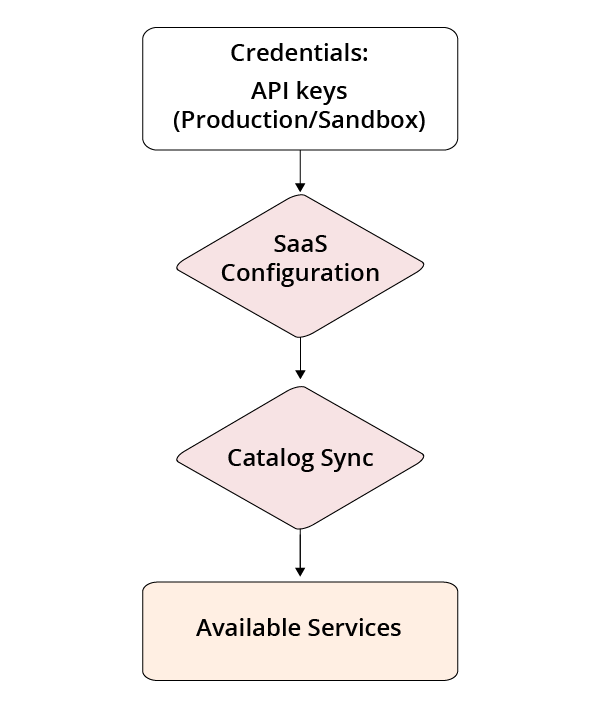

# [!DNL Commerce Services Connector]

部分Adobe Commerce和Magento Open Source功能由 [!DNL Commerce Services]  並部署為SaaS（軟體即服務）。 若要使用這些服務，您必須連接 [!DNL Commerce] 執行個體（使用生產金鑰和沙箱API金鑰），並指定 [配置](https://experienceleague.adobe.com/docs/commerce-admin/config/services/saas.html). 您只需設定一次。

## 可用服務 {#availableservices}

以下列出 [!DNL Commerce] 您可以透過 [!DNL Commerce Services Connector]:

| 服務 | 可用性 |
| ---|--- |
| [[!DNL Product Recommendations]](/help/product-recommendations/overview.md) 由Adobe Sensei提供 | Adobe Commerce |
| [[!DNL Live Search]](/help/live-search/overview.md) 由Adobe Sensei提供 | Adobe Commerce |
| [[!DNL Payment Services]](/help/payment-services/overview.md) | Adobe Commerce與Magento Open Source |
| [[!DNL Channel Manager]](https://experienceleague.adobe.com/docs/commerce-channels/channel-manager/intro-to-channel-manager/overview.html) | Adobe Commerce與Magento Open Source |
| [[!DNL Site-Wide Analysis Tool]](https://experienceleague.adobe.com/docs/commerce-operations/tools/site-wide-analysis-tool/intro.html) | Adobe Commerce |
| [[!DNL Catalog Service]](/help/catalog-service/overview.md) | Adobe Commerce |
| [Experience Platform連接器](/help/experience-platform-connector/overview.md) | Adobe Commerce |

## 架構

從高度來說， [!DNL Commerce Services Connector] 由下列核心元素組成：

以下各節將更詳細地討論這些元素中的每個元素。

## 憑證 {#apikey}

生產與沙箱API金鑰是從 [!DNL Commerce] 許可證持有者的帳戶，由 [!DNL Commerce] ID(MageID)。 若要通過服務(例如 [!DNL Product Recommendations] 或 [!DNL Live Search]，只要帳戶信譽良好，商家組織的授權持有人就可產生API金鑰集。 密鑰可以「需要知道」地與系統整合商或代表許可證持有者管理項目和環境的開發團隊共用。 此外，解決方案整合商也有權使用 [!DNL Commerce Services]. 如果您是解決方案整合商，則 [!DNL Commerce] 合作夥伴合約應產生API金鑰。

### 產生生產與沙箱API金鑰 {#genapikey}

1. 登入 [!DNL Commerce] 帳戶 [https://account.magento.com](https://account.magento.com/){:target=&quot;_blank&quot;}。

1. 在 **Magento** 索引標籤，選取 **API入口網站** 在側欄。

1. 從 _環境_ 菜單，選擇 **生產** 或 **沙箱**.

1. 在 _API金鑰_ 區段，按一下 **新增**.

   這會開啟一個對話方塊，用於下載新金鑰。

   

   >[!WARNING]
   >
   > 這是您唯一必須複製或下載金鑰的機會。

1. 按一下 **下載** 然後按一下 **取消**.

1. 對每個環境（生產和沙箱）重複上述步驟。

   此 **API金鑰** 區段現在會顯示您的API金鑰。 當您 [選擇或建立SaaS項目](#createsaasenv).

## SaaS配置 {#saasenv}

[!DNL Commerce] 實例必須配置SaaS項目和SaaS資料空間，以便 [!DNL Commerce Services] 可將資料傳送至正確位置。 SaaS項目將所有SaaS資料空間分組。 SaaS資料空間用於收集和儲存資料，以便 [!DNL Commerce Services] 工作。 有些此資料可從 [!DNL Commerce] 例項和部分可從店面上的購物者行為中收集。 然後，該資料會保存至安全的雲端儲存空間。

針對 [!DNL Product Recommendations],SaaS資料空間包含目錄和行為資料。 您可以指向 [!DNL Commerce] 實例到SaaS資料空間(按 [選取](https://docs.magento.com/user-guide/configuration/services/saas.html) 在 [!DNL Commerce] 設定。

>[!WARNING]
>
> 只在生產環境中使用生產SaaS資料空間 [!DNL Commerce] 安裝以避免資料衝突。 否則，您可能會使用測試資料污染生產站點資料，而這會導致部署延遲。 例如，您的生產產品資料可能會從測試資料（例如測試URL）錯誤覆寫。

### 選擇或建立SaaS項目 {#createsaasenv}

>[!NOTE]
>
> 如果您沒有看到 **[!UICONTROL Commerce Services Connector]** 區段 [!DNL Commerce] 設定，您必須安裝 [!DNL Commerce] 模組 [[!DNL Commerce] 服務](#availableservices).

要選擇或建立SaaS項目，請請求 [!DNL Commerce] 來自 [!DNL Commerce] 您的商店的許可證持有者。

1. 在 _管理_ 邊欄，轉到 **系統** >服務> **商務服務連接器**.

1. 在 _沙箱API金鑰_ 和 _生產API金鑰_ 區段，貼上索引鍵值。

   私鑰必須包括 `----BEGIN PRIVATE KEY---` 在鍵和 `----END PRIVATE KEY----` 在私密金鑰的結尾。

1. 按一下 **儲存**.

與密鑰關聯的任何SaaS項目都會顯示在 **專案** 欄位 **SaaS標識符** 區段。

1. 如果不存在SaaS項目，請按一下 **建立專案**. 在 **專案** 欄位中，輸入SaaS項目的名稱。

   建立SaaS項目時， [!DNL Commerce] 會根據您的 [!DNL Commerce] 許可證：
   - Adobe Commerce — 單一生產資料空間；兩個測試資料空間
   - Magento Open Source — 一個生產資料空間；無測試資料空間

1. 選取 **資料空間** 以用於 [!DNL Commerce] 儲存。

>[!WARNING]
>
> 如果您在「我的帳戶」的「API入口」區段中產生新金鑰，請立即更新「管理員」設定中的API金鑰。 如果您生成新密鑰，並且未在管理員中更新密鑰，則您的SaaS擴展將不再工作，並且您會丟失寶貴的資料。

要更改SaaS項目或資料空間名稱，請按一下 **重新命名**.

## IMS組織（選用） {#organizationid}

若要將Adobe Commerce執行個體連結至Adobe Experience Platform，請使用Adobe ID登入您的Adobe帳戶。 登入後，與您的Adobe帳戶相關聯的IMS組織會顯示在此區段。

## 目錄同步

當 [!DNL Commerce] 實例已成功連接到 [!DNL Commerce Services]，目錄同步程式會從您的 [!DNL Commerce] 伺服器 [!DNL Commerce Services]. [深入了解](catalog-sync.md) 關於目錄同步程式。
