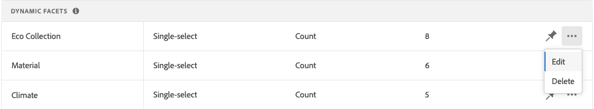

# 管理Facet

請依照下列指示更新現有刻面的屬性或變更其在店面中的呈現方式。

## 設定價格面群組

請參閱 [設定](settings.md) 設定價格對應間隔和分組。

## 編輯Facet

1. 尋找您要編輯的面向。
1. 如果清單中有許多面向，請設定 *篩選依據* 至下列其中一項：

   * 固定
   * 動態

   若要進一步了解，請前往 [小平面類型](facets-type.md).

   

1. 要編輯小面屬性，請按一下 **更多** (...)選項。
1. 按一下 **編輯**

   

1. 要編輯Facet標籤，請執行以下操作之一：

   * 若 [!DNL Commerce] storefront，編輯 [屬性標籤](https://experienceleague.adobe.com/docs/commerce-admin/catalog/product-attributes/product-attributes.html).
   * 對於無標題實作，按一下第一欄中的值，並視需要編輯文字。

   

1. （僅限無頭）若要變更用來排序小面值的方法，請按一下 *排序類型* 欄中，並選擇以下選項之一：

   * 字母順序
   * 計數

   

1. 在 **最大值** 欄中，設定要顯示在店面的小平面篩選值的最大數量（從0到10）。
1. 完成後，按一下 **儲存**.
您的變更要等到發佈後，才會顯示在店面中。

## 銷/取消銷小面

按一下時，針腳會變更顏色，並用來將面移至 *固定的刻面* 或 *動態Facet* 區段。

1. 將小平面釘到 *篩選器* 清單中，在 *動態Facet* 列出並按一下灰色銷()。
銷會變藍，而小面會移至 *固定的刻面* 區段。
1. 要取消固定小面，請在 *固定的刻面* 列出，然後按一下藍色釘()。
銷會變灰，小面會移至 *動態Facet* 區段。

   

## 移動固定面

>[!NOTE]
>
>固定刻面的順序僅在無頭實施中受支援。 如果需要有序的刻面，請使用 [!DNL Live Search] PLP介面工具集。

可將行移動到不同位置，以更改固定小平面的順序。 固定小平面具有 *移動* 圖示()。 與固定Facet不同，動態Facet無法移動。

1. 在 *固定的刻面* 的下界。
1. 使用 **移動** ()圖示，將列拖曳至 *固定的刻面* 區段。
變更發佈後，重新排序的Facet會顯示在店面 *篩選器* 清單。

## 刪除Facet

1. 在清單中尋找小面，然後按一下 **更多** (...)選項。
1. 按一下 **刪除**.
1. 提示確認時，按一下 **刪除Facet**.
變更發佈後，會從店面移除小面。

## 發佈變更

1. 若要使用您的變更更新店面，請按一下 **發佈變更**.
1. 等待15分鐘，讓更新出現在您的商店中。
