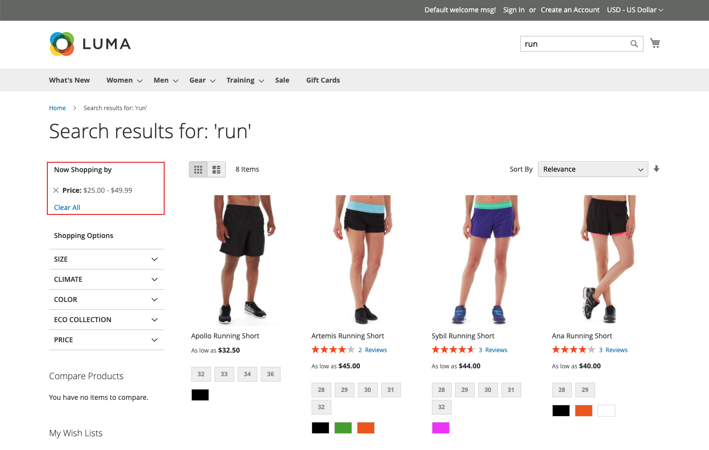

# Facet型別

[!DNL Live Search] 會使用各種Facet型別，而這些型別會顯示在 *篩選器* 僅在相關時列出。 可用Facet清單會根據傳回的產品而變更。 下列特性會影響其顯示方式和行為：

* 釘選Facet — 最常用的Facet可以釘選到清單頂端。 其餘的多面會列於 *排序型別* 釘選Facet後的順序。
* Dynamic Facet — 具有以下功能的產品屬性： [Adobe Sensei](https://www.adobe.com/sensei.html) 尋找與產品集和查詢最相關的專案。 計算會考量整個目錄的屬性中繼資料，並在查詢時決定與查詢最相關的Facet。
* 熱門Facet — 最常出現在搜尋結果中的產品屬性。
* 價格Facet — 依價格範圍傳回產品。 您可以指定選擇的數量與價格範圍間隔，在 [*設定*](settings.md) 標籤。

在查詢時， [!DNL Live Search] 會以動態和人氣Facet群組產生搜尋結果。

## 店面和Headless選項

針對呈現的Facet [!DNL Commerce] 店面由搜尋配接卡處理，這會路由請求並在店面中呈現結果。 全部 [!DNL Commerce] 店面Facet使用單選選項按字母順序排序，無論指定給對應屬性的輸入型別為何。 店面中可用的Facet會根據目前的主題進行演算，並反映對分層導覽的呈現所做的任何自訂。

相反地， [headless](https://developer.adobe.com/commerce/php/architecture/technical-vision/web-api/) 實作是由API處理並支援其他選項。 Headless Facet可依字母順序或計數排序，並可使用單一或多重選取選項。

### Facet標籤

對象 [!DNL Commerce] 店面，多面標籤由 [*屬性屬性*](https://experienceleague.adobe.com/docs/commerce-admin/catalog/product-attributes/create/attribute-product-create.html). 對於具有多個檢視的商店，可以在下方定義其他標籤 *管理標籤*. 針對Headless實作，標籤會從 [多面向工作區](faceting-workspace.md).

### 排序型別

為店面演算的所有多面向都會依字母順序排序。 針對Headless實作，Facet可依字母順序或計數排序。

| 排序型別 | 說明 |
|--- |--- |
| 字母順序 | 在店面 *篩選器* 清單， Facet會依字母順序排序。 |
| 計數 | （僅限Headless）針對Headless實作，Facet也可依目前傳回產品集合中每個Facet的值數量排序。 |
