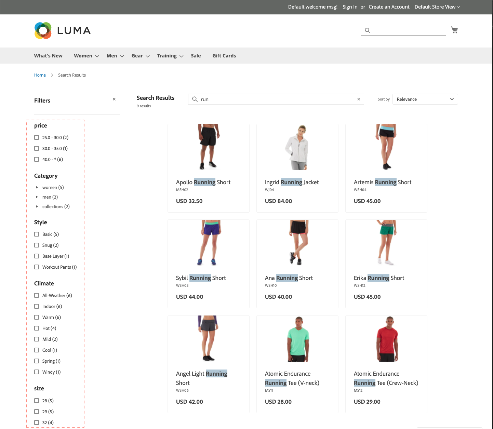

# 小平面

Faceting是一種高效能過濾方法，它使用多個維屬性值作為搜索標準。 多面搜索相似，但比標準「更智慧」 [分層導航](https://docs.magento.com/user-guide/catalog/navigation-layered.html)。 可用篩選器清單由 [可篩選屬性](https://docs.magento.com/user-guide/catalog/navigation-layered-filterable-attributes.html) 搜索結果中返回的產品。 最多可配置100個小平面 [!DNL Live Search]。

## 麵包要求

用於分層導航的類別和產品屬性要求與可篩選屬性類似。 每個屬性的儲存面屬性必須設定為 `filterable (with results)`。

| 設定 | 說明 |
|--- |--- |
| [類別顯示設定](https://docs.magento.com/user-guide/catalog/categories-display-settings.html) | 錨點 —  `Yes` |
| [屬性屬性](https://docs.magento.com/user-guide/stores/attribute-product-create.html) | [目錄輸入類型](https://docs.magento.com/user-guide/stores/attributes-input-types.html) - `Yes/No`。 `Dropdown`。 `Multiple Select`。 `Price` |
| 屬性儲存面屬性 | 在分層導航中使用 —  `Filterable (with results)` |

## 預設非系統屬性屬性

下表顯示了非系統屬性的預設搜索和可篩選屬性，包括特定於Luma示例資料的屬性。 設定 *在搜索中使用* 屬性屬性 `Yes` 使屬性可在兩者中搜索 [!DNL Live Search] 和Adobe Commerce。

| 屬性代碼 | 可搜索 | 在分層導航中使用 |
|--- |--- |--- |
| 活動 | 是 | 可篩選（帶結果） |
| 屬性_品牌 | 是 | 否 |
| 品牌 | 是 | 否 |
| 氣候 | 是 | 可篩選（帶結果） |
| 領 | 是 | 可篩選（帶結果） |
| 顏色 | 是 | 可篩選（帶結果） |
| 成本 | 是 | 否 |
| eco_collection | 是 | 可篩選（帶結果） |
| 性別 | 是 | 可篩選（帶結果） |
| 製造商 | 是 | 可篩選（帶結果） |
| 材料 | 是 | 可篩選（帶結果） |
| 目的 | 是 | 可篩選（帶結果） |
| 帶袋 | 是 | 可篩選（帶結果） |
| 樣式_常規 | 是 | 可篩選（帶結果） |

## 預設系統屬性

下表顯示了系統屬性的預設搜索和可篩選屬性。

| 屬性代碼 | 可搜索 | 在分層導航中使用 |
|--- |--- |--- |
| allow_open_amount | 是 | 可篩選（帶結果） |
| 描述 | 是 | 否 |
| 名稱 | 是 | 否 |
| 價格 | 是 | 可篩選（帶結果） |
| short_description | 是 | 否 |
| sku | 是 | 否 |
| 狀態 | 是 | 否 |
| 稅_class_id | 是 | 否 |
| url_key | 是 | 否 |
| 重量 | 是 | 否 |
