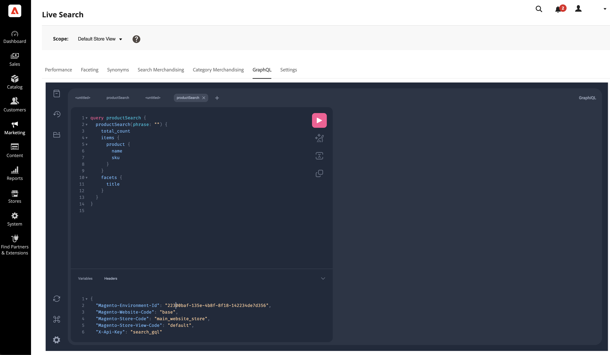

# GraphQL

此 [!DNL Live Search] GraphQL標籤是互動式GraphQL工作區，可讓管理員使用自己的資料建立和測試GraphQL查詢。

此工作區支援 [`productSearch`](https://developer.adobe.com/commerce/services/graphql/live-search/product-search/) 和 [`attributeMetadata`](https://developer.adobe.com/commerce/services/graphql/live-search/attribute-metadata/) 查詢。

