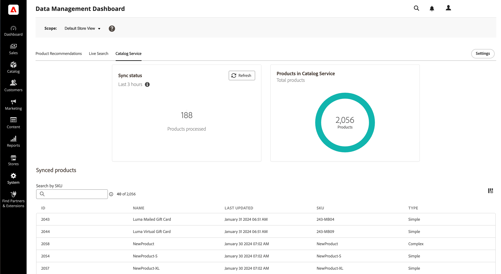

# 設定以取得成功 [!DNL Live Search]

Adobe Commerce [!DNL Live Search] 和 [[!DNL Catalog Service]](../catalog-service/guide-overview.md) 共同合作，提供效能、相關且直覺式的搜尋解決方案，讓客戶快速找到所需的專案。 具體來說， [!DNL Catalog Service] 顯示您的SaaS服務目錄資料，例如 [!DNL Live Search] 以使用。

本文提供實作的逐步指示 [!DNL Live Search] 替換為 [!DNL Catalog Service].

>[!IMPORTANT]
>
>在網站搜尋方面，Adobe Commerce會提供您選項。 請務必閱讀 [邊界和限制](boundaries-limits.md) 實施前，為了確保 [!DNL Live Search] 適合您的業務需求。

## 對象

本文適用於負責安裝和設定Adobe Commerce執行個體的開發人員或團隊中的系統整合商。

## 需求

- [Adobe Commerce](https://business.adobe.com/products/magento/magento-commerce.html) 2.4.4+
- PHP 8.1 / 8.2 / 8.3
- [!DNL Composer]

## 支援平台

- 雲端上的Adobe Commerce (ECE) ： 2.4.4+
- Adobe Commerce內部部署(EE) ： 2.4.4+

## 工作流程概觀

概略說明，入門 [!DNL Live Search] 需要您：


## 1.安裝 [!DNL Live Search] 副檔名

[!DNL Live Search] 會安裝為擴充功能，來自 [Adobe市集](https://commercemarketplace.adobe.com/magento-live-search.html) 到 [作曲者](https://getcomposer.org/). 安裝及設定之後 [!DNL Live Search]，Adobe [!DNL Commerce] 開始與SaaS服務共用搜尋和目錄資料。 此時， *管理員* 使用者可以設定、自訂及管理搜尋Facet、同義字和銷售規則。

>[!NOTE]
>
>截至 [!DNL Live Search] 3.0.2， [!DNL Catalog Service] 擴充功能與 [!DNL Live Search] 安裝。

1. 確認 [cron工作](https://experienceleague.adobe.com/en/docs/commerce-operations/configuration-guide/cli/configure-cron-jobs) 和 [索引子](https://experienceleague.adobe.com/en/docs/commerce-admin/systems/tools/index-management) 執行中。

   >[!IMPORTANT]
   >
   >由於Elasticsearch7於2023年8月宣佈終止支援，建議所有Adobe Commerce客戶移轉至OpenSearch 2.x搜尋引擎。 如需在產品升級期間移轉搜尋引擎的相關資訊，請參閱 [移轉至OpenSearch](https://experienceleague.adobe.com/en/docs/commerce-operations/upgrade-guide/prepare/opensearch-migration) 在 _升級指南_.

1. 下載 `live-search` 封裝來自 [Adobe市集](https://commercemarketplace.adobe.com/magento-live-search.html).

1. 從命令列執行以下命令：

   ```bash
   composer require magento/live-search
   ```

   如果您要新增 [!DNL Live Search] 擴充功能至 **新** Adobe Commerce安裝，請執行以下動作以停用 [!DNL OpenSearch] 和相關模組，以及安裝 [!DNL Live Search]. 然後繼續步驟4。

   ```bash
      bin/magento module:disable Magento_Elasticsearch Magento_Elasticsearch7 Magento_OpenSearch Magento_ElasticsearchCatalogPermissions Magento_InventoryElasticsearch Magento_ElasticsearchCatalogPermissionsGraphQl
   ```

   如果您要新增 [!DNL Live Search] 擴充功能至 **現有** Adobe Commerce安裝，請執行以下動作以暫時停用 [!DNL Live Search] 提供店面搜尋結果的模組。 然後繼續步驟4：

   ```bash
      bin/magento module:disable Magento_LiveSearchAdapter Magento_LiveSearchStorefrontPopover Magento_LiveSearchProductListing 
   ```

   [!DNL Elasticsearch] 持續管理店面的搜尋請求，同時 [!DNL Live Search] 服務會在背景同步目錄資料和索引產品。

1. 執行下列動作：

   ```bash
   bin/magento setup:upgrade
   ```

1. 確認下列事項 [索引子](https://experienceleague.adobe.com/en/docs/commerce-admin/systems/tools/index-management) 設為「依排程更新」：

   - 產品摘要
   - 產品變體摘要
   - 目錄屬性摘要
   - 產品價格摘要
   - 範圍網站資料摘要
   - 範圍客戶群組資料摘要
   - 類別摘要
   - 類別許可權摘要

1. 如果您正在安裝 [!DNL Live Search] 在新的Commerce執行個體上，您已完成，可跳至 [2. 設定API金鑰](#2-configure-api-keys) 區段。 如果您要將即時搜尋安裝至現有的Commerce執行個體，請繼續進行下一個步驟。

1. 執行以下命令以啟用 [!DNL Live Search] 擴充功能，停用 [!DNL OpenSearch]，並執行 `setup`.

   ```bash
   bin/magento module:enable Magento_LiveSearchAdapter Magento_LiveSearchStorefrontPopover  Magento_LiveSearchProductListing 
   ```

   ```bash
   bin/magento module:disable Magento_Elasticsearch Magento_Elasticsearch6 Magento_Elasticsearch7 Magento_ElasticsearchCatalogPermissions Magento_InventoryElasticsearch 
   Magento_ElasticsearchCatalogPermissionsGraphQl
   ```

   ```bash
   bin/magento setup:upgrade
   ```

## 2.設定API金鑰

需要Adobe Commerce API金鑰及其關聯的私密金鑰才能連線 [!DNL Live Search] Adobe Commerce的安裝。 API金鑰是在的帳戶中產生和維護 [!DNL Commerce] 授權持有者，可與開發人員或系統整合商分享。 開發人員可以代表授權持有人建立和管理SaaS資料空間。 如果您已經有一組API金鑰，則不需要重新產生。

瞭解如何在中設定API金鑰 [Commerce服務聯結器](../landing/saas.md) 文章。

## 3.同步處理您的目錄資料 {#synchronize-catalog-data}

[!DNL Live Search] 將目錄資料移至Adobe的SaaS基礎結構。 資料會編制索引，而搜尋結果會從此索引直接傳送到店面。 根據大小和複雜性，索引可能需要30分鐘到數小時的時間。

若要開始將目錄資料初始同步至SaaS服務，請依此順序執行下列命令：

```bash
bin/magento saas:resync --feed productattributes
bin/magento saas:resync --feed products
bin/magento saas:resync --feed scopesCustomerGroup
bin/magento saas:resync --feed scopesWebsite
bin/magento saas:resync --feed prices
bin/magento saas:resync --feed productoverrides
bin/magento saas:resync --feed variants
bin/magento saas:resync --feed categories
bin/magento saas:resync --feed categoryPermissions
```

當您執行這些命令時，會開始將目錄資料與SaaS服務進行初始同步。

>[!WARNING]
>
> 當資料已編制索引並同步時，店面中無法使用搜尋和類別瀏覽操作。 根據目錄的大小，程式可能需要至少一個小時的時間 `cron` 執行以將您的資料同步到SaaS服務。

### 監視同步處理進度

您可以使用檢視已同步和共用的資料 [資料管理控制面板](https://experienceleague.adobe.com/en/docs/commerce-admin/systems/data-transfer/data-dashboard). 此儀表板提供您店面產品資料可用性的寶貴見解，確保可及時向購物者顯示。



#### 未來的產品更新

初始同步後，增量產品更新最多可能需要15分鐘才能用於店面搜尋。 若要深入瞭解，請參閱 [索引 — 串流產品更新](indexing.md).

## 4.驗證是否已匯出資料 {#verify-export}

驗證目錄資料是否已從您的Adobe Commerce執行個體匯出並同步 [!DNL Live Search]，您有幾個選項：

- 在下清單格中尋找專案：

   - `catalog_data_exporter_products`
   - `catalog_data_exporter_product_attributes`

- 使用 [GraphQL遊樂場](https://developer.adobe.com/commerce/services/graphql/live-search/) 預設查詢，以驗證以下內容：

   - 傳回的產品計數接近您對商店檢視的預期。
   - 會傳回多面向。

如需其他說明，請參閱 [[!DNL Live Search] 目錄未同步](https://experienceleague.adobe.com/en/docs/commerce-knowledge-base/kb/troubleshooting/miscellaneous/live-search-catalog-data-sync) 位於支援知識庫中。

## 5.設定資料

正確設定您的產品資料可確保為您的客戶帶來良好的搜尋結果。 在此區段中，您會啟用產品清單Widget並指派類別和屬性。

### 啟用產品清單Widget

當您安裝時 [!DNL Live Search] 4.0.0+，產品清單Widget預設為啟用。 Widget啟用時，搜尋結果頁面和類別瀏覽產品清單頁面會使用不同的UI元件。 此UI元件會直接呼叫 [目錄服務API](https://developer.adobe.com/commerce/services/graphql/catalog-service/product-search/)，進而加快回應時間。

如果您擁有 [!DNL Live Search] 4.0.0+之前的版本，您必須手動啟用產品清單Widget。

1. 從 *管理員*，前往 **[!UICONTROL Stores]** > _[!UICONTROL Settings]_>**[!UICONTROL Configuration]**.
1. 在 **[!UICONTROL Live Search]**，選取 **[!UICONTROL Storefront Features]**.
1. 設定 **[!UICONTROL Enable Product Listing Widgets]** 至 `Yes`.

   

當您變更此設定時，訊息 `Page cache is invalidated` 隨即顯示。 您需要清除Magento快取以儲存變更。

1. 存取 [快取管理](https://experienceleague.adobe.com/en/docs/commerce-admin/systems/tools/cache-management) 執行下列任一項作業來建立頁面：

   - 按一下 **[!UICONTROL Cache Management]** 工作區上方訊息中的連結。
   - 在 _管理員_ 側欄，前往 **[!UICONTROL System]** > _[!UICONTROL Tools]_>**[!UICONTROL Cache Management]**.

1. 選取 **設定** [!UICONTROL Cache Type] 並按一下 **[!UICONTROL Flush Magento Cache]**.

   排清快取後，立即變更店面。

### 指派類別

產品傳回 [!DNL Live Search] 必須指派給 [類別](https://experienceleague.adobe.com/en/docs/commerce-admin/catalog/categories/categories). 例如，在Luma中，產品分為「男性」、「女性」和「齒輪」等類別。 也會為「Top」、「Bottoms」和「Watch」設定子類別。 這可提供更精細的篩選粒度。

### 可搜尋和可篩選的欄位

已指派產品 [屬性](https://experienceleague.adobe.com/en/docs/commerce-admin/catalog/product-attributes/product-attributes) 可用於搜尋和篩選的規則。 屬性包括「顏色」、「尺寸」、「材質型別」等。 透過這些屬性，使用者可以尋找「綠色頂端」。 每個產品可能都有許多已定義的屬性， [!DNL Commerce] 管理員。

每一個屬性都可以定義為 [&quot;searchable&quot;](https://experienceleague.adobe.com/en/docs/commerce-admin/catalog/catalog/search/search) 在Admin中。 當設為「可搜尋」時，這些屬性便可供搜尋 [!DNL Live Search].

[Facet](facets.md) 是在中定義的產品屬性 [!DNL Live Search] 可篩選。 任何可篩選的屬性都可以設定為Facet於 [!DNL Live Search] 但一次可以搜尋的面向數量存在限制。

[同義字](synonyms.md) 是您可以定義的術語，以協助引導使用者使用正確的產品。 尋找褲子的使用者可能會輸入「trousers」或「slacks」。 您可以設定同義字，讓這些搜尋詞將使用者帶到「褲子」結果。

## 6.測試連線 {#test-connection}

現在，如果您的目錄資料在SaaS中，請進行測試以確保在以下情況下傳回產品資料：

- 此 [!UICONTROL Search] 方塊會正確傳回結果
- 類別瀏覽正確傳回結果
- Facet在搜尋結果頁面上可作為篩選使用

如果一切正常運作， [!DNL Live Search] 已安裝、連線且隨時可使用。

如果您在店面中遇到問題，請檢查 `var/log/system.log` API通訊失敗或服務端錯誤的檔案。

允許 [!DNL Live Search] 透過防火牆，新增 `commerce.adobe.io` 加入允許清單。

## 7.根據您的店面量身打造

您已安裝 [!DNL Live Search] 擴充功能，已同步、驗證和設定您的資料。 現在，您需要確保 [!DNL Live Search] Widget符合商店的外觀和風格。

您可以視需要定義自訂CSS規則，以設定彈出視窗和PLP Widget的樣式。 另請參閱 [樣式彈出視窗元素](storefront-popover-styling.md) 和 [產品清單頁面Widget](plp-styling.md).

如果您想要擴充Widget的功能，每個元件的原始碼都可在公用存放庫中取得。
在這種情況下，您可以根據自己的需求自訂JavaScript，然後在CDN上託管自訂程式碼。 此自訂指令碼會與 [!DNL Live Search] 並傳回正常結果，讓您控制Widget的功能。

- [PLP Widget存放庫](https://github.com/adobe/storefront-product-listing-page)
- [搜尋列存放庫](https://github.com/adobe/storefront-search-as-you-type)

## 正在更新 [!DNL Live Search] {#update}

在更新Live Search之前，請從命令列執行下列操作以檢查已安裝的Live Search版本：

```bash
composer show magento/module-live-search | grep version
```

更新 [!DNL Live Search]，從命令列執行以下命令：

```bash
composer update magento/live-search --with-dependencies
```

若要更新至主要版本，例如從3.1.1到4.0.0，請編輯專案的根目錄 [!DNL Composer] `.json` 檔案如下所示：

1. 若您目前已安裝 `magento/live-search` 版本為 `3.1.1` 或更低版本，而您正升級至版本 `4.0.0` 或更高版本，請在升級之前執行以下命令：

   ```bash
   bin/magento module:enable Magento_AdvancedSearch
   ```

   有關目前安裝的資訊 `magento/live-search` 版本，執行以下命令：

   ```bash
   composer show magento/live-search
   ```

1. 開啟根 `composer.json` 檔案和搜尋 `magento/live-search`.

1. 在 `require` 區段，更新版本號碼，如下所示：

   ```json
   "require": {
      ...
      "magento/live-search": "^4.0",
      ...
    }
   ```

1. 儲存 `composer.json`. 然後，從命令列執行下列動作：

   ```bash
   composer update magento/live-search --with-dependencies
   ```

## 解除安裝 [!DNL Live Search] {#uninstall}

若要解除安裝 [!DNL Live Search]，請參閱 [解除安裝模組](https://experienceleague.adobe.com/en/docs/commerce-operations/installation-guide/tutorials/uninstall-modules).

## [!DNL Live Search] 套件 {#packages}

此 [!DNL Live Search] 擴充功能包含下列套件：

| 封裝 | 說明 |
|--- |--- |
| `module-live-search` | 可讓商家針對多面向、同義字、查詢規則等設定其搜尋設定，並提供對唯讀GraphQL遊樂場的存取權，以測試來自 *管理員*. |
| `module-live-search-adapter` | 將搜尋要求從店面路由至 [!DNL Live Search] 服務，並在店面中呈現結果。 <br /> — 類別瀏覽 — 路由店面的請求 [上層導覽](https://experienceleague.adobe.com/en/docs/commerce-admin/catalog/catalog/navigation/navigation-top) 至搜尋服務。<br /> — 全域搜尋 — 路由來自下列專案的請求： [快速搜尋](https://experienceleague.adobe.com/en/docs/commerce-admin/catalog/catalog/search/search) 方塊位於店面右上角的 [!DNL Live Search] 服務。 |
| `module-live-search-storefront-popover` | 「依輸入方式搜尋」彈出視窗會取代標準快速搜尋，並傳回熱門搜尋結果的資料和縮圖。 |

## [!DNL Live Search] 相依性 {#dependencies}

下列專案 [!DNL Live Search] 相依性擷取自 [!DNL Composer].

- `magento/module-saas-catalog`
- `magento/module-saas-category`
- `magento/module-saas-category-permissions`
- `magento/module-saas-product-override`
- `magento/module-saas-product-variant`
- `magento/module-saas-price`
- `magento/module-saas-scopes`
- `magento/module-bundle-product-data-exporter`
- `magento/module-catalog-inventory-data-exporter`
- `magento/module-catalog-url-rewrite-data-exporter`
- `magento/module-configurable-product-data-exporter`
- `magento/module-parent-product-data-exporter`
- `magento/module-gift-card-product-data-exporter`
- `magento/module-bundle-product-override-data-exporter`
- `data-services`
- `services-id`

## 進階概念

以下小節提供使用時的進階主題 [!DNL Live Search] 和 [!DNL Catalog Service].

### 端點

[!DNL Live Search] 透過位於的端點通訊 `https://catalog-service.adobe.io/graphql`.

作為 [!DNL Live Search] 沒有完整產品資料庫的存取權， [!DNL Live Search] GraphQL與Commerce核心GraphQL不會有完整的同位檢查。

建議直接呼叫SaaS API — 尤其是目錄服務端點。

- 略過Commerce資料庫/Graphql程式，獲得效能並降低處理器負載
- 充分運用 [!DNL Catalog Service] 要呼叫的同盟 [!DNL Live Search]， [!DNL Catalog Service]、和 [!DNL Product Recommendations] 來自單一端點。

對於某些使用案例，呼叫 [!DNL Catalog Service] 以取得產品詳細資料和類似案例。 另請參閱 [refineProduct](https://developer.adobe.com/commerce/services/graphql/catalog-service/refine-product/) 以取得詳細資訊。

如果您有自訂Headless實施，請檢視 [!DNL Live Search] 參考實作：

- [PLP Widget](https://github.com/adobe/storefront-product-listing-page)
- [即時搜尋欄位](https://github.com/adobe/storefront-search-as-you-type)

如果您未使用預設元件(例如Luma上的搜尋配接器或Widget或AEM CIF Widget)，事件(為Adobe Sensei提供智慧型銷售和效能量度摘要的點按資料流資料)將無法立即運作，且需要自訂開發來實施Headless事件。

最新版本的 [!DNL Live Search] 已使用 [!DNL Catalog Service].

### 語言支援

[!DNL Live Search] Widget支援下列語言：

|  |  |  |  |
|--- |--- |--- |--- |
| 語言 | 地區 | 語言代碼 | Magento地區設定 |
| 保加利亞文 | 保加利亞 | bg_BG | bg_BG |
| 加泰隆尼亞文 | 西班牙 | ca_ES | ca_ES |
| 捷克文 | 捷克共和國 | cs_CZ | cs_CZ |
| 丹麥文 | 丹麥 | da_DK | da_DK |
| 德文 | 德國 | de_DE | de_DE |
| 希臘文 | 希臘 | el_GR | el_GR |
| 英文 | 英國 | en_GB | en_GB |
| 英文 | 美國 | en_US | en_US |
| 西班牙文 | 西班牙 | es_ES | es_ES |
| 愛沙尼亞文 | 愛沙尼亞 | et_EE | et_EE |
| 巴斯克語 | 西班牙 | eu_ES | eu_ES |
| 波斯文 | 伊朗 | fa_IR | fa_IR |
| 芬蘭文 | 芬蘭 | fi_FI | fi_FI |
| 法文 | 法國 | fr_FR | fr_FR |
| 加利西亞語 | 西班牙 | gl_ES | gl_ES |
| 北印度文 | 印度 | hi_IN | hi_IN |
| 匈牙利文 | 匈牙利 | hu_HU | hu_HU |
| 印尼文 | 印尼 | id_ID | id_ID |
| 義大利文 | 義大利 | it_IT | it_IT |
| 韓文 | 南韓 | ko_KR | ko_KR |
| 立陶宛文 | 立陶宛 | lt_LT | lt_LT |
| 拉脫維亞文 | 拉脫維亞 | lv_LV | lv_LV |
| 挪威文 | 挪威巴克摩 | nb_NO | nb_NO |
| 荷蘭文 | 荷蘭 | nl_NL | nl_NL |
| 波蘭文 | 波蘭 | pl_PL | pl_PL |
| 葡萄牙文 | 巴西 | pt_BR | pt_BR |
| 葡萄牙文 | 葡萄牙 | pt_PT | pt_PT |
| 羅馬尼亞文 | 羅馬尼亞 | ro_RO | ro_RO |
| 俄文 | 俄羅斯 | ru_RU | ru_RU |
| 瑞典文 | 瑞典 | sv_SE | sv_SE |
| 泰文 | 泰國 | th_TH | th_TH |
| 土耳其文 | 土耳其 | tr_TR | tr_TR |
| 中文 | 中國 | zh_CN | zh_Hans_CN |
| 中文 | 台灣 | zh_TW | zh_Hant_TW |

如果Widget偵測到Commerce管理語言設定(_商店_ >設定> _設定_ > _一般_ >國家/地區選項)符合支援的語言，預設為該語言。 否則，Widget會預設為英文。

管理員也可以將語言設定為 [搜尋索引](settings.md#language)，以協助確保獲得更好的搜尋結果。

### Widget程式碼存放庫

產品清單頁面Widget和「即時搜尋」欄位Widget都可從其Github存放庫下載。

如此一來，開發人員就能完全自訂功能與樣式。 這些使用者自行託管程式碼，同時仍利用 [!DNL Live Search] 服務。

- [PLP Widget](https://github.com/adobe/storefront-product-listing-page)
- [搜尋列](https://github.com/adobe/storefront-search-as-you-type)

### Inventory management

[!DNL Live Search] 支援 [Inventory management](https://experienceleague.adobe.com/en/docs/commerce-admin/inventory/introduction) Commerce中的功能(先前稱為多來源詳細目錄(Multi-Source Inventory)，簡稱MSI)。 若要啟用完整支援，您必須 [更新](install.md#update) 相依性模組 `commerce-data-export` 至102.2.0+版。

[!DNL Live Search] 傳回布林值，指出產品是否可在Inventory management中使用，但不包含有關哪個來源有庫存的資訊。

### 價格索引器

Live Search客戶可使用新的 [SaaS價格索引子](../price-index/price-indexing.md)，提供更快的價格變更更新和同步處理時間。

### 價格支援

即時搜尋Widget支援大多數（但不是所有）Adobe Commerce支援的價格型別。

目前支援基本價格。 不支援的進階價格為：

- 成本
- 最低廣告價格

檢視 [API網格](../catalog-service/mesh.md) 適用於較複雜的價格計算。

價格格式支援Commerce例項中的地區設定組態設定： *商店* >設定> *設定* >一般> *一般* >本機選項>地區設定。

### PWA支援

[!DNL Live Search] 可與PWA Studio搭配使用，但使用者與其他Commerce實施之間可能會有細微差異。 在Venia中，基本功能（例如搜尋和產品清單頁面）可正常運作，但Graphql的某些排列可能無法正常運作。 此外，也可能會出現效能差異。

- 目前的PWA實作 [!DNL Live Search] 傳回搜尋結果所需的處理時間比 [!DNL Live Search] 搭配原生Commerce店面。
- [!DNL Live Search] PWA不支援 [事件處理](https://developer.adobe.com/commerce/services/shared-services/storefront-events/sdk/). 因此，搜尋報表和智慧型銷售都將可正常運作。
- 直接篩選 `description`， `name`， `short_description` 不支援GraphQL搭配使用 [PWA](https://developer.adobe.com/commerce/pwa-studio/)，但會以較一般的篩選器傳回。

使用 [!DNL Live Search] 透過PWA Studio，整合經銷商也必須：

1. 安裝 [livesearch-storefront-utils](https://www.npmjs.com/package/@magento/ds-livesearch-storefront-utils).
1. 設定 `environmentId` 在 `storeDetails` 物件。

   ```javascript
   const storeDetails: StoreDetailsProps = {
       environmentId: <Storefront_ID>,
       websiteCode: "base",
       storeCode: "main_website_store",
       storeViewCode: "default",
       searchUnitId: searchUnitId,
       config: {
           minQueryLength: 5,
           pageSize: 8,
           currencySymbol: "$",
           },
       };
   ```

### Cookie

[!DNL Live Search] 會收集使用者互動資料，作為其基本功能的一部分，而Cookie可用來儲存此資料。 收集任何使用者資訊時，使用者必須同意儲存Cookie。 [!DNL Live Search] 和 [!DNL Product Recommendations] 共用資料串流，因此使用相同的Cookie機制。 如需詳細資訊，請參閱 [處理Cookie限制](https://experienceleague.adobe.com/en/docs/commerce-merchant-services/product-recommendations/developer/setting-cookie).
