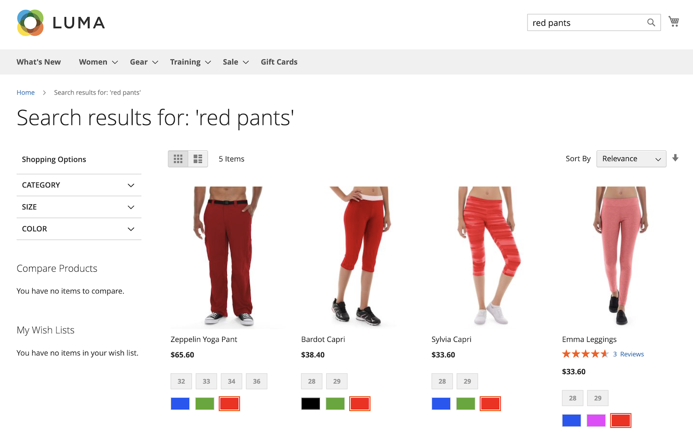

# 什麼是 [!DNL Live Search]？

[!DNL Live Search] 是一項功能，可取代Adobe Commerce中的標準搜尋功能。 此 [!DNL Live Search] 功能隨Composer一起安裝，並連線您的 [!DNL Commerce] 儲存至 [Commerce服務聯結器](../landing/saas.md). 設定後，預設搜尋文字欄位會取代為 [!DNL Live Search] 文字欄位。 [!DNL Live Search] 也會安裝產品清單頁面(PLP) Widget，在瀏覽搜尋結果時提供強大的篩選功能。

替換為 [!DNL Live Search]，您可以：

- 建立有意義的搜尋體驗，協助購物者和買家儘可能輕鬆地找到他們想要的。
- 利用AI支援的動態多面向和重新排名搜尋結果，以回應工作階段中的購物者行為。
- 使用輕量型的SaaS服務，提供輕鬆的更新並包含在您的授權中，以降低總擁有成本。
- 啟用graphQL API、Headless彈性、API沙箱環境和超快速SaaS，以獲得技術優勢。

>[!IMPORTANT]
>
>在網站搜尋方面，Adobe Commerce會提供您選項。 實施前，請檢閱 [邊界和限制](boundaries-limits.md) 資訊以確保 [!DNL Live Search] 適合您的業務需求。

## 架構

架構的Adobe Commerce端包含託管搜尋 *管理員*，同步目錄資料，以及執行查詢服務。 晚於 [!DNL Live Search] 安裝與設定完成時，Adobe Commerce會開始與SaaS服務共用搜尋和目錄資料。 此時，管理員使用者可以設定、自訂及管理搜尋 [Facet](facets.md)， [同義字](synonyms.md)、和 [銷售規則](category-merch.md).

## 快速導覽

注重速度、關聯性和易用性， [!DNL Live Search] 對購物者和商家來說都是一個遊戲規則的改變者。 請觀看以下影片，然後快速導覽 [!DNL Live Search] 從店面。

>[!VIDEO](https://video.tv.adobe.com/v/3418679?quality=12&learn=on)

如需有關使用和設定「即時搜尋」的更深入影片，請參閱 [完整示範： [!DNL Live Search]](https://experienceleague.adobe.com/en/docs/commerce-learn/tutorials/getting-started/capabilities/live-search-full-demonstration) 主題。

### 依輸入內容搜尋

[!DNL Live Search] 在中，以建議的產品和排名最前的搜尋結果的縮圖影像回應 [彈出視窗](storefront-popover.md) 當購物者輸入查詢至 [搜尋](https://experienceleague.adobe.com/en/docs/commerce-admin/catalog/catalog/search/search) 方塊。 此 [產品詳細資料](https://experienceleague.adobe.com/en/docs/commerce-admin/start/storefront/storefront) 當購物者按一下建議或精選產品時顯示頁面。 A _檢視全部_ 彈出視窗頁尾中的連結會顯示搜尋結果頁面。

[!DNL Live Search] 針對兩個或多個字元的查詢，傳回「鍵入時搜尋」結果。 若為部分相符，則每個字的字元數上限為20。 查詢中的字元數無法設定。 彈出視窗包括`name`， `sku`、和 `category_ids` 欄位。

### 檢視所有搜尋結果

若要列出「鍵入時搜尋」查詢傳回的所有產品，請按一下 _檢視全部_ 在彈出視窗的頁尾中。

### 使用Facet篩選的搜尋

篩選搜尋會使用多個屬性值的維度，或 [Facet](facets.md)，以作為搜尋條件。 篩選器的選取專案由商家定義，並會根據傳回的產品而變更，而最常使用的多面向會釘選至清單頂端。

使用Facet做為URL引數：`http://yourwebsite.com?color=red`和「即時搜尋」會根據這些屬性值篩選結果。

### 同義字

[同義字](synonyms.md) 透過包含購物者可能使用的與目錄不同的字詞，來擴大觸及面並強化查詢的焦點。 您可以微調同義字字典，讓購物者持續參與並前往購買路徑。

### 銷售規則

銷售 [規則](rules.md) 使用可新增邏輯和事件以搜尋的if-then陳述式來塑造購物體驗。 您可以輕鬆提升或隱藏促銷活動、季節或其他時段之產品。

### 搜尋詞支援

[!DNL Live Search] 支援Commerce [搜尋字詞重新導向](https://experienceleague.adobe.com/en/docs/commerce-admin/catalog/catalog/search/search-terms). 例如，使用者可以搜尋「運費」之類的辭彙，並直接進入運費頁面。

## Live Search元件

- [!DNL Live Search] [彈出視窗Widget](storefront-popover.md) 是在包含搜尋結果的搜尋欄位下開啟的方塊。
- [產品清單頁面Widget](plp-styling.md) (PLP)提供可搜尋的產品清單頁面，支援多面向和同義字。 Widget已安裝並在Live Search 4.0.0+中啟用。
- (**已棄用**)搜尋配接器是PLP Widget的前身，並隨Live Search &lt; 4.0.0安裝。如果您使用的Live Search版本早於4.0.0，Commerce建議您升級以享受PLP Widget功能和未來改進的優點。

## [!DNL Live Search] 工作區

此 [!DNL Live Search] [工作區](workspace.md) 是管理員中您設定的區域 [!DNL Live Search] 同義字、多面向和類別銷售等功能。

## 活動

[!DNL Live Search] 使用 [事件](events.md) 以計算 [智慧型銷售](category-merch.md) 和 [績效](performance.md) 控制面板。 事件會隨預設實施提供。 Headless店面事件應手動啟用。
