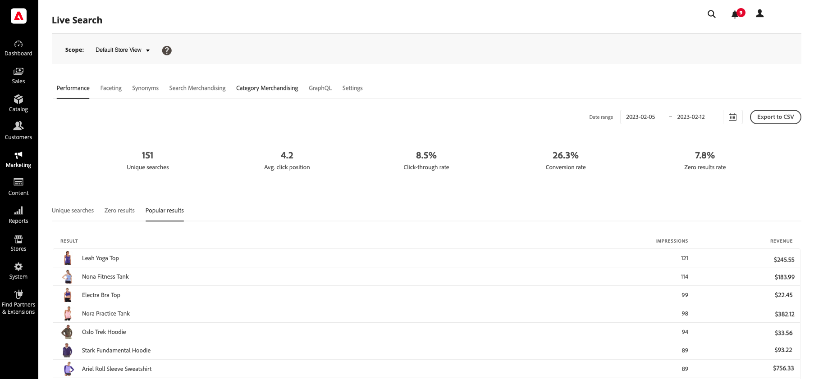

# 效能

的 [!DNL Live Search] 效能控制板可讓消費者深入瞭解使用的搜索詞。 該資訊可用於識別趨勢、增加點擊次數和提高轉換率。 「效能」面板提供特定日期範圍的搜索度量的快照，並包括以下報告：

* 唯一搜索
* 零結果
* 熱門結果

## 查看報告

1. 要輸入 **日期範圍**，按一下日曆()並執行下列操作之一：

   * 要指定單個日期，請按兩下日曆上的日期。
   * 要指定日期範圍，請按一下日曆上的第一個日期和最後一個日期。

   

1. 按一下要查看的報表頁籤。

   

## 欄位說明

| 快照資料 | 說明 |
|--- |--- |
| 唯一搜索 | 指定日期範圍的唯一搜索總數。 同一購物者的多次搜索，即使針對同一查詢，如果分別提交超過一小時，也被視為唯一的。 |
| 點擊率 | 與購物者點擊產品結束的搜索百分比。 例如，如果購物者搜索「褲子」和「襯衫」，然後在「襯衫」搜索中按一下一個結果，點擊率為50%。 |
| 轉換率 | 購物者購買的產品百分比與購物者在指定日期範圍內點擊的產品數量之比。 例如，如果購物者在跨距內查看6個產品，按一下1，然後進行購買，則交互的轉換率為100%。   轉換率不受給定產品的視圖數的影響。 例如，如果購物者使用搜索，但不按一下任何產品，則轉換率保持不變。 |
| 零結果率 | 不返回指定日期範圍結果的唯一搜索的百分比。 例如，如果購物者兩次搜索「fjjajfjfjf」（沒有結果），一次搜索「褲子」（有結果），則零結果率為66.67%。 |
| 平均 按一下位置 | 基於對指定日期範圍的唯一搜索的平均點擊率的相對位置。 |

| 報表 | 說明 |
|--- |--- |
| 唯一搜索 | 列出在指定日期範圍內使用的唯一搜索查詢。 報告資料的計算方式與唯一搜索快照資料的計算方式相同。 如果購物者鍵入兩次相同的搜索查詢，但相差超過一小時，則搜索被視為兩個唯一的搜索。 報告限制：前500個術語 |
| 零結果 | 列出未返回結果的搜索查詢以及在指定日期範圍內使用的次數。 報告限制：前500個術語 |
| 熱門結果 | 列出在指定日期範圍內接收最多視圖的產品名稱。 熱門結果僅根據觀感計算，不受點擊次數或收入的影響。 報告限制：前500個術語 |
