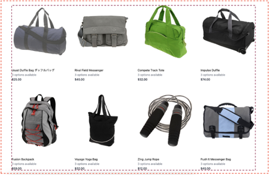
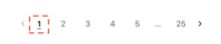
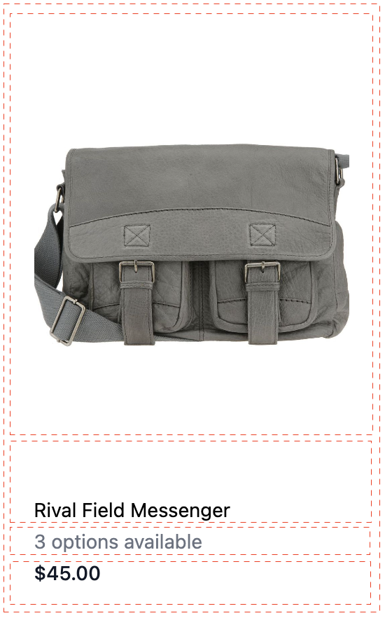

# 產品清單頁面Widget

此 [!DNL Live Search Product Listing Page Widget] (PLP)使用商務服務平台，提供效能、可搜尋和可刻面的產品清單頁面。 本主題說明如何啟用和設定PLP介面工具集的樣式。

## 啟用PLP介面工具集

當 [!DNL Live Search] 服務時，預設搜尋功能會轉換為 [!DNL Live Search] 自動。
必須在「管理員」中啟用PLP介面工具集。

1. 前往 **商店** >設定> **設定** > **[!DNL Live Search]** > **店面功能** 設定 **啟用產品清單小工具** 「是」。
1. 選擇 **儲存設定** 以儲存設定。

## 樣式範例

您可以自訂PLP介面工具集的外觀和風格，以符合您的網站，使用 [CSS](https://developer.adobe.com/commerce/frontend-core/guide/css/).

>[!NOTE]
>
>不會繼承Adobe Commerce主題中具有自訂類別的元素。 這些元素必須由其特定類定位，才能與自訂類匹配；主要動作類別無法用於介面工具集按鈕。
>將繼承CSS內的一般目標元素； `button` 會套用至介面工具集按鈕。

突出顯示的div包含目標類 `ds-sdk-product-item__product-name`.


新增規則以使產品成為大寫，借此自訂產品名稱。

```css
.ds-sdk-product-item__product-name {
 text-transform: uppercase;
}
```


## CSS類

### 產品清單

* `.ds-sdk-product-list`:外div
* `.ds-sdk-product-list__grid`:內div



#### 產品清單分頁

* `.ds-plp-pagination`


* `.ds-plp-pagination_item`


* `.ds-plp-pagination_item--current`



### 介面工具集

* `.ds-widgets`:外div
* `.ds-widgets__actions`:左側內div
* `.ds-widgets__results`:右側內div


### 排序下拉式清單

* `.ds-sdk-sort-dropdown`


* `.ds-sdk-sort-dropdown__button`


* `.ds-sdk-sort-dropdown__items`


* `.ds-sdk-sort-dropdown__items--item`


* `.ds-sdk-sort-dropdown__items--item-selected`


* `.ds-sdk-sort-dropdown__items--item-active`


### Facet

* `.ds-plp-facets`
* `.ds-plp-facets__header`
* `.ds-plp-facets__header_title`
* `.ds-plp-facets__header__clear-all`

{width="350"}

* `.ds-plp-facets__pills`
* `.ds-sdk-pill`

{width="350"}

* `.ds-sdk-pill__label`
* `.ds-sdk-pill__cta`

{width="350"}

* `.ds-plp-facets__list`

{width="350"}

* `.ds-sdk-input`
* `.ds-sdk-input__label`
* `.ds-sdk-input__options`
* `.ds-sdk-input_fieldset_show-more`


* `.ds-sdk-labelled-input`


* `.ds-sdk-labelled-input__input`
* `.ds-sdk-labelled-input__label`


### 產品項目

* `.ds-sdk-product-item`
* `.ds-sdk-product-item__image`
* `.ds-sdk-product-item__product-name`
* `.ds-sdk-product-item__product-options`
* `.ds-sdk-product-price`
   * `.ds-sdk-product-price--no-discount`
   * `.ds-sdk-product-price--grouped`
   * `.ds-sdk-product-price--bundle`
   * `.ds-sdk-product-price--discount`



### 載入

* `.ds-sdk-loading`
* `.ds-sdk-loading__spinner`
* `.ds-sdk-loading__spinner-label`


