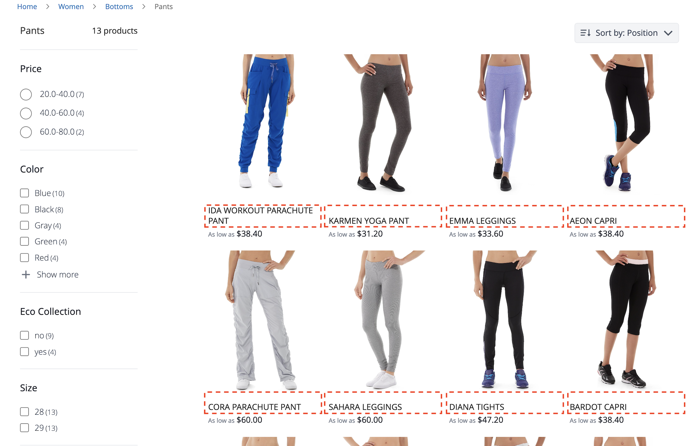
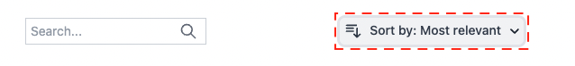
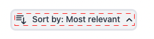
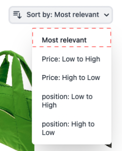
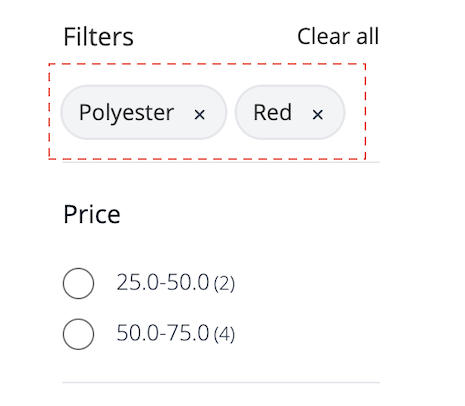
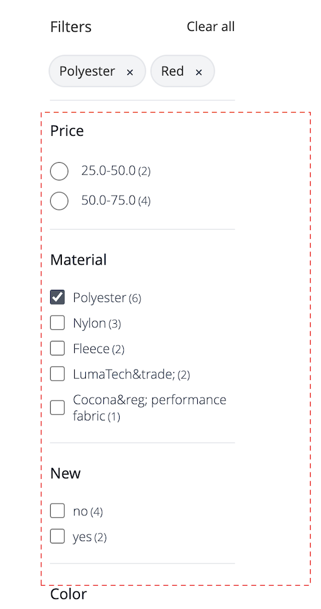
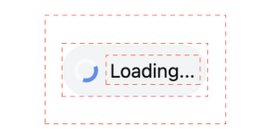

# 產品清單頁面構件

的 [!DNL Live Search Product Listing Page Widget] (PLP)使用Commerce Services平台提供效能、可搜索和可刻面的產品清單頁。 本主題介紹如何啟用和設定PLP小部件的樣式。

## 啟用PLP構件

當 [!DNL Live Search] 服務已安裝，預設搜索功能將轉換為 [!DNL Live Search] 的下界。
必須在管理中啟用PLP構件。

1. 轉到 **商店** >設定> **配置** > **[!DNL Live Search]** > **店面功能** 設定 **啟用產品清單小部件** &quot;是&quot;
1. 選擇 **保存配置** 按鈕。

## 樣式示例

您可以自定義PLP小部件的外觀，使其與站點匹配 [CSS](https://developer.adobe.com/commerce/frontend-core/guide/css/)。

>[!NOTE]
>
>不繼承在Adobe Commerce主題中具有自定義類的元素。 這些元素必須由其特定類作為目標，才能與自定義類匹配；主操作類不能用於小部件按鈕。
>將繼承CSS中的通用目標元素； `button` 將應用於小部件按鈕。

突出顯示的視頻包含目標類 `ds-sdk-product-item__product-name`。


通過添加規則使產品名稱大寫來自定義產品名稱。

```css
.ds-sdk-product-item__product-name {
 text-transform: uppercase;
}
```



## CSS類

### 產品清單

* `.ds-sdk-product-list`:外div
* `.ds-sdk-product-list__grid`:內div


#### 產品清單分頁

* `.ds-plp-pagination`


* `.ds-plp-pagination_item`


* `.ds-plp-pagination_item--current`


### 小部件

* `.ds-widgets`:外div
* `.ds-widgets__actions`:左側內div
* `.ds-widgets__results`:右側內div


### 排序下拉清單

* `.ds-sdk-sort-dropdown`



* `.ds-sdk-sort-dropdown__button`



* `.ds-sdk-sort-dropdown__items`


* `.ds-sdk-sort-dropdown__items--item`


* `.ds-sdk-sort-dropdown__items--item-selected`



* `.ds-sdk-sort-dropdown__items--item-active`


### 小平面

* `.ds-plp-facets`
* `.ds-plp-facets__header`
* `.ds-plp-facets__header_title`
* `.ds-plp-facets__header__clear-all`

{width="350"}

* `.ds-plp-facets__pills`
* `.ds-sdk-pill`

{width="350"}

* `.ds-sdk-pill__label`
* `.ds-sdk-pill__cta`

{width="350"}

* `.ds-plp-facets__list`

{width="350"}

* `.ds-sdk-input`
* `.ds-sdk-input__label`
* `.ds-sdk-input__options`
* `.ds-sdk-input_fieldset_show-more`


* `.ds-sdk-labelled-input`


* `.ds-sdk-labelled-input__input`
* `.ds-sdk-labelled-input__label`


### 產品物料

* `.ds-sdk-product-item`
* `.ds-sdk-product-item__image`
* `.ds-sdk-product-item__product-name`
* `.ds-sdk-product-item__product-options`
* `.ds-sdk-product-price`
   * `.ds-sdk-product-price--no-discount`
   * `.ds-sdk-product-price--grouped`
   * `.ds-sdk-product-price--bundle`
   * `.ds-sdk-product-price--discount`


### 正在載入

* `.ds-sdk-loading`
* `.ds-sdk-loading__spinner`
* `.ds-sdk-loading__spinner-label`


