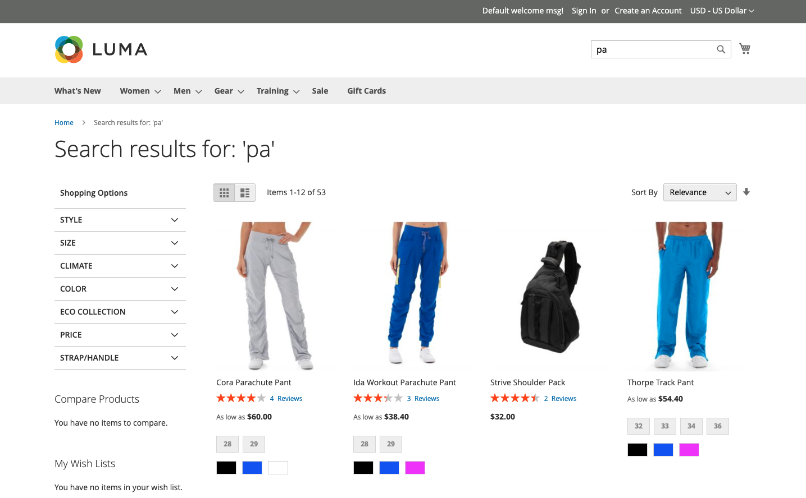

# 快速導覽

注重速度、關聯性和易用性， [!DNL Live Search] 對購物者和商家來說都是一個遊戲規則的改變者。 請跟隨並快速導覽 [!DNL Live Search] 從店面。

## 依輸入內容搜尋

[!DNL Live Search] 在中，以建議的產品和排名最前的搜尋結果的縮圖影像回應 [彈出視窗](storefront-popover.md) 當購物者輸入查詢至 [搜尋](https://experienceleague.adobe.com/docs/commerce-admin/catalog/catalog/search/search.html#quick-search) 方塊。 此 [產品詳細資料](https://experienceleague.adobe.com/docs/commerce-admin/start/storefront/storefront.html#product-page) 當購物者按一下建議或精選產品時，頁面就會顯示。 A _檢視全部_ 彈出視窗頁尾中的連結會顯示搜尋結果頁面。

[!DNL Live Search] 針對兩個或多個字元的查詢，傳回「鍵入時搜尋」結果。 若為部分相符，則每個字的字元數上限為20。 查詢中的字元數無法設定。 彈出視窗中包含下列欄位： `name`， `sku`、和 `category_ids`.

## 檢視所有搜尋結果

若要列出「鍵入時搜尋」查詢傳回的所有產品，請按一下 _檢視全部_ 在彈出視窗的頁尾中。

## 使用Facet篩選的搜尋

篩選搜尋會使用多個屬性值的維度，或 [Facet](facets.md)，以作為搜尋條件。 篩選器的選取專案由商家定義，並會根據傳回的產品而變更，而最常使用的多面向會釘選至清單頂端。

使用Facet做為URL引數：`http://yourwebsite.com?color=red`和「即時搜尋」會根據這些屬性值篩選結果。

## 同義字

[同義字](synonyms.md) 透過包含購物者可能使用的與目錄不同的字詞，來擴大觸及面並強化查詢的焦點。 您可以微調同義字字典，讓購物者持續參與並前往購買路徑。

## 銷售規則

銷售 [規則](rules.md) 使用可新增邏輯和事件以搜尋的if-then陳述式來塑造購物體驗。 您可以輕鬆提升或隱藏促銷活動、季節或其他時段之產品。
