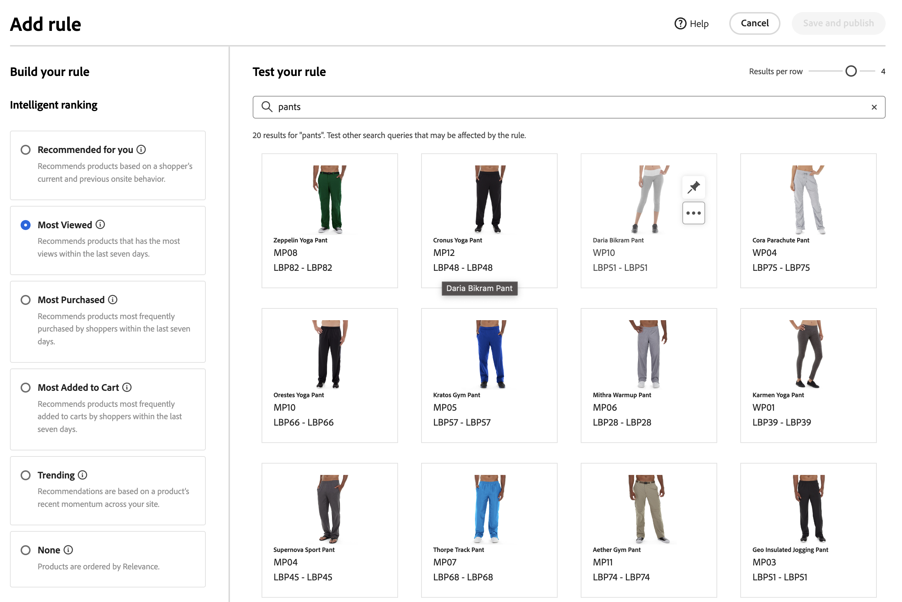
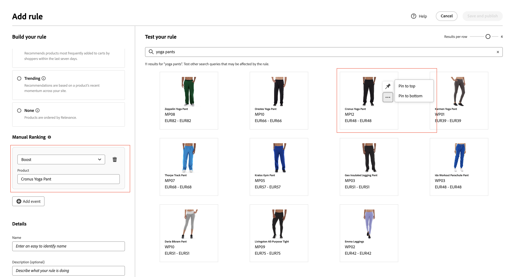

# 新增規則

若要建立規則，第一步是使用規則編輯器，定義購物者查詢文字中會觸發相關事件的條件。 接著，完成規則詳細資料、測試結果並發佈規則。

## 新增規則

1. 在Admin中，前往 **行銷** > SEO與搜尋> **[!DNL Live Search]**.
1. 設定 **範圍** 以識別 [存放區檢視](https://experienceleague.adobe.com/docs/commerce-admin/start/setup/websites-stores-views.html#scope-settings) 規則的套用位置。
1. 按一下 **規則** 標籤。
1. 按一下 **新增規則** 以啟動規則編輯器。

## 條件

條件為觸發事件的需求。 一個規則最多可以有10個條件和25個事件。

>[!NOTE]
>
>目前無法將規則鎖定在特定客戶群組。

### 單一條件

1. 在 *建置您的規則*，選取 **條件** 並依照指示完成陳述。

   * 搜尋查詢包含 — 輸入必須在購物者查詢中的文字字串。 「符合」設定會決定購物者的查詢與目錄相符的程度。 選項：  任何 — 購物者的查詢文字的任何部分都可以符合條件。 全部 — 所有購物者的查詢必須符合條件。
   * 搜尋查詢為 — 輸入與購物者的查詢完全相符的文字字串。 例如：「瑜伽褲」。 規則與 `Search query is` 並符合 `All` 只能有一個條件。
   * 搜尋查詢開頭為 — 輸入必須在購物者查詢開頭的字元或文字字串。
   * 搜尋查詢結尾為 — 輸入必須在購物者查詢結尾的字元或文字字串。

   結果會立即顯示在 *測試您的規則* 窗格並依優先順序編號。 您可以使用 *每列結果* 滑桿可變更每列的產品數。

   

1. 若要測試其他查詢，請變更 *測試您的規則* 搜尋方塊並按 **傳回**.
最初，測試窗格會從「條件」搜尋方塊轉譯查詢。 但是現在它正在從測試查詢方塊轉譯查詢。 測試窗格一次只轉譯一個查詢。
1. 如果您喜歡結果，請更新 *條件* 搜尋方塊。 然後，按一下頁面上的任何位置，以更新測試窗格中的結果。
1. 若要建立具有一個條件的簡單規則，請前往步驟3： [新增事件](#events).

### 多個條件

1. 若要建立包含多個條件的規則，請按一下 **新增條件**.
一個規則最多可以有十個條件。 結合兩個條件的邏輯運運算元是以目前的 *符合* 設定。 根據預設， *符合* 是 `All` 邏輯運運算元為 `AND`.

   

1. 選取第二個條件並輸入必要的查詢文字。

1. 若要變更規則的邏輯，請變更 **符合** 此設定可決定購物者的搜尋條件必須符合查詢條件的程度。 設定 **符合** 變更為下列其中一項：

   * 任何 — （預設）規則中的所有邏輯運運算元都設為 `OR` 而結果會顯示在測試窗格中。
   * 全部 — 規則中的所有邏輯運運算元都設為 `AND` 而結果會顯示在測試窗格中。

   此 *符合* 值決定用來連線多個條件的邏輯運運算元。 變更 *符合* 設定會變更規則中的所有邏輯運運算元。 無法合併 `AND` 和 `OR` 在同一規則中。

   在此範例中，不是搜尋「yoga pants」，而是有兩個不同的查詢可搜尋「yoga」或「pants」。 此規則較少具體，且在店面觸發的頻率遠高於其他規則。

   

1. 若要新增其他條件，請按一下 **新增條件** 並重複此程式。

## 排名型別

排名會結合使用者行為和網站統計資料，以判斷產品排名。
商店擁有者可設定下列型別的排名策略：

* 最多購買：這會根據過去7天內每個SKU的總購買量來排名產品。
* 加入購物車次數最多 — 依過去7天內全部「加入購物車」活動排名。
* 檢視次數最多：排名我過去7天每個SKU的總檢視次數。
* 為您推薦 — 使用 `viewed-viewed` 資料點 — 檢視此SKU的購物者也會檢視這些其他SKU
* 趨勢：針對背景事件回顧過去72小時的頁面檢視事件，而針對前景事件則回顧24小時
* 無：產品是依關聯性排序

1. 選取規則的策略型別。 「測試規則」視窗會顯示預期的結果。

>[!NOTE]
>
>查詢中的撇號和引號可能會導致某些語言中的排名和相關性出現一些小問題。

## 新增事件

事件是在符合定義的條件時修改搜尋結果的動作。 單一規則最多可包含25個事件。

* 提升 — 將產品在搜尋結果中移到較高的位置。
* Bury — 將SKU在搜尋結果中下移。
* 釘選產品 — 產品會顯示在頁面上選取的「位置」中。
* 隱藏產品 — 從搜尋結果中排除SKU。

釘選產品最簡單的方式是拖放。

1. 按一下並拖曳測試窗格中的產品。 將其拖放到所需位置。 產品及位置欄位會自動填入事件窗格中。

   

您也可以按一下圖示將產品釘選至其目前位置。 使用省略符號快顯選單來「釘選至頂端」或「釘選至底部」。

>[!NOTE]
>
>您只能釘選查詢中傳回的產品。

或可手動設定事件：

1. 在 *活動*，選擇 **事件** 當符合相關條件時發生。

   例如，選擇 `Hide a product`. 然後，輸入您要隱藏的產品名稱。 建議您在輸入產品時一併輸入。

1. 對於多個事件，選擇符合條件時要觸發的任何其他事件。

## 其他詳細資料

此處輸入的資訊會顯示在 [規則詳細資料](rules-workspace.md) 面板。

1. 在 *詳細資料*，輸入 **名稱** 適用於規則。 所有規則名稱必須是唯一的。
1. 輸入簡報 **說明** 規則的。
1. 輸入 **開始日期** 和 **結束日期** 讓規則處於作用中狀態，或從行事曆中選擇日期。

   若要選取日期範圍，請按一下第一個日期並拖曳以選取範圍。

   

## 正在完成規則

1. 在測試窗格中檢查規則的結果。
1. 如果規則有多個查詢，請測試每個可能受規則影響的查詢。
1. 完成後，按一下 **儲存並發佈**.

   規則會新增至規則工作區的清單中。

1. 雖然使用中的規則會立即生效，但您可能需要等候最多15分鐘，才能重新整理店面中的快取查詢結果。

## 欄位說明

### 條件(if)

| 條件 | 說明 |
|--- |--- |
| 搜尋查詢包含 | 購物者的查詢中包含的字元或文字字串。 購物者的查詢只需要符合單一字元即可符合此條件。 |
| 搜尋查詢為 | 完全符合購物者查詢的字元或文字字串。 使用此條件時，無法構成具有多個條件的複雜查詢。 |
| 搜尋查詢開頭為 | 購物者的查詢以此字元或文字字串開頭。 |
| 搜尋查詢結尾為 | 購物者的查詢以這個字元或文字字串結束。 |

### 邏輯運運算元

| 運算子 | 說明 |
|--- |--- |
| 或 | （預設）邏輯運運算元 `OR` 會比較兩個條件並符合在至少一個條件為true時觸發事件的需求。 |
| 和 | 邏輯運運算元 `AND` 會比較兩個條件並符合觸發事件的要求（如果兩個條件皆為true）。 |

### 比對運運算元

| 運算子 | 說明 |
|--- |--- |
| 任何 | 將規則中的所有邏輯運運算元變更為 `OR` 和會傳回一組相符的產品。 |
| 全部 | 將規則中的所有邏輯運運算元變更為 `AND` 和會傳回一組相符的產品。 |

### 活動

| Event | 說明 |
|--- |--- |
| 提升 | 在搜尋結果中將SKU或SKU範圍移到較高的位置。 每個報表在測試搜尋結果中都會標示「已提升」預覽徽章。 |
| Bury | 將搜尋結果中的SKU或SKU範圍移到較低的位置。 在測試搜尋結果中，每個都標有「已掩埋」的預覽徽章。 |
| 釘選產品 | 將單一SKU附加至搜尋結果中的特定位置。 產品在測試搜尋結果中標有「已釘選」預覽徽章。 |
| 隱藏產品 | 從搜尋結果中排除SKU或SKU範圍。 |

### 詳細資料

| 欄位 | 說明 |
|--- |--- |
| 名稱 | 規則的名稱。 規則名稱必須是唯一的。 |
| 開始日期 | 規則的開始日期（如果已排程）。 |
| 結束日期 | 規則的結束日期（如果已排程）。 |
| 說明 | 規則的簡短說明。 |
