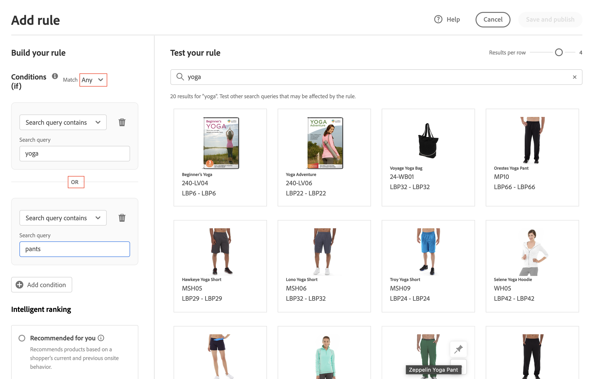

# 新增規則

若要建立規則，第一步是使用規則編輯器定義購物者查詢文字中觸發相關事件的條件。 然後，完成規則詳細資訊、測試結果並發佈規則。

## 步驟1:新增規則

1. 在管理員中，前往 **行銷** > SEO與搜尋> **即時搜尋**.
1. 設定 **範圍** 識別 [商店檢視](https://docs.magento.com/user-guide/configuration/scope.html) 規則的位置。
1. 按一下 **規則** 標籤。
1. 按一下 **新增規則** 來啟動規則編輯器。

   

## 步驟2:說明條件

條件是觸發事件的要求。 規則最多可包含10個條件和25個事件。

### 單一條件

1. 在 *建立規則*，請選取 **條件** 並按照指示完成陳述。

   * 搜尋查詢包含 — 輸入購物者查詢中必須包含的文字字串。 「符合」設定決定購物者查詢與目錄相符的程度。 選項：  任何 — 購物者查詢文字的任何部分皆可符合條件。 全部 — 所有購物者的查詢都必須符合條件。
   * 搜尋查詢是 — 輸入與購物者查詢完全相符的文字字串。 例如：「瑜伽褲」。 規則 `Search query is` 和符合 `All` 只能有一個條件。
   * 搜尋查詢的開頭為 — 輸入必須位於購物者查詢開頭的字元或文字字串。
   * 搜尋查詢的結尾為 — 輸入必須位於購物者查詢結尾的字元或文字字串。

   結果會立即顯示在 *測試您的規則* 窗格，並按優先順序編號。 您可以使用 *每行結果* 右上角的滑桿，以變更每一列的產品數量。

   

1. 若要測試其他查詢，請變更 *測試您的規則* 搜索框和按鍵 **傳回**.
最初，測試窗格會從「條件」搜尋方塊轉譯查詢。 但現在它正從測試查詢方塊轉譯查詢。 測試窗格一次只呈現一個查詢。

   

1. 如果您喜歡結果，請更新 *條件* 搜索框。 然後，按一下頁面上的任何位置，以更新測試窗格中的結果。
1. 若要使用一個條件建立簡單規則，請前往步驟3: [新增事件](#events).

### 多個條件

1. 若要建立包含多個條件的規則，請按一下 **新增條件**.
規則最多可以有10個條件。 連接兩個條件的邏輯運算子基於當前 *符合* 設定。 依預設， *符合* is `All` 邏輯運算子是 `AND`.

   

1. 選擇第二個條件並輸入所需的查詢文本。

   

1. 若要變更規則的邏輯，請變更 **符合** 設定，以判斷購物者的搜尋條件必須符合查詢條件的距離。 設定 **符合** 至下列其中一項：

   * Any — （預設）規則中的所有邏輯運算子都設為 `OR` 結果會出現在測試窗格中。
   * 全部 — 規則中的所有邏輯運算子都設定為 `AND` 結果會出現在測試窗格中。

   此 *符合* 值決定用於連接多個條件的邏輯運算子。 變更 *符合* 設定會變更規則中的所有邏輯運算子。 無法結合 `AND` 和 `OR` 在同一規則中。

   在本例中，除了搜索「瑜伽褲」之外，還有兩個不同的查詢可搜索「瑜伽」或「褲子」。 此規則的特定性較低，且在店面觸發的頻率較高。

   

1. 若要新增其他條件，請按一下 **新增條件** 並重複這個過程。

## 步驟3:新增事件

事件是在符合條件時變更搜尋結果的動作。 單一規則最多可包含25個事件。

1. 在 *事件*，選擇 **事件** 以在符合相關條件時進行。

   例如，選擇 `Pin a product`. 然後，輸入要釘上的產品名稱。 如果您需要協助，可在測試窗格中找到名稱。
然後，輸入 *位置* 顯示被固定產品的位置。 產品會移至測試窗格中的新位置，並加上 *固定* 預覽徽章。

   

1. 若是多個事件，請選擇您要在符合條件時觸發的任何其他事件。

   * 提升 — 選取提升。 然後，輸入您要在搜尋結果中移至較高位置的產品名稱或SKU。 在測試窗格中，每個提升的產品都有 *提升* 預覽徽章。
   * Bury — 在搜尋結果中降低SKU。 每個SKU都標有 *埋* 在測試窗格中預覽徽章。
   * 固定產品 — 輸入產品名稱或SKU。 然後，在搜尋結果中選取應該顯示產品的位置。 產品標有 *固定* 在測試窗格中預覽徽章。
   * 隱藏產品 — 從搜尋結果中排除SKU。

## 步驟4:完成詳細資訊

此處輸入的資訊會顯示在 [規則詳細資料](rules-workspace.md) 中。

1. 在 *詳細資料*，請輸入 **名稱** 規則。
1. 輸入簡報 **說明** 規則。
1. 輸入 **開始日期** 和 **結束日期** 讓規則生效，或從日曆中選擇日期。

   若要選取日期範圍，請按一下第一個日期，然後拖曳以選取範圍。

   

## 步驟5:測試規則

1. 在測試窗格中檢查規則的結果。
1. 如果規則有多個查詢，請測試每個可能受規則影響的查詢。

## 步驟6:儲存並發佈

1. 完成後，按一下 **儲存並發佈**.

   規則會新增至規則工作區中的清單。

1. 雖然作用中規則會立即生效，但快取查詢結果可能必須等待15分鐘才會重新整理店面。

## 欄位說明

### 條件(if)

| 條件 | 說明 |
|--- |--- |
| 搜索查詢包含 | 購物者查詢中包含的字元或文字字串。 購物者的查詢只需要符合單一字元即可符合此條件。 |
| 搜索查詢為 | 完全符合購物者查詢的字元或文字字串。 使用此條件時，無法構成具有多個條件的複雜查詢。 |
| 搜索查詢的開頭為 | 購物者的查詢以此字元或文字字串開頭。 |
| 搜索查詢的結尾為 | 購物者的查詢以此字元或文字字串結尾。 |

### 邏輯運算子

| 運算元 | 說明 |
|--- |--- |
| 或 | （預設）邏輯運算子 `OR` 會比較兩個條件，並符合條件，以在至少一個條件為true時觸發事件。 |
| 和 | 邏輯運算子 `AND` 會比較兩個條件，並符合條件，若兩者皆為真，則觸發事件。 |

### 匹配運算子

| 運算元 | 說明 |
|--- |--- |
| 任何 | 將規則中的所有邏輯運算子變更為 `OR` 和會傳回相符產品集。 |
| 全部 | 將規則中的所有邏輯運算子變更為 `AND` 和會傳回相符產品集。 |

### 事件

| Event | 說明 |
|--- |--- |
| 提升 | 在搜尋結果中將SKU或SKU範圍移得較高。 測試搜尋結果中會標示「提升」預覽徽章。 |
| 伯里 | 在搜尋結果中將SKU或SKU範圍移至較低位置。 測試搜尋結果中會標示「隱藏」預覽徽章。 |
| 固定產品 | 將單一SKU附加至搜尋結果中的特定位置。 產品在測試搜尋結果中會標示為「已固定」預覽徽章。 |
| 隱藏產品 | 從搜尋結果中排除SKU或SKU範圍。 |

### 詳細資料

| 欄位 | 說明 |
|--- |--- |
| 名稱 | 規則的名稱。 |
| 開始日期 | 規則的開始日期（如果已排程）。 |
| 結束日期 | 規則的結束日期（如果已排程）。 |
| 說明 | 規則的簡短說明。 |
