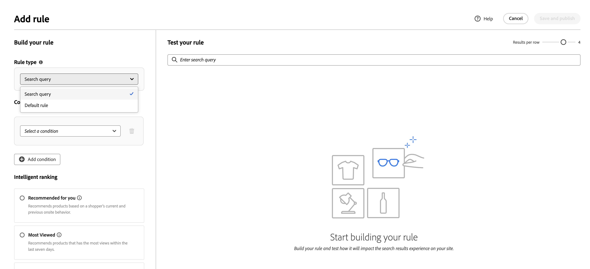

# 添加規則

要構建規則，第一步是使用規則編輯器定義觸發關聯事件的購物者查詢文本中的條件。 然後，完成規則詳細資訊，test結果，並發佈規則。

## 步驟1:添加規則

1. 在管理員中，轉到 **營銷** > SEO &amp; Search > **即時搜索**。
1. 設定 **範圍** 以識別 [商店視圖](https://docs.magento.com/user-guide/configuration/scope.html) 適用規則的地方。
1. 按一下 **規則** 頁籤。
1. 按一下 **添加規則** 啟動規則編輯器。

   

## 步驟2:描述條件

條件是觸發事件的要求。 一條規則最多可包含10個條件和25個事件。

### 單條件

1. 下 *建立規則*，選擇 **條件** 並按照說明完成陳述。

   * 搜索查詢包含 — 輸入購物者查詢中必須包含的文本字串。 「匹配」設定確定購物者查詢與目錄匹配的程度。 選項：  任意 — 購物者查詢文本的任何部分都可以匹配條件。 全部 — 購物者的所有查詢必須與條件匹配。
   * 搜索查詢為 — 輸入與購物者查詢完全匹配的文本字串。 例如：「瑜伽褲」。 規則 `Search query is` 和匹配 `All` 只能有一個條件。
   * 搜索查詢以開始 — 輸入必須位於購物者查詢開始處的文本字元或字串。
   * 搜索查詢以 — 輸入必須位於購物者查詢末尾的文本字元或字串。

   結果將立即顯示在 *Test規則* 按優先順序編號。 您可以使用 *每行結果* 右上角的滑塊以更改每行中的產品數。

   

1. 要test其他查詢，請更改 *Test規則* 搜索框和按鍵 **返回**。
最初，test窗格會從「條件」搜索框中呈現查詢。 但現在它正在從test查詢框中呈現查詢。 test窗格一次只呈現一個查詢。

   

1. 如果您喜歡結果，請更新 *條件* 的子菜單。 然後，按一下頁面上的任意位置以更新test窗格中的結果。
1. 要使用一個條件構建簡單規則，請轉至步驟3: [添加事件](#events)。

### 多個條件

1. 要構建具有多個條件的規則，請按一下 **添加條件**。
一條規則最多可以包含10個條件。 連接兩個條件的邏輯運算子基於當前 *匹配* 的子菜單。 預設情況下， *匹配* 是 `All` 邏輯運算子是 `AND`。

   

1. 選擇第二個條件並輸入所需的查詢文本。

   

1. 要更改規則的邏輯，請更改 **匹配** 設定以確定購物者的搜索條件必須與查詢條件匹配的程度。 設定 **匹配** 到以下項之一：

   * Any — （預設）規則中的所有邏輯運算子都設定為 `OR` 結果將出現在test窗格中。
   * 全部 — 規則中的所有邏輯運算子都設定為 `AND` 結果將出現在test窗格中。

   的 *匹配* 值確定用於連接多個條件的邏輯運算子。 更改 *匹配* 設定將更改規則中的所有邏輯運算子。 不可能合併 `AND` 和 `OR` 同一條規則。

   在本例中，除了搜索「瑜伽褲」外，還有兩個單獨的查詢可搜索「瑜伽」或「褲子」。 此規則不太具體，在店面觸發的次數會比在店面觸發的次數多。

   

1. 要添加其他條件，請按一下 **添加條件** 重複這個過程。

## 第3步：添加事件

事件是當滿足條件時更改搜索結果的操作。 一個規則最多可以包含25個事件。

1. 下 *事件*&#x200B;的子菜單。 **事件** 在滿足相關條件時發生。

   例如，選擇 `Pin a product`。 然後，輸入要固定的產品名稱。 如果需要幫助，可以在test窗格中找到該名稱。
然後，輸入 *位置* 要顯示被固定產品的位置。 產品將移到test窗格中的新位置，並標有 *已固定* 預覽徽章。

   

1. 對於多個事件，選擇要在滿足條件時觸發的任何其他事件。

   * Boost — 選擇Boost。 然後，輸入要在搜索結果中移動到更高位置的產品名稱或SKU。 在test窗格中，每個升級產品 *提升* 預覽徽章。
   * Bury — 在搜索結果中移動較低的SKU。 每個SKU都標有 *埋藏* 在test窗格中預覽徽章。
   * 固定產品 — 輸入產品名稱或SKU。 然後，在應顯示產品的搜索結果中選擇「位置」。 產品標有 *已固定* 在test窗格中預覽徽章。
   * 隱藏產品 — 從搜索結果中排除SKU。

## 第4步：完成詳細資訊

此處輸入的資訊將顯示在 [規則詳細資訊](rules-workspace.md) 的子菜單。

1. 下 *詳細資訊*，輸入 **名稱** 為了規則。
1. 輸入簡短資訊 **說明** 規則。
1. 輸入 **開始日期** 和 **結束日期** 規則將處於活動狀態或從日曆中選擇日期。

   要選擇日期範圍，請按一下第一個日期並拖動以選擇該範圍。

   

## 第5步：Test規則

1. 在「test」窗格中檢查規則的結果。
1. 如果規則具有多個查詢，則test每個可能受規則影響的查詢。

## 步驟6:保存和發佈

1. 完成後，按一下 **保存和發佈**。

   規則將添加到規則工作區的清單中。

1. 儘管活動規則會立即生效，但您可能需要等待15分鐘才能刷新儲存區中快取的查詢結果。

## 欄位說明

### 條件（如果）

| 條件 | 說明 |
|--- |--- |
| 搜索查詢包含 | 包含在購物者查詢中的文本字元或字串。 購物者的查詢只需匹配一個字元即可滿足此條件。 |
| 搜索查詢為 | 完全匹配購物者查詢的字元或字串。 使用此條件時，無法組成具有多個條件的複雜查詢。 |
| 搜索查詢以 | 購物者的查詢以此字元或文本字串開頭。 |
| 搜索查詢以 | 購物者的查詢以此字元或文本字串結尾。 |

### 邏輯運算子

| 運算子 | 說明 |
|--- |--- |
| 或 | （預設）邏輯運算子 `OR` 比較兩個條件，並滿足在至少一個條件為true時觸發事件的要求。 |
| 和 | 邏輯運算子 `AND` 比較兩個條件，並滿足在兩個條件都為真時觸發事件的要求。 |

### 匹配運算子

| 運算子 | 說明 |
|--- |--- |
| 任意 | 將規則中的所有邏輯運算子更改為 `OR` 並返回匹配產品集。 |
| 全部 | 將規則中的所有邏輯運算子更改為 `AND` 並返回匹配產品集。 |

### 事件

| Event | 說明 |
|--- |--- |
| 提升 | 在搜索結果中將SKU或SKU範圍移得更高。 每個都在test搜索結果中用「提升」預覽標籤進行標籤。 |
| 伯里 | 在搜索結果中移動較低的SKU或SKU範圍。 每個test搜索結果中都標有「隱藏」預覽標籤。 |
| 固定產品 | 將單個SKU附加到搜索結果中的特定位置。 產品在test搜索結果中標籤有「固定」預覽標籤。 |
| 隱藏產品 | 從搜索結果中排除SKU或SKU範圍。 |

### 詳細資訊

| 欄位 | 說明 |
|--- |--- |
| 名稱 | 規則的名稱。 |
| 開始日期 | 規則的開始日期（如果已計畫）。 |
| 結束日期 | 規則的結束日期（如果已計畫）。 |
| 說明 | 規則的簡短說明。 |
