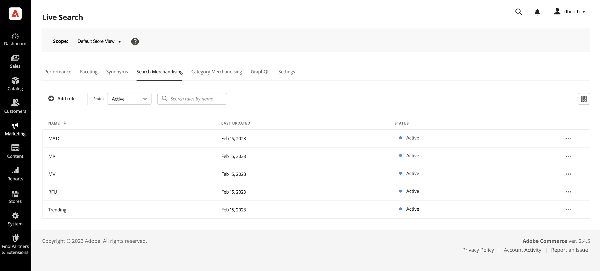
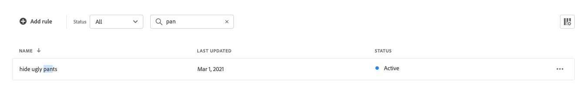

# 搜尋銷售工作區

「搜尋銷售」工作區會列出規則目前的選取專案及其狀態，並可讓您存取建立和管理規則所需的工具。 您可以從工作區中執行下列作業：

* 搜尋規則
* 檢視規則詳細資料
* 啟用/停用規則
* 刪除規則
* 存取規則編輯器

## 設定範圍

如果您的Adobe Commerce安裝包含多個商店檢視，請設定 **範圍** 至 [存放區檢視](https://experienceleague.adobe.com/docs/commerce-admin/start/setup/websites-stores-views.html#scope-settings) 您的規則套用的位置。

## 顯示/隱藏欄

1. 在右上角，按一下 **顯示/隱藏**  欄。
可見欄在選項選單中有藍色勾號。 規則名稱是唯一無法隱藏的欄。

1. 在功能表中，執行下列任一項作業：

   * 若要顯示隱藏的欄，請按一下任何沒有核取記號的欄名稱。
   * 若要隱藏可見欄，請按一下帶有核取記號的欄名稱。

## 依狀態篩選規則

1. 如果您的存放區有許多規則，您可以依狀態篩選規則以縮短清單。 依預設，「規則」清單會顯示所有規則。

1. 若只要列出具有特定狀態設定的規則，請設定 **狀態** 變更為下列其中一項：

   * 全部
   * 作用中
   * 非使用中
   * 已排程

## 依名稱尋找搜尋規則

開始輸入規則名稱，或輸入規則名稱中的任何單字。
搜尋會在您輸入時尋找相符的規則。 相符字元的字串會在找到的每個規則名稱中反白顯示。

## 檢視詳細資料

詳細資訊面板會顯示規則名稱、狀態、條件和事件、開始和結束日期、說明以及上次編輯日期。 您可以從詳細資料面板啟用、編輯和刪除規則。

1. 在 *搜尋銷售* 標籤，在網格中尋找要檢視的規則，然後按一下 **更多** (...)。
1. 按一下 **檢視詳細資料**.
您可以從「檢視詳細資料」面板執行下列任一項作業：

   * 編輯規則
   * 刪除規則
   * 啟用/停用規則

1. 若要關閉 *檢視詳細資料* 面板，按一下 **關閉** (X)的右上角。

   

## 欄說明

| 欄 | 說明 |
|--- |--- |
| 名稱 | 規則的名稱。 |
| 上次更新時間 | 上次更新規則的日期。 |
| 開始日期 | 排程規則的開始日期。 |
| 結束日期 | 排程規則的結束日期。 |
| 狀態 | 以色彩標示的狀態表示規則的目前狀態。 使用格線上方的「狀態」控制項，依狀態篩選規則。 值： 全部狀態 — 顯示所有規則，無論狀態為何。 作用中（藍色） — 僅顯示作用中的規則。 已排程（橘色） — 僅顯示已排程的規則。 非作用中（灰色） — 僅顯示非作用中的規則。 |

## 控制項

| 控制 | 說明 |
|--- |--- |
| 新增規則 | 開啟 [規則編輯器](rules-add.md). |
| 狀態 | 依狀態篩選規則清單。 選項：全部、作用中、非作用中、已排程 |
|  | 指定網格中可見的欄。 選項：上次更新、開始日期、結束日期、狀態 |
| 搜尋 | 依完整名稱或部份相符專案搜尋規則。 |
|  | 顯示可套用至所選規則的更多動作功能表。 選項：編輯、檢視詳細資訊、刪除 |

## 規則詳細資料

| 欄位 | 說明 |
|--- |--- |
| 狀態 | 規則的目前狀態。 |
| 條件 | 描述與規則關聯條件的搜尋查詢。 |
| 開始日期 | 規則生效的日期（如果已排程）。 |
| 結束日期 | 規則到期的日期（如果已排程）。 |
| 說明 | 規則的簡短說明。 |
| 上次更新時間 | 上次更新規則的日期和時間。 |
| 已啟用 | 變更規則狀態的控制項。 選項：啟用/停用 |
