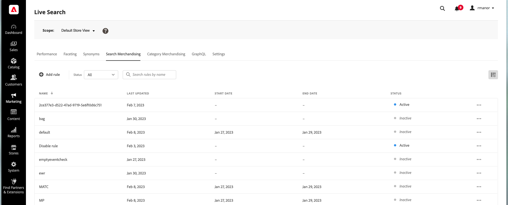

# 規則工作區

規則工作區會列出規則的目前選取項目及其狀態，並提供建立和管理規則所需工具的存取權。 從工作區，您可以：

* 搜尋規則
* 檢視規則詳細資訊
* 啟用/停用規則
* 刪除規則
* 存取規則編輯器

## 設定範圍

若您的Adobe Commerce安裝包含多個商店檢視，請設定 **範圍** 到 [商店檢視](https://experienceleague.adobe.com/docs/commerce-admin/start/setup/websites-stores-views.html#scope-settings) 規則的位置。

## 顯示/隱藏列

1. 在右上角，按一下 **顯示/隱藏**  欄。
可見的欄在選項功能表中有藍色的勾號。 規則名稱是唯一無法隱藏的欄。

   

1. 在功能表中，執行下列任一操作：

   * 要顯示隱藏列，請按一下任何列名稱，但不帶複選標籤。
   * 要隱藏可見列，請按一下帶有複選標籤的任何列名。

   

## 依狀態篩選規則

1. 如果您的商店有許多規則，您可以依狀態篩選規則以縮短清單。 依預設，規則清單會顯示所有規則。

   

1. 若要僅列出具有特定狀態設定的規則，請設定 **狀態** 至下列其中一項：

   * 全部
   * 作用中
   * 非作用中
   * 已排程

   

## 依名稱搜尋規則

開始鍵入規則的名稱，或規則名稱中的任何字詞。
搜尋會在您輸入時尋找相符的規則。 找到的每個規則名稱中都會強調顯示相符字元的字串。

## 查看詳細資訊

「詳細資訊」面板會顯示規則名稱、狀態、條件和事件、開始和結束日期、說明和上次編輯的日期。 您可以從詳細資訊面板啟用、編輯和刪除規則。

1. 在 *規則* ，在要查看的網格中查找規則，然後按一下 **更多** (...)
1. 按一下 **查看詳細資訊**.
您可以從「查看詳細資訊」面板執行下列任一操作：

   * 編輯規則
   * 刪除規則
   * 啟用/停用規則

1. 若要關閉 *查看詳細資訊* 面板，按一下 **關閉** (X)。

   

## 欄說明

| 欄 | 說明 |
|--- |--- |
| 名稱 | 規則的名稱。 |
| 上次更新 | 上次更新規則的日期。 |
| 開始日期 | 排程規則的開始日期。 |
| 結束日期 | 排程規則的結束日期。 |
| 狀態 | 色碼狀態表示規則的目前狀態。 使用網格上方的「狀態」控制項，依狀態篩選規則。 值： 全部狀態 — 顯示所有規則（無論狀態如何）。 作用中（藍色） — 僅顯示作用中的規則。 已排程（橘色） — 僅顯示已排程規則。 非作用中（灰色） — 僅顯示非作用中規則。 |

## 控制項

| 控制 | 說明 |
|--- |--- |
| 新增規則 | 開啟 [規則編輯器](rules-add.md). |
| 狀態 | 依狀態篩選規則清單。 選項：全部、活動、非活動、已排程 |
|  | 指定網格中可見的列。 選項：上次更新，開始日期，結束日期，狀態 |
| 搜尋 | 依全名或部分相符搜尋規則。 |
|  | 顯示可套用至所選規則的更多動作功能表。 選項：編輯，查看詳細資訊，刪除 |

## 規則詳細資訊

| 欄位 | 說明 |
|--- |--- |
| 狀態 | 規則的目前狀態。 |
| 條件 | 描述與規則關聯的條件的搜索查詢。 |
| 開始日期 | 規則生效的日期（如果已排程）。 |
| 結束日期 | 規則的到期日（如果已排程）。 |
| 說明 | 規則的簡短說明。 |
| 上次更新 | 上次更新規則的日期和時間。 |
| 已啟用 | 可變更規則狀態的控制項。 選項：啟用/停用 |
