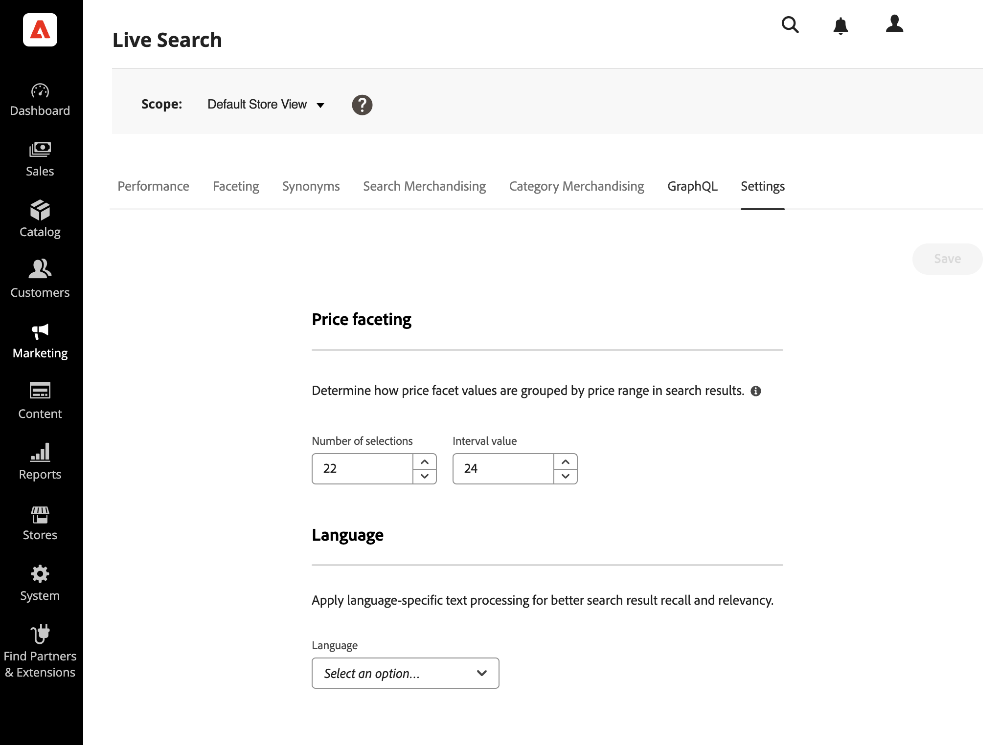

# 設定

使用 *設定* 頁簽來設定價格面向範圍和間隔，這些範圍和間隔在店面中作為搜索篩選器可用。 價格面向設定為靜態而非動態，且不以搜尋結果為基礎。

您可以指定價格範圍組的數量以及價格值在它們之間的分佈方式。 每個價格範圍與前一組重疊1。 例如，間隔為20的五個群組會建立下列價格範圍：0-20、20-40、40-60、60-80和>80。 如果目錄中沒有足夠的產品來填滿所有已定義的範圍，則可用群組的顯示會相應調整。 例如：0-20、60-80、>80。

## 設定價格面群組

1. 在管理員中，前往 **行銷** > *SEO與搜尋* > **[!DNL Live Search]**.
1. 在 **設定** 標籤 *價格面向*，請執行下列動作：
   * 輸入 **選擇數**，或價格分組。 最多可定義50種價格分組。
   * 輸入 **間隔值**，或每個群組的價格範圍。 最大值為10,000。
1. 按一下 **儲存**.

   更新後的設定需要約15分鐘才能在店面使用。

## 欄位說明

| 欄位 | 說明 |
|--- |--- |
| 選擇數 | 指定在店面中用作搜索篩選器的價格範圍分組數。 預設值：8，最大值：50 |
| 間隔值 | 指定每個組的價格範圍間隔。 例如，區間值為20的五個選擇將建立5組0-20、20-40、40-60、60-80和>80。 預設值：5，最大值：1萬 |
