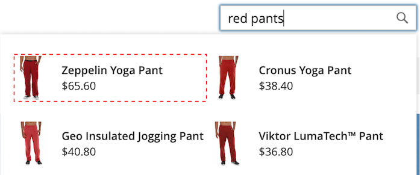
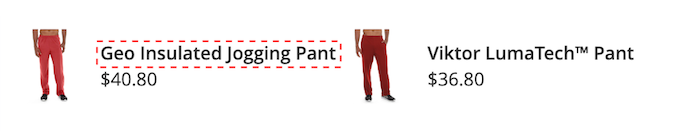

# 樣式 [!DNL Popover] 元素

此 [[!DNL storefront popover]](storefront-popover.md) 一律顯示產品 `name` 和 `price`，且無法設定欄位的選取。 不過， [!DNL popover] 元素可使用CSS類別來設定樣式。 例如，下列宣告會變更 [!DNL popover] 容器和頁尾。

```css
.livesearch.popover-container {
    background-color: lavender;
}

.livesearch.view-all-footer {
    background-color: magenta;
}
```

## 容器可見度

的父元件 `.livesearch.popover-container` is `.search-autocomplete`.  此 `.active` 類別表示容器的可見性。 此 `.active` 當 [!DNL popover] 開啟。

```css
.search-autocomplete.active   /* visible */
.search-autocomplete          /* not visible */
```

有關樣式店面元素的詳細資訊，請參閱 [階層式樣式表(CSS)](https://devdocs.magento.com/guides/v2.4/frontend-dev-guide/css-topics/css-overview.html) 在 [前端開發人員指南](https://devdocs.magento.com/guides/v2.4/frontend-dev-guide/bk-frontend-dev-guide.html).

## 類別選取器

下列類別選取器可用來設定中的容器和產品元素的樣式 [!DNL popover].

* `.livesearch.popover-container`
* `.livesearch.view-all-footer`
* `.livesearch.products-container`
* `.livesearch.product-result`
* `.livesearch.product-name`
* `.livesearch.product-price`

### 容器類選擇器

#### .livesearch.poopver-container

![[!DNL Popover] 容器](assets/livesearch-popover-container.png)

#### .livesearch.view-all-footer


### 產品類別選取器

#### .livesearch.products-container


#### .livesearch.product-result



#### .livesearch.product-name



#### .livesearch.product-price


## 使用修改的主題 {#working-with-modified-theme}

此 [!DNL storefront popover] 可與自訂 [主題](https://devdocs.magento.com/guides/v2.3/frontend-dev-guide/themes/theme-overview.html) 會繼承 *盧馬*. 此 `top.search` 在 `header-wrapper` 的 `Magento_Search` 不得修改模組。

```html
<referenceContainer name="header-wrapper">
   <block class="Magento\Framework\View\Element\Template" name="top.search" as="topSearch" template="Magento_Search::form.mini.phtml">
      <arguments>
         <argument name="configProvider" xsi:type="object">Magento\Search\ViewModel\ConfigProvider</argument>
      </arguments>
   </block>
</referenceContainer>
```

## 停用 [!DNL popover]

若要停用 [!DNL popover] 並恢復標準 [快速搜尋](https://docs.magento.com/user-guide/catalog/search-quick.html) 功能，請輸入以下命令：

```bash
bin/magento module:disable Magento_LiveSearchStorefrontPopover
```
