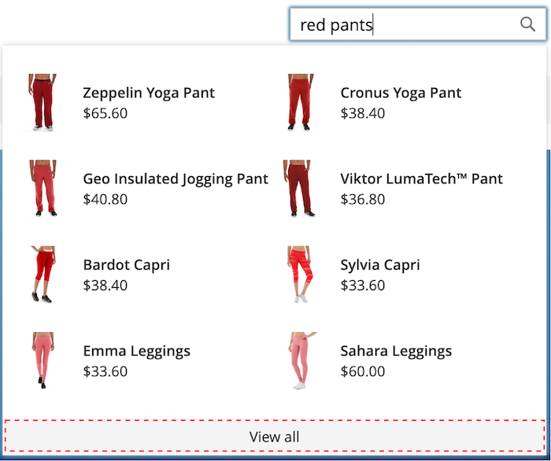

# 造型 [!DNL Popover] 元素

的 [[!DNL storefront popover]](storefront-popover.md) 始終顯示產品 `name` 和 `price`，且無法配置欄位的選擇。 但是， [!DNL popover] 元素可以使用CSS類設定樣式。 例如，以下聲明更改了 [!DNL popover] 容器和頁腳。

```css
.livesearch.popover-container {
    background-color: lavender;
}

.livesearch.view-all-footer {
    background-color: magenta;
}
```

## 容器可見性

的父元件 `.livesearch.popover-container` 是 `.search-autocomplete`。  的 `.active` class表示容器的可見性。 的 `.active` 在 [!DNL popover] 開啟。

```css
.search-autocomplete.active   /* visible */
.search-autocomplete          /* not visible */
```

有關造型庫面元素的詳細資訊，請參閱 [層疊樣式表(CSS)](https://developer.adobe.com/commerce/frontend-core/guide/css/) 的 [前端開發人員指南](https://developer.adobe.com/commerce/frontend-core/guide/)。

## 類選擇器

以下類選擇器可用於對 [!DNL popover]。

* `.livesearch.popover-container`
* `.livesearch.view-all-footer`
* `.livesearch.products-container`
* `.livesearch.product-result`
* `.livesearch.product-name`
* `.livesearch.product-price`

### 容器類選擇器

#### .livesearch.popover容器

![[!DNL Popover] 容器](assets/livesearch-popover-container.png)

#### .livesearch.view — 所有頁腳



### 產品類選擇器

#### .livesearch.products容器


#### .livesearch.product結果


#### .livesearch.product-name


#### .livesearch.product價格


## 使用修改的主題 {#working-with-modified-theme}

的 [!DNL storefront popover] 可與自定義 [主題](https://developer.adobe.com/commerce/frontend-core/guide/themes/) 繼承所需檔案的 *盧馬*。 的 `top.search` 在 `header-wrapper` 的 `Magento_Search` 不能修改模組。

```html
<referenceContainer name="header-wrapper">
   <block class="Magento\Framework\View\Element\Template" name="top.search" as="topSearch" template="Magento_Search::form.mini.phtml">
      <arguments>
         <argument name="configProvider" xsi:type="object">Magento\Search\ViewModel\ConfigProvider</argument>
      </arguments>
   </block>
</referenceContainer>
```

## 禁用 [!DNL popover]

禁用 [!DNL popover] 並恢復標準 [快速搜索](https://experienceleague.adobe.com/docs/commerce-admin/catalog/catalog/search/search.html#quick-search) 功能，輸入以下命令：

```bash
bin/magento module:disable Magento_LiveSearchStorefrontPopover
```
