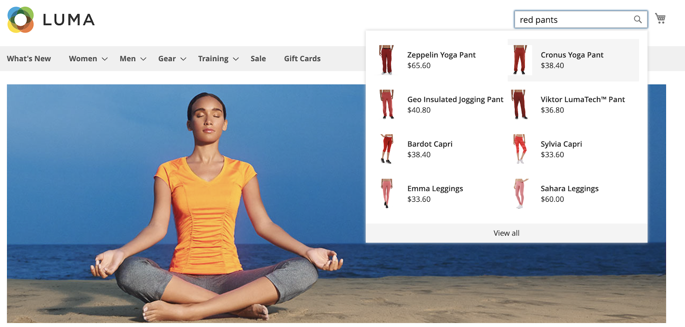

# 庫面頂

當 [!DNL Live Search] 是 [已安裝](install.md)，當購物者在 [搜索](https://docs.magento.com/user-guide/catalog/search-quick.html) 框。 鍵入每個字元後，將使用建議的產品和頂部搜索結果的縮略圖來更新跨距。

[!DNL Live Search] 返回兩個或更多字元的查詢的結果。 對於部分匹配，每個字的最大字元數為20。 「鍵入時搜索」查詢中的字元數不可配置。

>[!NOTE]
>
>的 [!DNL Live Search] storefront popover僅適用於使用 *盧馬* 主題，或基於 *盧馬*。 的 *盧馬* 的 [!DNL Commerce] 示例資料。 跨距不支援 *空白* 的子菜單。 請參閱 [造型跨距元素](storefront-popover-styling.md) 來瞭解更多資訊。

## 可搜索屬性

要生成目標明確的結果，請查看 [可搜索](https://docs.magento.com/user-guide/stores/attributes-product.html#storefront-properties) (`searchable=true`)產品屬性。 為確保關聯性，只有在屬性包含含有明確和簡明含義的內容時，才使屬性可搜索。 避免使用包含較不精確、較長文本的屬性，如 `description`，雖然預設情況下啟用搜索功能，但會降低搜索結果的精度。 例如，如果某人搜索「短褲」，而且有帶有「短袖」一詞描述的襯衫，則搜索結果中將包含這些襯衫。

以下屬性始終可搜索：

* `sku`
* `name`
* `categories`

## 跨距頁面大小

跨距的頁面大小決定了可以返回的自動完成產品行數。 以前，頁面大小硬編碼為六行。 然而， `page_size` 值現在是可通過 *管理*。 在Live Search安裝過程中， `page_size` 值更改為 [目錄搜索](https://docs.magento.com/user-guide/configuration/catalog/catalog.html#catalog-search) - `Autocomplete Limit` 的子菜單。

預設情況下，「目錄搜索 — 自動完成限制」(Catalog Search - Autocomplete Limit)值設定為八行（或八行）。 要更改跨距的頁面大小，請執行以下操作：

1. 在 *管理* 邊欄，轉到 **商店** >設定> **配置**。
1. 在左面板中，展開 **目錄** 選擇 **目錄** 的子菜單。
1. 展開 *目錄搜索* 的子菜單。
1. 設定 **自動完成限制** 到要在跨距中允許的行數。
1. 完成後，按一下 **保存配置**。
