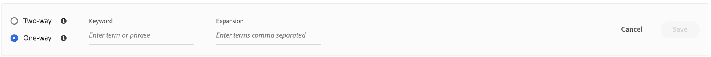

# 添加同義詞

新增您自己策劃的 [!DNL Live Search] 同義詞。 [!DNL Live Search] 可以管理每個最多200個同義字 `Data Space ID`.

![[!DNL Live Search] 同義詞](assets/synonym-workspace.png)

## 步驟1:添加同義詞

1. 在管理員中，前往 **行銷** > SEO與搜尋> **[!DNL Live Search]**.
1. 若是多個商店，請設定 **範圍** 到 [商店檢視](https://experienceleague.adobe.com/docs/commerce-admin/start/setup/websites-stores-views.html#scope-settings) 應用同義詞設定的位置。
1. 按一下 **同義字** 標籤。
1. 按一下 **添加同義詞** 按鈕。

## 步驟2:按類型定義同義詞

遵循 [同義詞類型](synonyms-type.md) 想要建立的。

### 雙向同義詞

1. 接受預設值 **雙向** 選項。

   

1. 輸入 **關鍵字** 要匹配的術語或短語。
1. 輸入 **擴展** 要新增為關鍵字同義字的詞語。 請使用逗號分隔多個詞語。
在此範例中，要比對的關鍵字為「pants」，而擴展片語是「長褲、褲子、寬鬆褲」。

   

1. 完成後，按一下 **儲存**.
同義字集會顯示在清單中，每個詞語之間有雙向箭頭，表示詞語是可互換的。

   

### 單向同義詞

1. 按一下 **單向** 同義詞類型。

   

1. 輸入 **關鍵字** 和 **擴展** 詞語。 請使用逗號分隔多個詞語。

   

   在此範例中，關鍵字為「pants」，單向展開詞「capris, caff-length pants, peddle-pushers」是每個「pants」的子集，但具有特定意義。

1. 完成後，按一下 **儲存**.
該同義詞集以單向箭頭顯示在清單中，該箭頭從擴展術語指向關鍵字，以指示術語是關鍵字的子集。 每個擴增詞語之間會加上加號。

   

## 步驟3:發佈變更

1. 完成同義詞後，按一下 **發佈變更**.
1. 等待最多2小時，以便您的更新在店面中可用。

## 欄位說明

| 欄位 | 說明 |
|--- |--- |
| [類型](synonyms.md) | 確定同義詞是否與關鍵字具有相同意義，還是關鍵字的子集。 選項： 雙向（預設） — 與關鍵字具有相同含義且傳回相同搜尋結果的詞語 單向 — 屬於關鍵字子集的詞語。 單向同義詞返回的是更窄的特定產品清單。 |
| 關鍵字 | 通常與目錄中的一系列產品相關聯的字詞。 |
| 擴展 | 與關鍵字具有相同或類似含義的其他術語。 |
