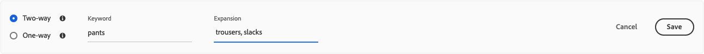
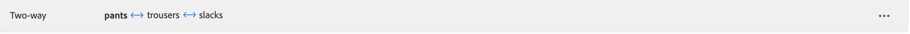

# 添加同義詞

通過添加您自己建立的即時搜索同義詞清單來增加客戶參與。 [!DNL Live Search] 每個同義詞最多可管理200個同義詞 `Data Space ID`。

![[!DNL Live Search] 同義詞](assets/synonym-workspace.png)

## 步驟1:添加同義詞

1. 在管理員中，轉到 **營銷** > SEO &amp; Search > **[!DNL Live Search]**。
1. 對於多個儲存，設定 **範圍** 到 [商店視圖](https://docs.magento.com/user-guide/configuration/scope.html) 的子菜單。
1. 按一下 **同義詞** 頁籤。
1. 按一下 **添加同義詞** 按鈕

## 步驟2:按類型定義同義詞

按照 [同義詞類型](synonyms-type.md) 建立。

### 雙向同義詞

1. 接受預設值 **雙向** 的雙曲餘切值。

   

1. 輸入 **關鍵字** 要匹配的術語或短語。
1. 輸入 **擴展** 要添加為關鍵字同義詞的術語。 用逗號分隔多個術語。
在本例中，匹配的關鍵字是「褲子」，而擴展字集是「長褲、褲子、寬鬆褲」。

   

1. 完成後，按一下 **保存**。
該同義詞集顯示在清單中，每個詞之間有一個雙向箭頭，表示詞是可互換的。

   

### 單向同義詞

1. 按一下 **單向** 同義詞類型。

   

1. 輸入 **關鍵字** 和 **擴展** 術語。 用逗號分隔多個術語。

   

   在本例中，關鍵字是&quot;pants&quot;，單向擴展詞&quot;capris, calf-length pants, peddle-pushers&quot;是每個&quot;pants&quot;的子集，但具有特定含義。

1. 完成後，按一下 **保存**。
該同義詞集顯示在清單中，並帶有從擴展術語指向關鍵字的單向箭頭，以指示術語是關鍵字的子集。 每個擴展項之間有加號。

   

## 第3步：發佈更改

1. 完成同義詞後，按一下 **發佈更改**。
1. 在店面等待最多兩小時，以便更新可用。

## 欄位說明

| 欄位 | 說明 |
|--- |--- |
| [類型](synonyms.md) | 確定同義詞是否與關鍵字具有相同的含義，或是關鍵字的子集。 選項： 雙向（預設） — 與關鍵字具有相同含義並返回相同搜索結果的術語 單向 — 關鍵字子集的術語。 單向同義詞返回一個更窄的特定產品清單。 |
| 關鍵字 | 通常與目錄中所選產品關聯的詞。 |
| 擴展 | 與關鍵字具有相同或相似含義的附加術語。 |
