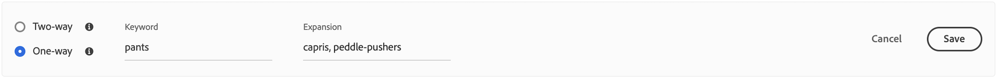

# 新增同義字

新增您自己的精選清單，以增加客戶參與度 [!DNL Live Search] 同義字。 [!DNL Live Search] 最多可管理每個200個同義字 `Data Space ID`.

![[!DNL Live Search] 同義字](assets/synonym-workspace.png)

## 步驟1：新增同義字

1. 在Admin中，前往 **行銷** > SEO與搜尋> **[!DNL Live Search]**.
1. 若為多個商店，請設定 **範圍** 至 [存放區檢視](https://experienceleague.adobe.com/docs/commerce-admin/start/setup/websites-stores-views.html#scope-settings) 同義字設定的套用位置。
1. 按一下 **同義字** 標籤。
1. 按一下 **新增同義字** 按鈕。

## 步驟2：依型別定義同義字

請依照 [同義字型別](synonyms-type.md) 要建立的物件。

### 雙向同義字

1. 接受預設值 **雙向** 選項。

   

1. 輸入 **關鍵字** 要比對的字詞或片語。
1. 輸入 **擴充** 您要新增為關鍵字的同義字的詞語。 請使用逗號分隔多個詞語。
在此範例中，要比對的關鍵字是「pants」，而擴充辭彙集是「trousers， slacks」。

   

1. 完成後，按一下 **儲存**.
同義字集合會顯示在清單中，每個辭彙之間會有一個雙向箭頭，表示辭彙可以互換。

   

### 單向同義字

1. 按一下 **單向** 同義字型別。

   

1. 輸入 **關鍵字** 和 **擴充** 辭彙。 請使用逗號分隔多個詞語。

   

   在此範例中，關鍵字是「pants」，而單向擴充辭彙「capris， pedle-pushers」是「pants」的子集，但具有特定含義。

1. 完成後，按一下 **儲存**.
同義字集合出現在清單中，有一個從展開詞指向關鍵字的單向箭頭，指示該詞是關鍵字的子集。 每個擴充詞以加號分隔。

   

## 步驟3：發佈變更

1. 當您的同義字完成時，按一下 **發佈變更**.
1. 等候最多2小時，讓您的更新在店面中出現。

## 欄位說明

| 欄位 | 說明 |
|--- |--- |
| [型別](synonyms.md) | 判斷同義字與關鍵字的意義相同，或是關鍵字的子集。 選項： 雙向（預設） — 與關鍵字具有相同含義的辭彙，並傳回相同的搜尋結果 單向 — 屬於關鍵字子集的詞語。 單向同義字會傳回特定產品的較窄清單。 |
| 關鍵字 | 通常與目錄中的一系列產品相關聯的字詞。 |
| 擴充 | 與關鍵字具有相同或類似含義的其他詞語。 |
