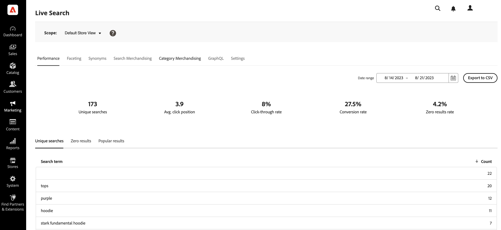

# 設定即時搜尋

工作區是您設定、管理和監控效能的地方 [!DNL Live Search]. 頂端的功能表可讓您存取每個功能區域中的工具。 可用的功能會反映目前的選單選取範圍。

## 設定範圍

最初 [範圍](https://experienceleague.adobe.com/docs/commerce-admin/start/setup/websites-stores-views.html#scope-settings) 全部 [!DNL Live Search] 設定已設為 `Default Store View`. 若您的 [!DNL Commerce] 安裝包含多個存放區檢視，設定 **範圍** 至 [存放區檢視](https://experienceleague.adobe.com/docs/commerce-admin/start/setup/websites-stores-views.html) 您的Facet設定套用的位置。

## 功能表選項

| 選項 | 說明 |
|--- |--- |
| [效能](performance.md) | 控制面板提供產品搜尋效能的深入分析。 |
| [多面向](facets.md) | 使用屬性值的多個維度來調整搜尋條件的高效能篩選。 |
| [同義字](synonyms.md) | 擴大搜尋範圍，納入購物者可能會用來尋找與目錄中不同產品的字詞。 |
| [搜尋銷售](rules.md) | 使用可觸發已排程動作的邏輯規則來塑造搜尋體驗。 提升、隱藏、釘選或隱藏產品，以校正搜尋結果，支援您的業務目標。 |
| [類別銷售](category-merch.md) | 在類別層級套用規則和智慧型銷售。 |
| [GraphQL](graphql.md) | 開發人員若已登入您商店的管理員，可使用實際目錄資料撰寫和測試查詢。 若要進一步瞭解，請前往 [GraphQL概觀](https://developer.adobe.com/commerce/webapi/graphql/) 在 [!DNL Live Search] 開發人員檔案。 |
| [設定](settings.md) | 決定如何在店面中依價格範圍分組價格方面值，並設定索引語言。 |

## 將屬性設定為可搜尋

若要產生具有高度針對性的結果，請檢閱 [可搜尋](https://experienceleague.adobe.com/docs/commerce-admin/catalog/product-attributes/product-attributes.html) (`searchable=true`)產品屬性。 為確保關聯性，請讓屬性只有在包含具有清晰精簡含義的內容時才可供搜尋。 避免使用包含較不精確、冗長文字的屬性，例如 `description`雖然預設已啟用搜尋，但可能會降低搜尋結果的精確度。 例如，如果有人搜尋「短褲」，而且有描述包含「短袖」字樣的襯衫，則這些襯衫會包含在搜尋結果中。

若要允許搜尋屬性，請完成下列步驟：

1. 在Admin中，前往 **商店** > *屬性* > **產品**.
1. 選取您要搜尋的屬性，例如 `color`.
1. 選取 **店面屬性** 並設定 **用於搜尋** 至 `yes`.

   

[!DNL Live Search] 也會遵守 [權重](https://experienceleague.adobe.com/docs/commerce-admin/catalog/catalog/search/search-results.html#weighted-search) 產品屬性的ID (如Adobe Commerce中所設定)。 權重較高的屬性會顯示在搜尋結果中較高的位置。

下列屬性一律可供搜尋：

* `sku`
* `name`
* `categories`

[Facet](facets.md) 是在中定義的產品屬性 [!DNL Live Search] 可篩選。 您可以將任何可篩選的屬性設定為Facet於 [!DNL Live Search]，但有 [限制](boundaries-limits.md) 一次可以搜尋多少個Facet。

[同義字](synonyms.md) 是您可以定義的術語，以協助引導使用者使用正確的產品。 尋找褲子的使用者可能會輸入「trousers」或「slacks」。 您可以設定同義字，讓這些搜尋詞將使用者帶到「褲子」結果。

## Commerce組態設定

下節將說明支援和不支援的Commerce組態設定 [!DNL Live Search].

### 支援的設定值

| Commerce組態設定 | 說明 | 由Popover支援 | 由介面卡支援 |
|---|---|---|---|
| 商店>設定>目錄>目錄>目錄搜尋>允許每頁所有產品 | 如果設為 `Yes`，包括 `ALL` 「每頁顯示」控制項中的選項。 | 是。 最多500種產品 | 是。 最多500種產品 |
| 儲存>設定>目錄>目錄>目錄搜尋>最小查詢長度 | 目錄搜尋中允許的最小字元數。 | 是 | 是 |
| 儲存>設定>目錄>目錄>目錄搜尋>每頁產品網格允許值 | 決定格線檢視中顯示的產品數目。 | 是 | 是 |
| 商店>設定>目錄>目錄>目錄搜尋>產品每頁格點預設值 | 決定網格檢視中預設每頁顯示的產品數目。 | 是。 最多500種產品 | 是。 最多500種產品 |
| 儲存>設定>目錄>庫存>顯示無庫存產品 | 顯示無庫存的產品。 | 是，含v2.0.4+ | 是，含v2.0.4+ |
| 儲存>組態>幣別>預設顯示幣別 | 用來顯示價格的主要貨幣。 | 是，含3.1.0+ | 是，含3.1.0+ |
| 儲存>組態>一般>貨幣設定>貨幣選項>基本貨幣 | 用於所有線上付款交易的主要幣別。 | 是 | 是 |

「Widget產品清單」頁面與「彈出視窗」中的價格會使用設定的幣別匯率，轉換為預設顯示幣別。

### 不支援的設定值

| Commerce組態設定 | 說明 | 附註 |
|---|---|---|
| 商店>設定>目錄>店面>清單模式 | 決定搜尋結果清單的格式。 | 正確轉譯，但部分頁面互動不會傳送事件 |
| 儲存>組態>目錄>目錄>目錄搜尋>查詢長度上限 | 目錄搜尋中允許的最大字元數。 | 未實作；搜尋服務接受最多255個字元 |
| 組態>銷售>稅捐>價格顯示設定>在目錄中顯示產品價格 | 決定目錄中所發佈的產品價格是否包含或排除稅捐，或顯示兩個版本的價格；一個含稅，另一個不含稅 |  |
| 商店>設定>目錄>店面>產品清單排序依據 | 決定搜尋結果清單的排序順序。 | 不適用於 [!DNL Live Search] [產品清單頁面Widget](plp-styling.md) |

### 搜尋詞

[!DNL Live Search] 支援 [搜尋字詞重新導向](https://experienceleague.adobe.com/docs/commerce-admin/catalog/catalog/search/search-terms.html) 在Adobe Commerce處理繞線的實施上，例如Luma和其他基於php的主題。
