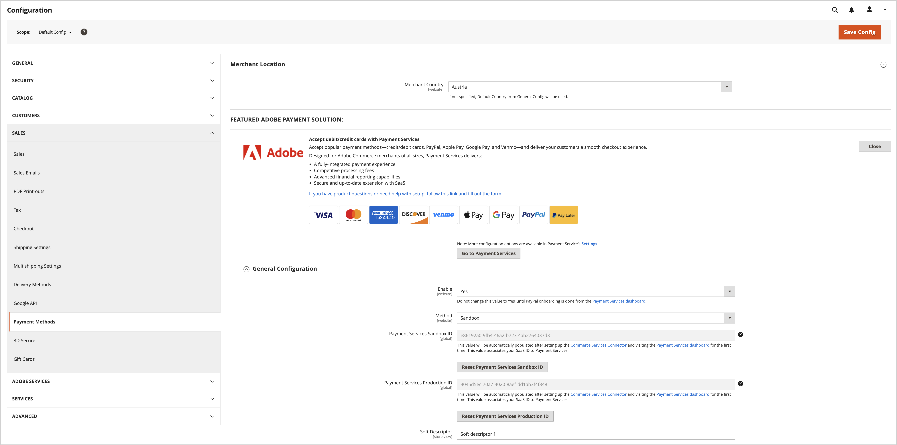

# 舊版 [!DNL Payment Services] 設定

您可以自訂 [!DNL Payment Services] 利用Admin中實用的設定選項來滿足您的需求。

當您設定 [!DNL Payment Services] 的 [!DNL Adobe Commerce] 和 [!DNL Magento Open Source] 在Admin中，這些設定僅適用於中設定的環境。 _[!UICONTROL Method]_欄位_[!UICONTROL General Configuration]_. 您在設定欄位中所做的任何變更與切換 _[!UICONTROL Method]_選取 — 如果切換方法，您的選取不會重設。

## 一般設定

您可以啟用 [!DNL Payment Services] 針對您的商店與您的  _[!UICONTROL Merchant Location]_，並在以下位置啟用沙箱測試或即時付款：_[!UICONTROL General Configuration]_ 區段。

1. 在 _管理員_ 側欄，前往 **[!UICONTROL Stores]** > _[!UICONTROL Settings]_>**[!UICONTROL Configuration]**.
1. 在左側面板中，展開 **[!UICONTROL Sales]** 並選擇 **[!UICONTROL Payment Methods]**.

   {width="400" zoomable="yes"}

1. 設定 _[!UICONTROL Merchant Country]_中的欄位_[!UICONTROL Merchant Location]_.
1. 展開 _[!UICONTROL FEATURED ADOBE PAYMENT SOLUTION]_區段以存取_[!UICONTROL [!DNL Payment Services]]_ 區段。
1. 在 _[!UICONTROL [!DNL Payment Services]]_區段，展開_[!UICONTROL General Configuration]_ 區段。
1. 的 **啟用**，將其設為 `Yes` 以啟用 [!DNL Payment Services] 以取得您的商店。
1. 的 **方法**，將其設為 `Sandbox` 如果您仍在測試 [!DNL Payment Services] （針對您的商店或） `Production` 如果您已準備好啟用即時付款。

   >[!WARNING]
   >
   >您的 _[!UICONTROL Sandbox Merchant ID]_和_[!UICONTROL Production Merchant ID]_ 當您完成沙箱和/或生產的入門時，會自動產生並顯示在其受人尊敬的欄位中。 請勿移除或變更這些ID。

1. 的 **軟性描述項** （自訂值，顯示在客戶交易銀行對帳單上，以區分商店/品牌/目錄），在文字欄位中新增自訂文字（最多22個字元），取代 `Custom descriptor` 或現有值。
1. 按一下 **[!UICONTROL Save Config]** 以儲存變更。
1. 瀏覽至 **[!UICONTROL System]** > **[!UICONTROL Cache Management]**，然後按一下 **[!UICONTROL Flush Cache]** 以重新整理所有無效的快取。

{width="700" zoomable="yes"}

### 設定選項

| 欄位 | 範圍 | 說明 |
|---|---|---|
| [!UICONTROL Enable] | 網站 | 啟用或停用 [!DNL Payment Services] 您的網站。 選項： `[!UICONTROL Yes]` / `[!UICONTROL No]` |
| [!UICONTROL Method] | 存放區檢視 | 設定商店的方法或環境。 選項： [!UICONTROL Sandbox] / [!UICONTROL Production] |
| [!UICONTROL Sandbox Merchant ID] | 存放區檢視 | 您的沙箱商家ID，會在沙箱上線期間自動產生。 請勿變更或變更此ID。 |
| [!UICONTROL Production Merchant ID] | 存放區檢視 | 您的生產商家識別碼，會在沙箱上線期間自動產生。 請勿變更或變更此ID。 |
| [!UICONTROL Soft Descriptor] | 網站或商店檢視 | 在您的網站和商店檢視中新增軟性描述項，以將資訊新增到客戶交易，其中會描述品牌、商店或產品線。 |

## [!UICONTROL Credit Card Fields]

此 [!UICONTROL Credit Card Fields] 付款選項可為信用卡或扣帳卡付款方式提供簡單安全的結帳。

另請參閱 [付款選項](payments-options.md#paypal-smart-buttons) 以取得詳細資訊。

1. 在 _管理員_ 側欄，前往 **[!UICONTROL Stores]** > _[!UICONTROL Settings]_>**[!UICONTROL Configuration]**.
1. 在左側面板中，展開 **[!UICONTROL Sales]** 並選擇 **[!UICONTROL Payment Methods]**.
1. 展開 _[!UICONTROL FEATURED ADOBE PAYMENT SOLUTION]_區段。
1. 在 _[!UICONTROL Payment Services]_區段，展開_[!UICONTROL Credit Card Fields]_ 區段。
1. 的 **[!UICONTROL Title]**，輸入文字（如有需要）以變更結帳期間顯示的付款方式名稱。
1. 至 [設定付款作業](production.md#set-payment-services-as-payment-method)，選取 **[!UICONTROL Authorize]** 或 **授權與擷取**.
1. 若要在結帳頁面上排定付款方式的優先順序，請提供 `Numeric Only` 中的值 **[!UICONTROL Sort order]** 欄位。
1. 的 **[!UICONTROL Show on checkout page]**，選擇 `Yes` 以啟用結帳頁面上的信用卡欄位。
1. 的 **[!UICONTROL Vault Enabled]**，選擇 `Yes` 以啟用信用卡存放區以進行簽出。
1. 的 **[!UICONTROL Vault Enabled in Admin]**，選擇 `Yes` 以讓商家使用其保管式信用卡來建立客戶的訂單。
1. 若要啟用 **[!UICONTROL 3DS Secure authentication]** (`Off` 依預設)選擇 `Always` 或 `When required`.
1. 的 **[!UICONTROL Debug Mode]**，選擇 `Yes` 啟用偵錯模式，或 `No` 以將其停用。
1. 按一下 **[!UICONTROL Save Config]** 以儲存變更。
1. 瀏覽至 **[!UICONTROL System]** > **[!UICONTROL Cache Management]**，然後按一下 **[!UICONTROL Flush Cache]** 以重新整理所有無效的快取。

### 設定選項

| 欄位 | 範圍 | 說明 |
|---|---|---|
| [!UICONTROL Title] | 存放區檢視 | 在結帳期間，新增文字以在「付款方式」檢視中顯示為此付款選項的標題。 選項： [!UICONTROL text field] |
| [!UICONTROL Payment Action] | 網站 | 此 [付款動作](https://experienceleague.adobe.com/docs/commerce-admin/config/sales/payment-methods/payment-methods.html) 指定付款方式的。 選項： [!UICONTROL Authorize] / [!UICONTROL Authorize and Capture] |
| [!UICONTROL Sort order] | 存放區檢視 | 結帳頁面上指定付款方式的排序順序。 `Numeric Only` 值 |
| [!UICONTROL Show on checkout page] | 網站 | 啟用或停用結帳頁面上的信用卡欄位。 選項： [!UICONTROL Yes] / [!UICONTROL No] |
| [!UICONTROL Vault enabled] | 存放區檢視 | 啟用或停用 [信用卡保險庫](vaulting.md). 選項： [!UICONTROL Yes] / [!UICONTROL No] |
| [!UICONTROL Vault enabled in Admin] | 存放區檢視 | 啟用或停用 [商家：在Admin中完成客戶的訂單](vaulting.md) 使用存放式付款方式。 選項： [!UICONTROL Yes] / [!UICONTROL No] |
| [!UICONTROL 3DS Secure authentication] | 網站 | 啟用或停用 [3DS安全驗證](security.md#3ds). 選項： [!UICONTROL Always] / [!UICONTROL When Required] / [!UICONTROL Off] |
| [!UICONTROL Debug Mode] | 網站 | 啟用或停用偵錯模式。 選項： `[!UICONTROL Yes]` / `[!UICONTROL No]` |

## [!UICONTROL Apple Pay]

此 [!UICONTROL Apple Pay] 付款選項可讓商家為其購物者提供可透過Safari瀏覽器在裝置上使用Touch ID進行購買的Apple Pay。 商家每個商家帳戶最多可新增99個網域。

另請參閱 [付款選項](payments-options.md#apple-pay-button) 以取得詳細資訊。

1. 在 _管理員_ 側欄，前往 **[!UICONTROL Stores]** > _[!UICONTROL Settings]_>**[!UICONTROL Configuration]**.
1. 在左側面板中，展開 **[!UICONTROL Sales]** 並選擇 **[!UICONTROL Payment Methods]**.
1. 展開 _[!UICONTROL FEATURED ADOBE PAYMENT SOLUTION]_區段。
1. 在 _[!UICONTROL Payment Services]_區段，展開_[!UICONTROL Apple Pay]_ 區段。
1. 的 **[!UICONTROL Title]**，輸入文字（如有需要）以變更結帳期間顯示的付款方式名稱。
1. 至 [設定付款作業](production.md#set-payment-services-as-payment-method)，選取 **[!UICONTROL Authorize]** 或 **[!UICONTROL Authorize and Capture]**.
1. 指定 [!DNL Apple Pay] Adobe Commerce選項，只要選取 `Yes` 視需要在下列選項中設定：
   * **[!UICONTROL Show Apple Pay on checkout page]**
   * **[!UICONTROL Show Apple Pay on product detail page]**
   * **[!UICONTROL Show Apple Pay in mini cart preview]**
   * **[!UICONTROL Show Apple Pay on cart page]**
1. 若要啟用偵錯模式，請選取 `Yes` 針對 **[!UICONTROL Debug Mode]** (`No` 停用它)。
1. 若要儲存變更，請按一下 **[!UICONTROL Save Config]** .
1. 瀏覽至 **[!UICONTROL System]** > **[!UICONTROL Cache Management]**，然後按一下 **[!UICONTROL Flush Cache]** 以重新整理所有無效的快取。

### 設定選項

| 欄位 | 範圍 | 說明 |
|---|---|---|
| [!UICONTROL Title] | 存放區檢視 | 在結帳期間，新增文字以在「付款方式」檢視中顯示為此付款選項的標題。 選項： [!UICONTROL text field] |
| [!UICONTROL Payment Action] | 網站 | 此 [付款動作](https://experienceleague.adobe.com/docs/commerce-admin/config/sales/payment-methods/payment-methods.html) 指定付款方式的。 選項： [!UICONTROL Authorize] / [!UICONTROL Authorize and Capture] |
| [!UICONTROL Show on checkout page] | 網站 | 啟用或停用 [!DNL Apple Pay] 在結帳頁面上。 選項： `[!UICONTROL Yes]` / `[!UICONTROL No]` |
| [!UICONTROL Sort order] | 存放區檢視 | 結帳頁面上指定付款方式的排序順序。 `Numeric Only` 值 |
| [!UICONTROL Show buttons on product detail page] | 存放區檢視 | 啟用或停用 [!DNL Apple Pay] 在產品詳細資料頁面上。 選項： `[!UICONTROL Yes]` / `[!UICONTROL No]` |
| [!UICONTROL Show buttons in mini-cart preview] | 存放區檢視 | 啟用或停用 [!DNL Apple Pay] 在迷你購物車預覽中。 選項： `[!UICONTROL Yes]` / `[!UICONTROL No]` |
| [!UICONTROL Show buttons on cart page] | 存放區檢視 | 啟用或停用 [!DNL Apple Pay] 在購物車頁面上。 選項： `[!UICONTROL Yes]` / `[!UICONTROL No]` |
| [!UICONTROL Debug Mode] | 網站 | 啟用或停用偵錯模式。 選項： `[!UICONTROL Yes]` / `[!UICONTROL No]` |

## [!UICONTROL Google Pay]

此 [!UICONTROL Google Pay] 付款選項可讓商家為購物者提供可在其裝置上使用Google Wallet進行購買的Google Pay。

另請參閱 [付款選項](payments-options.md#google-pay-button) 以取得詳細資訊。

1. 在 _管理員_ 側欄，前往 **[!UICONTROL Stores]** > _[!UICONTROL Settings]_>**[!UICONTROL Configuration]**.
1. 在左側面板中，展開 **[!UICONTROL Sales]** 並選擇 **[!UICONTROL Payment Methods]**.
1. 展開 _[!UICONTROL FEATURED ADOBE PAYMENT SOLUTION]_區段。
1. 在 _[!UICONTROL Payment Services]_區段，展開_[!UICONTROL Google Pay]_ 區段。
1. （選擇性）變更結帳時顯示的付款方式名稱，方法是在下列欄位中輸入新名稱： **[!UICONTROL Title]** 欄位。
1. [設定付款作業](production.md#set-payment-services-as-payment-method) 藉由選取 **[!UICONTROL Authorize]** 或 **[!UICONTROL Authorize and Capture]**.
1. 指定 [!DNL Google Pay] Adobe Commerce選項，只要選取 `Yes` 視需要在下列選項中設定：
   * **[!UICONTROL Show Google Pay on checkout page]**
   * **[!UICONTROL Show Google Pay on product detail page]**
   * **[!UICONTROL Show Google Pay in mini cart preview]**
   * **[!UICONTROL Show Google Pay on cart page]**
1. 若要啟用偵錯模式，請選取 `Yes` 針對 **[!UICONTROL Debug Mode]** (`No` 停用它)。
1. 設定外觀 _[!UICONTROL Google Pay]_按鈕，方法是選取&#x200B;**[!UICONTROL Button Color]**，**[!UICONTROL Button Type]**、和&#x200B;**[!UICONTROL Button Style]**視需要。
1. 若要設定高度，會使用中定義之高度的預設值 **[!UICONTROL Button Style]**.
1. 若要儲存變更，請按一下 **[!UICONTROL Save Config]** .
1. 瀏覽至 **[!UICONTROL System]** > **[!UICONTROL Cache Management]**，然後按一下 **[!UICONTROL Flush Cache]** 以重新整理所有無效的快取。

### 設定選項

| 欄位 | 範圍 | 說明 |
|---|---|---|
| [!UICONTROL Title] | 存放區檢視 | 指定結帳時，在「付款方式」檢視中，為此付款選項顯示的文字標籤。 選項： `[!UICONTROL text field]` |
| [!UICONTROL Payment Action] | 網站 | 此 [付款動作](https://experienceleague.adobe.com/docs/commerce-admin/config/sales/payment-methods/payment-methods.html) 指定付款方式的。 選項： `[!UICONTROL Authorize]` / `[!UICONTROL Authorize and Capture]` |
| [!UICONTROL Show on checkout page] | 網站 | 啟用或停用 [!DNL Google Pay] 在結帳頁面上。 選項： `[!UICONTROL Yes]` / `[!UICONTROL No]` |
| [!UICONTROL Sort order] | 存放區檢視 | 結帳頁面上指定付款方式的排序順序。 `Numeric Only` 值 |
| [!UICONTROL Show buttons on product detail page] | 存放區檢視 | 啟用或停用 [!DNL Google Pay] 在產品詳細資料頁面上。 選項： `[!UICONTROL Yes]` / `[!UICONTROL No]` |
| [!UICONTROL Show buttons in mini-cart preview] | 存放區檢視 | 啟用或停用 [!DNL Google Pay] 在迷你購物車預覽中。 選項： `[!UICONTROL Yes]` / `[!UICONTROL No]` |
| [!UICONTROL Show buttons on cart page] | 存放區檢視 | 啟用或停用 [!DNL Google Pay] 在購物車頁面上。 選項： `[!UICONTROL Yes]` / `[!UICONTROL No]` |
| [!UICONTROL Debug Mode] | 網站 | 啟用或停用偵錯模式。 選項： `[!UICONTROL Yes]` / `[!UICONTROL No]` |
| [!UICONTROL Button Color] | 存放區檢視 | 定義 [!DNL Google Pay] 按鈕。 選項： `[!UICONTROL Default]` / `[!UICONTROL Black]` / `[!UICONTROL White]` |
| [!UICONTROL Button Type] | 存放區檢視 | 定義 [!DNL Google Pay] 按鈕。 選項： `[!UICONTROL buy]` / `[!UICONTROL checkout]` / `[!UICONTROL order]` / `[!UICONTROL pay]` / `[!UICONTROL plain]` |

另請參閱 [Google Pay API要求物件選項](https://developers.google.com/pay/api/web/reference/request-objects) 檔案以取得詳細資訊。

## [!DNL PayPal Payment Buttons]

此 [!DNL PayPal payment buttons] 付款選項可為您的客戶提供簡單、快速且安全的結帳程式。

另請參閱 [付款選項](payments-options.md#paypal-smart-buttons) 以取得詳細資訊。

設定 [!DNL PayPal payment buttons]

您可以在「管理員」中啟用並設定PayPal付款按鈕付款選項：

1. 在 _管理員_ 側欄，前往 **[!UICONTROL Stores]** > _[!UICONTROL Settings]_>**[!UICONTROL Configuration]**.
1. 在左側面板中，展開 **[!UICONTROL Sales]** 並選擇 **[!UICONTROL Payment Methods]**.
1. 展開 _[!UICONTROL FEATURED ADOBE PAYMENT SOLUTION]_區段。
1. 在 _[!UICONTROL Payment Services]_區段，展開_[!UICONTROL PayPal payment buttons]_ 區段。
1. 若要變更結帳時顯示的付款方式名稱，請編輯 _[!UICONTROL Title]_欄位。
1. 至 [設定付款作業](production.md#set-payment-services-as-payment-method)，選取 **[!UICONTROL Authorize]** 或 **[!UICONTROL Authorize and Capture]**.
1. 若要在結帳頁面上排定付款方式的優先順序，請提供 `Numeric Only` 中的值 **[!UICONTROL Sort order]** 欄位。
1. 若要啟用/停用 [先付款後傳送訊息](payments-options.md#pay-later-button)，選取 `Yes`/`No` 的 **[!UICONTROL Display Pay Later Message]**.
1. 透過選取「 」，指定在Adobe Commerce中啟用PayPal付款按鈕的位置 `Yes` 視需要在下列選項中設定：
   * **[!UICONTROL Show buttons on checkout page]**
   * **[!UICONTROL Show buttons on product detail page]**
   * **[!UICONTROL Show buttons in mini cart preview]**
   * **[!UICONTROL Show buttons on cart page]**
1. 若要啟用Venmo作為付款選項，請選取 `Yes` 的 **[!UICONTROL Venmo Enabled]**.
1. 若要啟用信用卡和借記卡作為付款選項（PayPal智慧按鈕），請選取 `Yes` 的 **[!UICONTROL Credit and Debit Card Enabled]**.
1. 若要啟用/停用 [PayPal稍後付款](payments-options.md#pay-later-button) 付款選項，選取 `Yes`/`No` 的 **[!UICONTROL PayPal Pay Later Enabled]**.
1. 若要啟用偵錯模式，請選取 `Yes` 針對 **[!UICONTROL Debug Mode]** (`No` 停用它)。
1. 若要儲存變更，請按一下 **[!UICONTROL Save Config]** .
1. 瀏覽至 **[!UICONTROL System]** > **[!UICONTROL Cache Management]**，然後按一下 **[!UICONTROL Flush Cache]** 以重新整理所有無效的快取。

### 設定選項

| 欄位 | 範圍 | 說明 |
|---|---|---|
| [!UICONTROL Title] | 存放區檢視 | 在結帳期間，在「付款方式」檢視中，新增要顯示為此付款選項標題的文字。 選項：文字欄位 |
| [!UICONTROL Payment Action] | 網站 | 此 [付款動作](https://docs.magento.com/user-guide/configuration/sales/payment-methods.html#payment-actions){target="_blank"} 指定付款方式的。 選項： [!UICONTROL Authorize] / [!UICONTROL Authorize and Capture] |
| [!UICONTROL Display Pay Later Message] | 網站 | 在購物車、產品頁面、迷你購物車和結帳流程中啟用或停用「稍後付款」訊息。 選項： `[!UICONTROL Yes]` / `[!UICONTROL No]` |
| [!UICONTROL Show buttons on checkout page] | 存放區檢視 | 啟用或停用 [!DNL PayPal payment buttons] 在結帳頁面上。 選項： `[!UICONTROL Yes]` / `[!UICONTROL No]` |
| [!UICONTROL Show buttons on product detail page] | 存放區檢視 | 啟用或停用 [!DNL PayPal payment buttons] 在產品詳細資料頁面上。 選項： `[!UICONTROL Yes]` / `[!UICONTROL No]` |
| [!UICONTROL Show buttons in mini-cart preview] | 存放區檢視 | 啟用或停用 [!DNL PayPal payment buttons] 在迷你購物車預覽中。 選項： `[!UICONTROL Yes]` / `[!UICONTROL No]` |
| [!UICONTROL Show buttons on cart page] | 存放區檢視 | 啟用或停用 [!DNL PayPal payment buttons] 在購物車頁面上。 選項： `[!UICONTROL Yes]` / `[!UICONTROL No]` |
| [!UICONTROL Venmo Enabled] | 存放區檢視 | 啟用或停用顯示付款按鈕的Venmo付款選項。 選項： `[!UICONTROL Yes]` / `[!UICONTROL No]` |
| [!UICONTROL Credit and Debit Card Enabled] | 存放區檢視 | 啟用或停用顯示付款按鈕的「信用卡」與「借記卡」選項。 選項： `[!UICONTROL Yes]` / `[!UICONTROL No]` |
| [!UICONTROL PayPal Pay Later Enabled] | 存放區檢視 | 啟用或停用顯示付款按鈕的PayPal Pay Later付款選項外觀。 選項： `[!UICONTROL Yes]` / `[!UICONTROL No]` |
| [!UICONTROL Debug Mode] | 網站 | 啟用或停用偵錯模式。 選項： `[!UICONTROL Yes]` / `[!UICONTROL No]` |

## 按鈕樣式

您也可以設定 _[!UICONTROL Button style]_付款按鈕的選項：

1. 在 _管理員_ 側欄，前往 **[!UICONTROL Stores]** > _[!UICONTROL Settings]_>**[!UICONTROL Configuration]**.
1. 在左側面板中，展開 **[!UICONTROL Sales]** 並選擇 **[!UICONTROL Payment Methods]**.
1. 展開 _[!UICONTROL FEATURED ADOBE PAYMENT SOLUTION]_區段。
1. 在 _[!UICONTROL [!DNL Payment Services]]_區段，展開_[!UICONTROL PayPal Smart Button Styling]_ 區段。
1. 若要設定版面，請選取 `Vertical` 或 `Horizontal` 的 **[!UICONTROL Layout]**
1. 若要設定顏色，請選取下列專案中的可用顏色： **[!UICONTROL Color]**.
1. 若要設定形狀，請選取 `Rectangular` 或 `Pill` 的 **[!UICONTROL Shape]**.
1. 若要使用預設高度，請選取 `Yes` 或 `No` 的 **[!UICONTROL Use Default Height]**.
1. 若要設定自訂高度，請新增所需的畫素高度 **[!UICONTROL Height]**.
1. 若要設定標語，請選取 `Yes` 或 `No` 的 **[!UICONTROL Tagline]**.
1. 若要儲存變更，請按一下 **[!UICONTROL Save Config]** .
1. 瀏覽至 **[!UICONTROL System]** > **[!UICONTROL Cache Management]**，然後按一下 **[!UICONTROL Flush Cache]** 以重新整理所有無效的快取。

您也可以設定付款按鈕樣式 [在設定中](settings.md#button-style) 從付款服務首頁。

### 設定選項

| 欄位 | 範圍 | 說明 |
|--- |--- |--- |
| [!UICONTROL Layout] | 存放區檢視 | 定義Paypal付款按鈕的版面樣式。 選項： `[!UICONTROL Vertical]` / `[!UICONTROL Horizontal]` |
| [!UICONTROL Color] | 存放區檢視 | 定義Paypal付款按鈕的色彩。 選項： [!UICONTROL Blue] / `[!UICONTROL Gold]` / `[!UICONTROL Silver]` / `[!UICONTROL White]` / `[!UICONTROL Black]` |
| [!UICONTROL Shape] | 存放區檢視 | 定義Paypal付款按鈕的形狀。 選項： `[!UICONTROL Rectangular]` / `[!UICONTROL Pill]` |
| [!UICONTROL Use Default Height] | 存放區檢視 | 定義PayPal付款按鈕是否使用預設高度。 選項： `[!UICONTROL Yes]` / `[!UICONTROL No]` |
| [!UICONTROL Height] | 存放區檢視 | 定義PayPal付款按鈕的高度。 預設值：無 |
| [!UICONTROL Label] | 存放區檢視 | 定義出現在PayPal付款按鈕中的標籤。 選項： `[!UICONTROL PayPal]` / `[!UICONTROL Checkout]` / `[!UICONTROL Buynow]` / `[!UICONTROL Pay]` / `[!UICONTROL Installment]` |
| [!UICONTROL Tagline] | 存放區檢視 | 啟用標語。 選項： `[!UICONTROL Yes]` / `[!UICONTROL No]` |

## 排清快取

如果您變更組態， [手動排清快取](/help/payment-services/settings.md#flush-the-cache) 以便您的商店顯示最新的組態設定。
