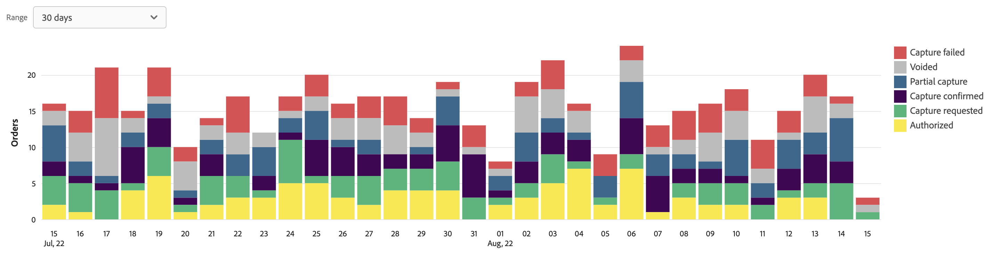
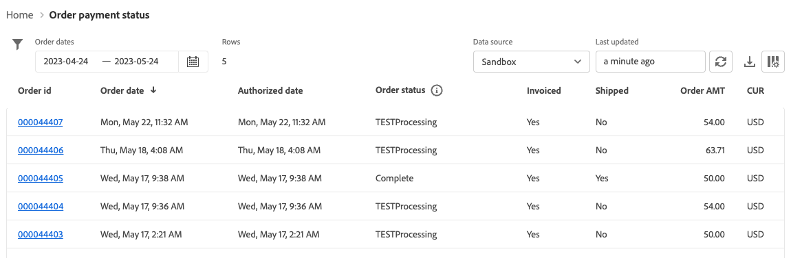

# 訂單付款狀態報表

[!DNL Payment Services] 的 [!DNL Adobe Commerce] 和 [!DNL Magento Open Source] 提供您全方位的報告，讓您清楚瞭解商店的 [交易](transactions.md)、訂購和付款。

有兩個可用的「訂單」付款狀態報表檢視表，可讓您快速檢視訂單的付款狀態：

* **[訂單付款狀態視覺效果檢視](#order-payment-status-data-visualization-view)** — 可在「付款服務首頁」上使用的圖表，以視覺化方式呈現訂單付款狀態報表檢視中的每日彙總付款狀態
* **[訂單付款狀態報表檢視](#order-payment-status-report-view)** — 以訂單付款狀態提供報表，顯示所有交易的詳細付款、已開立商業發票、已出貨、退款及爭議狀態

「訂單」付款狀態檢視表可協助您輕鬆瞭解特定訂單在訂單至現金處理流程中的位置。 這些報表可讓您根據訂單的付款狀態和付款日期快速檢視訂單，並識別任何潛在問題。

您可以 [下載訂單付款狀態](#download-order-payment-statuses) .csv檔案格式，用於現有的會計或訂單管理軟體。

>[!NOTE]
>
>如果沒有，您將無法檢視財務報表 [已上線和已啟動的即時模式](production.md#enable-live-payments) 的 [!DNL Payment Services].

## 訂單付款狀態資料視覺效果檢視

付款服務首頁提供「訂單付款狀態」資料視覺化檢視。 這是詳細表格中每日彙總付款狀態的視覺化表示法 [訂單付款狀態報表檢視](#order-payment-status-report-view).

在 _管理員_ 側欄，前往 **銷售** > **付款服務** > _訂購_ 若要檢視資料視覺效果 [付款狀態表](#statuses-information).

{zoomable=yes}

按一下 **[!UICONTROL View Report]** 瀏覽至詳細表格 [訂單付款狀態報表檢視](#order-payment-status-report-view).

### 自訂狀態時間範圍

依預設，會顯示30天的付款狀態。

從「訂單付款狀態」視覺效果檢視中，您可以選取日期範圍，以自訂您要檢視之付款狀態的時間範圍：

1. 在 _管理員_ 側欄，前往 **[!UICONTROL Sales]** > **[!UICONTROL Payment Services]**. 訂單付款狀態資料視覺化檢視會顯示在 _訂購_ 區段。
1. 按一下 **[!UICONTROL Range]** 選擇器篩選器。
1. 選擇適用的日期範圍 — 30天、15天或7天。
1. 檢視指定日期的狀態資訊。

### 狀態資訊

所選日期範圍的付款狀態會顯示在「訂單付款狀態」資料視覺效果檢視的左側。 所選日期範圍的日期會顯示在檢視的底部。 如果特定日期沒有訂單，該日期就不會出現。

「訂單付款狀態」資料視覺效果檢視包括下列資訊。

| 資料 | 說明 |
| ------------ | -------------------- |
| [!UICONTROL Orders] | 指定時間範圍內訂單的金額範圍；Y軸上的資料（左側） |
| 日期範圍 | 指定時間範圍的日期範圍；X軸（底部）上的資料 |
| 已授權 | 訂單已授權 |
| 已要求擷取 | 訂單要求的擷取 |
| 擷取已確認 | 訂單擷取完成 |
| 部分擷取 | 部分擷取的訂單 |
| 擷取失敗 | 訂單擷取失敗 |
| 已失效 | 訂單已失效 |

## 訂單付款狀態報表檢視

「付款服務」的「首頁」檢視中，提供「訂單」付款狀態報表檢視表。 其中包括所有交易的詳細狀態 — 付款、已開立商業發票、出貨、退款、爭議等等。

在 _管理員_ 側欄，前往 **[!UICONTROL Sales]** > **[!UICONTROL Payment Services]** > _[!UICONTROL Orders]_>**[!UICONTROL View Report]**若要檢視詳細的表格「訂單付款狀態」報表檢視，請執行下列步驟：

您可以根據本主題中的章節設定此檢視，以最理想的方式呈現您想要檢視的資料。

您可以 [下載支付交易](#download-order-payment-statuses) .csv檔案格式，用於現有的會計或訂單管理軟體。

>[!NOTE]
>
>此表格中顯示的資料會依遞減順序排序(`DESC`)預設會使用 `TRANS DATE`. 此 `TRANS DATE` 是交易的起始日期和時間。

### 報告中使用的資料

此 [!DNL Payment Services] 模組使用訂單資料，並將其與其他來源（包括PayPal）的彙總付款資料結合，以提供有意義且高度有用的報表。

訂單資料會匯出並保留在付款服務中。 當您 [變更或新增訂單狀態](https://docs.magento.com/user-guide/sales/order-status-custom.html) 或 [編輯商店檢視](https://docs.magento.com/user-guide/stores/stores-all-view-edit.html)， [儲存](https://docs.magento.com/user-guide/stores/store-information.html)或網站名稱)中，該資料會與付款資料結合，而「訂單付款狀態」報表會填入結合的資訊。

此程式包含兩個步驟：

1. 索引已變更資料 `ON SAVE` （每次訂單資訊或商店資訊變更時）或 `BY SCHEDULE` （根據預先設定的cron排程），視在中設定的方式而定 [索引管理](https://docs.magento.com/user-guide/system/index-management.html) 在Admin中。

   依預設，會發生資料索引 `ON SAVE`，這表示每當順序、訂單狀態、商店檢視、商店或網站中有任何專案變更，都會立即進行重新索引程式。

1. 已編制索引的資料會傳送至付款服務，然後填入「訂單」付款狀態報表。

為報表目的匯出和整理的唯一資料是「訂單付款狀態」報表所使用的資料。

>[!NOTE]
>
>此表格中顯示的資料會依遞減順序排序(`DESC`)預設會使用 `ORDER DATE`. 此 `ORDER DATE` 是建立訂單的日期時間戳記。

#### 設定資料匯出

即使預設情況下重新索引會發生在中 `ON SAVE` 模式，建議您在以下位置編列索引： `BY SCHEDULE` 模式。 此 `BY SCHEDULE` 索引會以1分鐘的cron排程執行，且任何已變更的資料會在任何資料變更後的2分鐘內顯示在訂單狀態報表中。 這個排程的重新索引可幫助您減少商店上的任何負擔，尤其是如果您有大量傳入的訂單，因為這會按照排程進行（而不是每次下訂單時）。

您可以變更索引模式 — `ON SAVE` 或 `BY SCHEDULE`—[在Admin](https://docs.magento.com/user-guide/system/index-management.html#change-the-index-mode).

若要瞭解如何設定資料匯出，請參閱 [命令列設定](configure-cli.md#configure-data-export).

### 選取資料來源

在「訂單付款狀態」報表檢視中，您可以選取資料來源 — **[!UICONTROL Live]** _或 **[!UICONTROL Sandbox]** — 您想要檢視其報告結果。

{width=400px}

如果 _[!UICONTROL Live]_是選取的資料來源，您可以檢視使用的存放區報表資訊 [!DNL Payment Services] 在生產模式中。 如果_[!UICONTROL Sandbox]_ 是選取的資料來源，您可以看到沙箱模式的報表資訊。

資料來源選取專案的工作方式如下：

* 如果您沒有任何使用的商店 [!DNL Payment Services] 在即時模式中，資料來源選項預設為 _[!UICONTROL Sandbox]_.
* 如果您有任何商店（一或多個）使用 [!DNL Payment Services] 在即時模式中，資料來源選項預設為 _[!UICONTROL Live]_.
* 報表匯出一律遵循資料來源選擇。

若要為您的選取資料來源 [!UICONTROL Order Payment Status] 報告：

1. 在 _管理員_ 側欄，前往 **[!UICONTROL Sales]** > **[!UICONTROL [!DNL Payment Services]]** > **[!UICONTROL Orders]** > **[!UICONTROL View Report]**.
1. 按一下 _[!UICONTROL Data source]_選取器篩選並選取&#x200B;**[!UICONTROL Live]**或&#x200B;**[!UICONTROL Sandbox]**.

   報表結果會根據選取的資料來源重新產生。

### 自訂日期時間範圍

從「訂單付款狀態」報表檢視中，您可以選取特定日期，以自訂您要檢視之狀態的時間範圍。 依預設，30天的訂單付款狀態會顯示在網格中。

1. 在 _管理員_ 側欄，前往 **[!UICONTROL Sales]** > **[!UICONTROL [!DNL Payment Services]]** > _[!UICONTROL Orders]_>**[!UICONTROL View Report]**.
1. 按一下 _[!UICONTROL Order dates]_行事曆選擇器篩選器。
1. 選擇適用的日期範圍。
1. 檢視網格中指定日期的訂單付款狀態。

### 篩選報表資訊

從「訂單付款狀態」報表檢視中，您可以選取篩選條件，以篩選您要檢視的狀態結果。

1. 在 _管理員_ 側欄，前往 **[!UICONTROL Sales]** > **[!UICONTROL [!DNL Payment Services]]** > _[!UICONTROL Orders]_>**[!UICONTROL View Report]**.
1. 按一下 **[!UICONTROL Filter]** 選擇器。
1. 切換 _付款狀態_ 選項，僅針對選取的訂單付款狀態檢視報表結果。
1. 輸入 _最小訂單金額_ 或 _最大訂單金額_ 以在該訂單金額範圍內檢視報表結果。
1. 按一下 **[!UICONTROL Hide filters]** 以隱藏篩選器。

### 顯示和隱藏欄

「訂單付款狀態」報表依預設會顯示所有可用的資訊欄位。 不過，您可以自訂您在報表中看到的欄。

1. 在 _管理員_ 側欄，前往 **[!UICONTROL Sales]** > **[!UICONTROL [!DNL Payment Services]]** > _[!UICONTROL Orders]_>**[!UICONTROL View Report]**.
1. 按一下 _欄設定_ 圖示()。
1. 若要自訂您在報表中看到的欄，請核取或取消核取清單中的欄。

   「訂單付款狀態」報表會立即顯示您在「欄位設定」功能表中所做的任何變更。 欄偏好設定將會儲存，而且如果您離開報表檢視，偏好設定將維持有效。

### 檢視狀態

「訂單付款狀態」報表檢視會顯示每張訂單的完整付款狀態資訊。

依預設，30天的訂單付款狀態會顯示在網格中。

向左向右捲動以檢視 [訂單付款狀態資訊](#column-descriptions)，包括訂單日期、授權日期、開立商業發票、已出貨、付款狀態等。

搜尋中傳回的列數，或顯示在預設30天訂單付款狀態的列數，會與「訂單日期」行事曆選取器篩選器一起顯示在「訂單付款」狀態檢視網格的上方。

#### 付款狀態

「付款狀態」欄位會顯示任何付款的目前狀態。 A `Capture failed` 付款顯示紅色警示狀態及 `Voided` 付款顯示灰色警示狀態。

#### 退款狀態

「退款」狀態列位會顯示任何退款的目前狀態。 A `Capture failed` 付款顯示紅色警示狀態及 `Voided` 付款顯示灰色警示狀態。

### 更新報表資料

「訂單付款狀態」報表檢視會顯示 _[!UICONTROL Last updated]_顯示上次更新報告資訊的時間戳記。 依預設，訂單付款狀態報表資料每三小時自動重新整理一次。

您也可以手動強制重新整理「訂單付款狀態」報表資料，以檢視最新的報表資訊。

1. 在 _管理員_ 側欄，前往 **[!UICONTROL Sales]** > **[!UICONTROL [!DNL Payment Services]]** > _[!UICONTROL Orders]_>**[!UICONTROL View Report]**.
1. 按一下 _重新整理_ 圖示()。

   訂單付款狀態報表資料已重新整理， *[!UICONTROL Update complete]* 確認功能會出現，而格線中會顯示最新的資訊。

### 檢視爭議

您可以檢視商店訂單上的任何爭議，並從「訂單付款狀態」報表中切換作業選項至「PayPal解決中心」以對其採取行動。

1. 在 _管理員_ 側欄，前往 **[!UICONTROL Sales]** > **[!UICONTROL [!DNL Payment Services]]** > _[!UICONTROL Orders]_>**[!UICONTROL View Report]**.
1. 導覽至 **[!UICONTROL Disputes column]**.
1. 檢視特定訂單的任何爭議，並請參閱 [爭議狀態](#order-payment-status-information).
1. 按一下爭議ID連結(開頭為 _PP-D-_)前往 [PayPal解析中心](https://www.paypal.com/us/smarthelp/article/what-is-the-resolution-center-faq3327).
1. 視需要對爭議採取適當行動。

   若要依狀態排序訂單爭議，請按一下「爭議」欄位標題。

### 下載訂單付款狀態

您可以下載.csv檔案，其中包含所有顯示在「訂單付款」狀態檢視格線中的狀態，無論您檢視的是預設的30天狀態還是自訂的時間範圍。

1. 在 _管理員_ 側欄，前往 **[!UICONTROL Sales]** > **[!UICONTROL [!DNL Payment Services]]** > _[!UICONTROL Orders]_>**[!UICONTROL View Report]**.
1. 如果您想檢視過去30天以外時間範圍的狀態， [自訂狀態的日期範圍時間範圍](#customize-dates-timeframe).
1. 按一下 _下載_ ()圖示。

您的訂單付款狀態會以.csv格式下載。

### 欄說明

訂單付款狀態報表包含下列資訊。

| 欄 | 說明 |
| ------------ | -------------------- |
| [!UICONTROL Order ID] | 商務訂單ID   若要檢視相關專案，請執行下列動作： [訂購資訊](https://docs.magento.com/user-guide/sales/orders.html){target="_blank"}，按一下ID。 |
| [!UICONTROL Order Date] | 訂購日期時間戳記 |
| [!UICONTROL Authorized Date] | 付款授權的日期時間戳記 |
| [!UICONTROL Order Status] | 目前的商務 [訂單狀態](https://docs.magento.com/user-guide/sales/order-status.html){target="_blank"} |
| [!UICONTROL Invoiced] | 訂單的商業發票狀態 — *[!UICONTROL No]*， *[!UICONTROL Partial]*，或 *[!UICONTROL Yes]* |
| [!UICONTROL Shipped] | 訂單的出貨狀態 — *[!UICONTROL No]*， *[!UICONTROL Partial]*，或 *[!UICONTROL Yes]* |
| [!UICONTROL Order Amt] | 訂單的總金額 |
| [!UICONTROL Cur] | 訂單的貨幣型別 |
| [!UICONTROL Pay Status] | 特定訂單的付款狀態 |
| [!UICONTROL Paid Amt] | 訂單上的已付金額 |
| [!UICONTROL Cur] | 訂單付款金額的幣別型別 |
| [!UICONTROL Refund Status] | 訂單上的退款狀態（例如退貨、RMA及銷退折讓單的資訊） —    *[!UICONTROL Requires refund]*， *[!UICONTROL Refund requested]*， *[!UICONTROL Refunded]*， *[!UICONTROL Refund failed]*，或 *[!UICONTROL Voided]* |
| [!UICONTROL Refund Amount] | 訂單的已退款金額總計 |
| [!UICONTROL Cur] | 訂單退款金額的幣別型態 |
| [!UICONTROL Disputes] | 訂單上任何爭議的狀態（爭議和借項衝回的資訊） — *[!UICONTROL Open]*， *[!UICONTROL Waiting for buyer response]*， *[!UICONTROL Waiting for seller response]*， *[!UICONTROL Under review]*， *[!UICONTROL Resolved]*，或 *[!UICONTROL Other]* |
| [!UICONTROL Payment Method] | 訂單的商務交易中使用的付款方法 |
| [!UICONTROL Website] | 下訂單的網站 |
| [!UICONTROL Store] | 下訂單的存放區 |
| [!UICONTROL Store View] | 下訂單的存放區檢視 |
