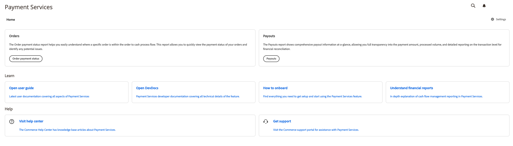

# 導言 [!DNL Payment Services] 首頁

[!DNL Payment Services] 為 [!DNL Adobe Commerce] 和 [!DNL Magento Open Source] 提供「首頁」視圖，其中包含啟動設定和使用副檔名所需的所有資訊。

1. 在 _管理_ 邊欄，轉到 **[!UICONTROL Sales]** > **[!UICONTROL Payment Services]**:

   

1. 在此「首頁」視圖中，您可以訪問 _首頁_ 視圖 _學習_ 關於 [!DNL Payment Services]，配置擴展 _設定_&#x200B;或 _幫助_。

## 首頁

| 欄位 | 說明 |
|---|---|
| [!UICONTROL Order payment status] | 這些報表允許您快速查看訂單的付款狀態並確定任何潛在問題。 |
| [!UICONTROL Payouts] | 支付報表一覽顯示全面的支付資訊，使您對支付金額、處理量和財務調節的交易級別的詳細報告具有完全透明性。 |

## 學習

| 欄位 | 說明 |
|---|---|
| [!UICONTROL Open user guide] | 最新用戶文檔，涵蓋 [!DNL Payment Services]。 |
| [!UICONTROL Open DevDocs] | [!DNL Payment Services] 包含功能所有技術詳細資訊的開發人員文檔。 |
| [!UICONTROL How to onboard] | 查找設定所需的所有內容，然後開始使用 [!DNL Payment Services] 的子菜單。 |
| [!UICONTROL Understand financial reports] | 深入解釋現金流量管理報告於 [!DNL Payment Services]。 |

## 設定

在「首頁」視圖中，按一下 **[!UICONTROL Settings]** 頁面右上角。 請參閱 [設定](settings.md) 的子菜單。

## 幫助

| 欄位 | 說明 |
|---|---|
| [!UICONTROL Visit help center] | 的 [!DNL Adobe Commerce] 幫助中心提供有關付款服務的知識文庫文章。 |
| [!UICONTROL Get support] | 訪問 [!DNL Adobe Commerce] 支援門戶以獲得支付服務幫助。 |
