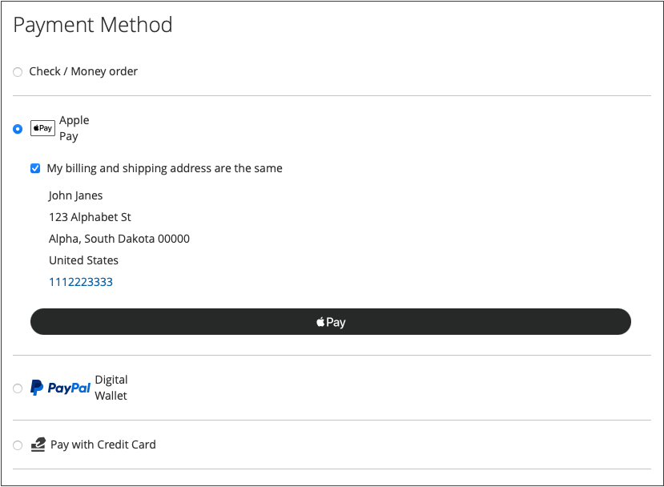

# 付款選項

替換為 [!DNL Adobe Commerce] 和 [!DNL Magento Open Source] [!DNL Payment Services]，您有多個可用的付款選項。

您可以在下列位置設定這些付款選項 [住家設定](payments-home.md) 或 [存放區設定](configure-admin.md) （建議使用舊版付款選項或多商店設定）。

根據您在結帳過程中的位置，每種付款方式都有不同的行為：

* 產品頁面 — 專案的產品頁面
* 迷你購物車 — 當產品已新增至購物車時，按一下購物車圖示即可使用
* 購物車 — 按一下即可使用 _檢視和編輯購物車_ 從迷你購物車
* 出庫檢視 — 可在按一下 _繼續結帳_ 從迷你購物車或購物車

>[!IMPORTANT]
>
>[!DNL Payment Services] 必須先完成上線，然後才能處理付款。

## 標準與進階付款體驗

[!DNL Payment Services] 提供 **進階** （完整支援）和 **標準** （快速結帳）付款選項和上線流程，視您營運的國家/地區而定。

* **進階**  — 全部可用 [付款選項](../payment-services/payments-options.md) 目前可用 [完全支援的國家/地區](../payment-services/overview.md#availability). 在上線以啟用即時付款時，選取 [進階上線選項](../payment-services/production.md#advanced-onboarding).
* **標準**  — 付款選項（快速結帳） （PayPal信用卡和借記卡）的子集適用於其他支援的國家/地區。 [信用卡欄位](#credit-card-fields) 和 [Apple Pay](#apple-pay-button) 不適用於此上線選項。 在上線以啟用即時付款時，選取 [標准入門選項](../payment-services/production.md#standard-onboarding).

另請參閱 [啟用 [!DNL Payment Services] 用於生產](../payment-services/production.md#complete-merchant-onboarding) 以取得關於完成進階和標準上線的資訊。

## [!UICONTROL Credit Card Fields]

[!UICONTROL Credit Card Fields] 為信用卡或扣帳卡付款方式提供簡單安全的結帳。 當購物者使用信用卡欄位結帳時，他們會輸入自己的姓名、帳單地址以及信用卡或扣帳卡資訊來下訂單。 客戶資訊在購買作業期間會安全地使用，以順暢地引導他們完成結帳流程。

{width="500" zoomable="yes"}

啟用 [信用卡保險庫](#vaulting) 讓您的商店允許購物者儲存信用卡資訊，以便稍後快速結帳。

您可以設定 [!UICONTROL Credit Card Fields] 在存放區設定或 [!DNL Payment Services] 首頁。 另請參閱 [設定](settings.md#credit-card-fields) 以取得詳細資訊。

您也可以變更信用卡欄位的版面、寬度、高度及外部樣式。 另請參閱 [PayPal檔案](https://developer.paypal.com/docs/checkout/advanced/customize/card-field-style/) 以取得詳細資訊。

## [!DNL Apple Pay] 按鈕

客戶可以使用 [[!DNL Apple Pay]](https://www.apple.com/apple-pay/)，會使用儲存在iOS或macOS裝置上的信用卡和扣帳卡付款憑證來進行購買。

[!DNL Apple Pay] 僅適用於Safari瀏覽器。 商家每個商家帳戶最多可新增99個網域。

{width="500" zoomable="yes"}

此 [!DNL Apple Pay] 按鈕在產品頁面、迷你購物車、購物車和結帳檢視中可見。

>[!NOTE]
>
> 使用 [!DNL Apple Pay] 針對您的商店，完成 [自助註冊 [!DNL Apple Pay]](https://developer.paypal.com/docs/checkout/apm/apple-pay/#register-your-live-domain) (_註冊您的即時網域_ 部分)和 [為中的商店設定 [!DNL Payment Services]](settings.md#payment-buttons).

您可以設定 [!UICONTROL Apple Pay] 在商店設定或支付服務首頁中。 另請參閱 [設定](settings.md#apple-pay) 以取得詳細資訊。

## [!DNL Google Pay] 按鈕

客戶可以使用 [[!DNL Google Pay]](https://pay.google.com/about/) 將付款詳細資料新增至其Google帳戶，安全地儲存這些資料，提供順暢的結帳體驗。

[!DNL Google Pay] 僅適用於特定國家或地區以及特定裝置。 另請參閱 [[!DNL Google Pay] 檔案](https://developer.paypal.com/docs/checkout/apm/google-pay/#link-googlepayintegration) 以取得詳細資訊。

{width="500" zoomable="yes"}

此 [!DNL Google Pay] 按鈕在產品頁面、迷你購物車、購物車和結帳檢視中可見。

您可以設定 [!UICONTROL Google Pay] 在商店設定或支付服務首頁中。 另請參閱 [設定](configure-admin.md) 以取得詳細資訊。

>[!NOTE]
>
> 此 [!DNL Google Pay] API只能在安全的內容中使用在網站上。 另請參閱 [疑難排除](https://developers.google.com/pay/api/web/support/troubleshooting) 檔案以取得詳細資訊。

## [!DNL PayPal Payment Buttons]

[!DNL PayPal payment buttons]，會使用PayPal完成購買、儲存購物者的運送地址、帳單地址和付款詳細資料，以供日後使用。 購物者可以使用PayPal先前儲存或提供的任何付款方式。

{width="350" zoomable="yes"}

您可以設定 [!UICONTROL PayPal payment buttons] 在存放區設定或 [!DNL Payment Services] 首頁。 另請參閱 [設定](settings.md#payment-buttons) 以取得詳細資訊。

瞭解PayPal中依國家/地區提供的付款方法 [付款方式檔案](https://developer.paypal.com/docs/checkout/payment-methods/).

### [!DNL PayPal] 按鈕

客戶可以使用PayPal按鈕輕鬆自信地結帳。

此 [!DNL PayPal] 按鈕在產品頁面、迷你購物車、購物車和結帳檢視中可見。

### [!DNL Venmo] 按鈕

客戶可使用 [Venmo](https://venmo.com/) 按鈕。

此 [!DNL Venmo] 按鈕在產品頁面、迷你購物車、購物車和結帳檢視中可見。

### PayPal借方或信用卡按鈕

客戶可以使用「PayPal扣款」或「信用卡」按鈕結帳。

「PayPal扣款」或「信用卡」按鈕可從結帳頁面顯示。

此選項可用來透過PayPal代管按鈕，向購物者顯示扣款或信用卡付款選項，作為信用卡整合的替代方案。

### [!DNL Pay Later] 按鈕

為您的客戶提供短期、免息的付款和其他融資選項，以便他們現在購買產品並於稍後使用 [!DNL Pay Later] 按鈕。

此 [!DNL Pay Later] 按鈕在產品頁面、迷你購物車、購物車和結帳檢視中可見。

請參閱以下連結中有關「稍後付款」優惠方案的資訊： [PayPal的稍後付款優惠檔案](https://developer.paypal.com/docs/checkout/pay-later/us/). 使用 **國家或地區** 下拉式清單以選取感興趣的區域。

瞭解如何停用或啟用 [!DNL Pay Later] 透過更新 [設定](settings.md#payment-buttons) 設定。

## 僅使用PayPal付款按鈕

若要快速將您的存放區帶入生產模式，您可以設定 _僅限_ PayPal付款按鈕（Venmo、PayPal等） — 不要再使用PayPal信用卡付款選項。

這可讓您：

* 為您的客戶提供各種付款選項，包括Venmo和PayPal付款按鈕，可選擇關閉PayPal代管卡欄位，並使用現有的信用卡提供者。
* 使用您現有的信用卡提供者進行信用卡付款，同時使用PayPal的其他付款選項。
* 在PayPal不支援信用卡付款選項的地區，使用PayPal的付款按鈕。

至 **擷取付款方式 _僅限_ PayPal付款按鈕(_非_ paypal信用卡付款選項)**：

1. 確認您的商店為 [在生產模式中](settings.md#enable-payment-services).
1. [設定所需的PayPal付款按鈕](settings.md#payment-buttons) 在「設定」中。
1. 翻轉 _關閉_ 此 **[[!UICONTROL Show PayPal Credit and Debit card button]](settings.md#payment-buttons)** 中的選項 _[!UICONTROL Payment buttons]_區段。

至 **向現有的信用卡提供者擷取付款 _和_ PayPal付款按鈕**：

1. 確認您的商店為 [在生產模式中](settings.md#enable-payment-services).
1. [設定所需的PayPal付款按鈕](settings.md#payment-buttons).
1. 翻轉 _關閉_ 此 **[[!UICONTROL PayPal Show Credit and Debit card button]](settings.md#payment-buttons)** 中的選項 _[!UICONTROL Payment buttons]_區段。
1. 翻轉 _關閉_ 此 **[[!UICONTROL Show on checkout page]](settings.md#credit-card-fields)** 中的選項 _[!UICONTROL Credit card fields]_區段並使用您的 [現有的信用卡提供者帳戶](https://experienceleague.adobe.com/docs/commerce-admin/stores-sales/payments/payments.html#payments).

## 訂單重新計算

當客戶從迷你購物車、購物車或產品頁面進入結帳流程時，會被導向至訂單稽核頁面，他們可在PayPal快顯視窗中看到選取的運送地址。 客戶選取出貨方式後，會適當重新計算訂單金額，而客戶可以看到出貨成本與稅捐。

當客戶從結帳頁面進入結帳流程時，系統已知道送貨地址和最終計算的金額，且總計已適當呈現。

免稅期、運費和銷售稅可能因地點而異。 晚於 [!DNL Payment Services] 會收到送貨地址及運費，然後快速重新計算所有適用成本，並在結帳的最後階段適當地加以顯示。

## 信用卡保險存放

購物者可以儲存或「儲存」他們的信用卡資訊，以供日後在網站層級（相同商家帳戶內的任何商店）購買。

另請參閱 [信用卡保險存放](vaulting.md) 以取得詳細資訊。

## 安全性

另請參閱 [PCI法規遵循](security.md#pci-compliance) 以取得詳細資訊。
