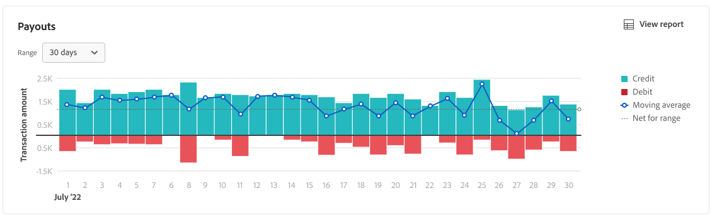

# 支付報告

[!DNL Payment Services] for [!DNL Adobe Commerce] 和 [!DNL Magento Open Source] 提供全面的報告，以便您能夠清楚地查看您商店的訂單和付款。

有兩種可用的「支付」報表視圖，使您能夠查看有關所有支付的深入資訊：

* **[支付資料可視化視圖](#payouts-data-visualization-view)** — 在「支付服務」首頁上可用的圖表，該圖表是「支付」報表視圖中每天合計金額的直觀表示
* **[支付報表視圖](#payouts-report-view)** — 「支付」中提供的報告，顯示所有交易的詳細支付資訊

「支付」視圖一目瞭然地顯示了全面的支付資訊，使您能夠完全透明地了解支付金額、處理量，並詳細報告用於財務對賬的交易級別。

>[!NOTE]
>
>付款報表只顯示已捕獲的訂單(付款活動設定為 [`Authorize and Capture`](https://experienceleague.adobe.com/docs/commerce-merchant-services/payment-services/get-started/production.html#set-payment-services-as-payment-method)) — 或 [標示為 `Invoiced`](https://docs.magento.com/user-guide/sales/invoice-create.html).

## 支付資料可視化視圖

支付服務首頁中提供了支付資料可視化視圖。 它是詳細表格中每天匯總金額的視覺表示 [支付報表視圖](#payouts-report-view).

在 _管理_ 邊欄，轉到 **[!UICONTROL Sales]** > **[!UICONTROL Payment Services]** 查看點數與借項及移動平均數在一段時間內的資料視覺效果圖表。

按一下 **[!UICONTROL View Report]** 導覽至詳細表格 [支付報表視圖](#payouts-report-view).

### 自訂交易時間範圍

預設會顯示30天的交易。

從「支付」資料可視化視圖，您可以通過選擇日期範圍來自定義要查看的支付交易的時間範圍：

1. 在 _管理_ 邊欄，轉到 **[!UICONTROL Sales]** > **[!UICONTROL Payment Services]**. 「支付」資料可視化視圖顯示在「支付」部分。
1. 按一下 **[!UICONTROL Range]** 選取器篩選器。
1. 選擇適用的日期範圍 — 30天、15天或7天。
1. 查看指定日期的交易資訊。

### 交易資訊

所選日期範圍的交易金額顯示在「支付」資料可視化視圖的左側。 所選日期範圍的日期會顯示在檢視底部。 如果某個日期沒有支付，該日期將不會出現。

支付資料可視化視圖包括以下資訊。

| 資料 | 說明 |
| ------------ | -------------------- |
| [!UICONTROL Transaction amount] | 指定時間範圍內的事務處理的金額範圍；Y軸上的資料（左） |
| 日期範圍 | 指定時間範圍的日期範圍；X軸上的資料（底部） |
| 來源 | 指定時間範圍的付款 |
| 借記 | 指定時段的借記（退款） |
| 移動平均 | 在指定時間範圍內表示每個日期的平均支付 |
| 範圍網 | 指定時間範圍（範圍）的淨支付額 |

## 支付報表視圖

支付報表視圖可在支付服務的支付視圖中使用。 它包括關於貴店支付款項的所有可用資訊。 此 [支付資料可視化視圖](#payouts-data-visualization-view) 在「支付服務首頁」中，在此更詳細的報表視圖中，以視覺化方式表示每天的匯總金額。

在 _管理_ 邊欄，轉到 **[!UICONTROL Sales]** > **[!UICONTROL Payment Services]** > **[!UICONTROL Payouts]** 查看詳細的表格「支付」報告視圖。

您可以依照本主題的各節設定此檢視，以最佳呈現您想要查看的資料。

請參閱「管理員」的「支付」報表中的連結商務訂單和交易ID、交易金額、每筆交易的支付方法等。

您可以下載.csv檔案格式的付款交易，以用於現有的會計或訂單管理軟體。

>[!NOTE]
>
>此表格中顯示的資料會以遞減順序排序(`DESC`)，預設為使用 `TRANS DATE`. 此 `TRANS DATE` 是事務處理的起始日期和時間。

### 選擇資料源

在「支付」報表視圖中，您可以選擇資料源 — _[!UICONTROL Live]_或_[!UICONTROL Sandbox]_ — 您想查看其報告結果。

若 _[!UICONTROL Live]_是選取的資料來源，您就會看到即時商店的報表資訊。 若 [!UICONTROL Sandbox]_是選取的資料來源，您可以看到沙箱環境的報表資訊。

資料源選擇的工作方式如下：

* 如果您沒有任何處於即時模式的儲存，資料來源選取項目會預設為 _[!UICONTROL Sandbox]_.
* 如果您在即時模式中有任何存放區（一或多個），資料來源選取項目會預設為 _[!UICONTROL Live]_.
* 報表匯出一律會遵循資料來源的選取。

要為訂單付款狀態報表選擇資料源，請執行以下操作：

1. 在 _管理_ 邊欄，轉到 **[!UICONTROL Sales]** > **[!UICONTROL Payment Services]** > **[!UICONTROL Payouts]**.
1. 按一下 **[!UICONTROL Data source]** 選取 _[!UICONTROL Live]_或_[!UICONTROL Sandbox]_.

   報表結果會根據選取的資料來源重新產生。

### 查看事務

預設會顯示30天的交易。

搜索中返回或顯示在預設30天交易中的行數，與「交易日期」日曆選擇器篩選器一起顯示在「支付」視圖網格上方。

向左和向右滾動以查看 [每個支付交易的資訊](#column-descriptions) 在每日報告中，包括交易日期、參考ID、發票編號和付款方法詳細資訊。

#### 自訂交易時間範圍

從「支付」報表視圖中，您可以通過輸入特定日期或從日期選擇器選擇日期範圍來自定義要查看的支付事務處理的時間範圍：

1. 在 _管理_ 邊欄，轉到 **[!UICONTROL Sales]** > **[!UICONTROL Payment Services]** > **[!UICONTROL Payouts]**.
1. 按一下「交易日期日曆選擇器」篩選器。
1. 選擇適用的日期範圍。
1. 在網格中查看指定日期的付款狀態。

### 顯示和隱藏列

預設情況下，「支付」報表視圖顯示最多可用的資訊列。 不過，您可以自訂在報表中看到的欄。

1. 在 _管理_ 邊欄，轉到 **[!UICONTROL Sales]** > **[!UICONTROL [!DNL Payment Services]]** > **[!UICONTROL Payouts]**.
1. 按一下 _欄設定_ 圖示()。
1. 若要自訂您在報表中看到的欄，請核取或取消勾選清單中的欄。

   「支付」報表視圖將立即顯示您在「列」設定菜單中所做的任何更改。 欄偏好設定會儲存，且如果您離開報表檢視，將保持有效。

### 下載交易

您可以下載包含「支付」視圖網格中顯示的所有交易的.csv檔案。

1. 在 _管理_ 邊欄，轉到 **[!UICONTROL Sales]** > **[!UICONTROL Payment Services]** > **[!UICONTROL Payouts]**.
1. [自訂交易的日期範圍時間範圍](#customize-transactions-timeframe).
1. 按一下 _下載_ ()圖示。

您的付款交易會以.csv格式下載。

### 欄說明

支付報告包括以下資訊。

| 欄 | 說明 |
| ------------ | -------------------- |
| [!UICONTROL Provider] | 支付提供商 |
| [!UICONTROL Provider trans] | 交易ID |
| [!UICONTROL Trans date] | 起始日期和時間事務處理 |
| [!UICONTROL Type] | 交易類型 — *[!UICONTROL PAYMENT]*, *[!UICONTROL BONUS]*, *[!UICONTROL CHARGEBACK]*, *[!UICONTROL CORRECTION]*, *[!UICONTROL CURRENCY_CONVERSATION]*, *[!UICONTROL DEPOSIT]*, *[!UICONTROL DISBURSEMENT]*, *[!UICONTROL DISPUTE]*, *[!UICONTROL FEES]*, *[!UICONTROL HOLD]*, *[!UICONTROL HOLD_RELEASE]*, *[!UICONTROL INCENTIVES]*, *[!UICONTROL OTHERS]*, *[!UICONTROL RECOUP]*, *[!UICONTROL REFUND]*, *[!UICONTROL REVERSAL]*, *[!UICONTROL WITHDRAWAL]*    請參閱 [交易類型](#transaction-types) 以取得更多資訊。 |
| [!UICONTROL Status] | 交易的當前狀態 — *[!UICONTROL SUCCESS]*, *[!UICONTROL DENIED]*, *[!UICONTROL PENDING]* |
| [!UICONTROL Code] | 表示信用(*CR*)或借項(*DR*) |
| [!UICONTROL Reference ID] | 與此事件相關的原始交易ID |
| [!UICONTROL Invoice] | 交易的發票ID（每張訂單一張） |
| [!UICONTROL Commerce order] | 商務訂單ID    查看相關 [訂購資訊](https://docs.magento.com/user-guide/sales/orders.html){target=&quot;_blank&quot;}，按一下ID。 |
| [!UICONTROL Commerce trans] | 商務交易ID    查看相關 [交易資訊](https://docs.magento.com/user-guide/sales/transactions.html){target=&quot;_blank&quot;}，按一下ID。 |
| [!UICONTROL Pay method] | 信用卡類型 — *[!UICONTROL BANK]*, *[!UICONTROL PAYPAL]*, *[!UICONTROL APPLE_PAY]*, *[!UICONTROL CREDIT_CARD]* — 和關聯的卡提供者(例如 *簽證* 或 *MasterCard*) |
| [!UICONTROL Trans amt] | 交易金額 |
| [!UICONTROL Cur] | 交易記錄金額的幣種單位 |
| [!UICONTROL Pending] | 尚未支付的金額 |
| [!UICONTROL Cur] | 待定金額的幣種單位 |
| [!UICONTROL Seller amt] | 轉給客戶或從客戶轉出的資金金額    從賣家帳戶移出的基金會顯示破折號(-)首碼。 |
| [!UICONTROL Cur] | 賣方金額的貨幣單位 |
| [!UICONTROL Partner fee] | 與交易相關的合作夥伴費用    從合作夥伴費用帳戶移出的資金會顯示破折號(-)首碼。 |
| [!UICONTROL Cur] | 合作夥伴費用的貨幣單位 |
| [!UICONTROL Prov fees] | 與交易相關的費用    從提供者的費用帳戶移出的資金會顯示破折號(-)首碼。 |
| [!UICONTROL Cur] | 提供商費用的貨幣單位 |
| [!UICONTROL Fee %] | 作為費用收取的交易金額的百分比 |
| [!UICONTROL Fixed fee] | 固定提供商費用金額 |
| [!UICONTROL Chbk fee] | 與交易關聯的拖欠款項費用    破折號(-)前置詞表示拖欠費用已衝銷。 |
| [!UICONTROL Cur] | 拖欠費用的貨幣單位 |
| [!UICONTROL Hold amt] | 暫停或解除保留的金額    破折號(-)首碼表示已發放暫掛基金。 |
| [!UICONTROL Cur] | 暫掛金額的幣種單位 |
| [!UICONTROL Recoup amt] | 從收回帳戶扣除的金額    從收回帳戶移出的資金會顯示破折號(-)首碼。 |
| [!UICONTROL Cur] | 收回金額的幣種單位 |

### 交易類型

這些交易類型可以在支付交易中記錄。

| 報表 | 說明 |
| ------------ | -------------------- |
| [!UICONTROL PAYMENT] | 在買方和賣方之間為訂單轉移的資金 |
| [!UICONTROL AUTH] | 授權和授權撤消事務 |
| [!UICONTROL BONUS] | — |
| [!UICONTROL CHARGEBACK] | 拖欠款項費用和拖欠款項費用衝銷交易 |
| [!UICONTROL CORRECTION] | — |
| [!UICONTROL CURRENCY_CONVERSION] | — |
| [!UICONTROL DEPOSIT] | — |
| [!UICONTROL DISBURSEMENT] | — |
| [!UICONTROL DISPUTE] | — |
| [!UICONTROL FEES] | 合作夥伴費用、支付費用和費用回撥交易 |
| [!UICONTROL HOLD] | — |
| [!UICONTROL HOLD_RELEASE] | — |
| [!UICONTROL INCENTIVES] | — |
| [!UICONTROL OTHERS] | — |
| [!UICONTROL RECOUP] | 從銀行或虧損帳戶中收回 |
| [!UICONTROL REFUND] | — |
| [!UICONTROL REVERSAL] | — |
| [!UICONTROL WITHDRAWAL] | — |
