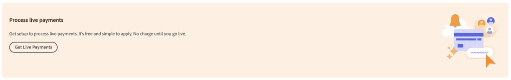

# 啟用 [!DNL Payment Services] 用於生產

您可以將服務投入生產並完成 [上線流程](onboard.md)，依照本主題中的步驟，在您：

* [安裝](install.md) 支付服務擴充功能
* [設定並連線](connect.md) 您的執行個體
* [設定](sandbox.md) 和 [測試](test-validate.md) 您的沙箱

## 設定 [!DNL Payment Services] 作為付款方式

在您之後 [設定您的Commerce服務](connect.md#configure-commerce-services) 並啟用 [沙箱測試](sandbox.md#enable-sandbox-testing) 或 [即時付款](#enable-live-payments)，您必須設定 [!DNL Payment Services] 作為您的付款方式。

1. 在 _管理員_ 側欄，前往 **[!UICONTROL Sales]** > **[!UICONTROL Payment Services]**.
1. 按一下 **[!UICONTROL Enable Payment Services]**.

   如果您尚未設定，便會顯示此選項 [!DNL Payment Services] 作為一或多個網站的付款方式。

   您將被導向至「首頁」檢視中的設定區域，相關的選項會展開(**[!UICONTROL Sales]** > **[!UICONTROL Payment Services]** > _[!UICONTROL Settings]_)，您可以在此處啟用 [!DNL Payment Services] 選項作為您的 [付款方法](https://docs.magento.com/user-guide/configuration/sales/payment-methods.html){target="_blank"}.

1. 在 _[!UICONTROL General Configuration]_，設定&#x200B;**[!UICONTROL Enable]**至 `Yes`.
1. 設定 **[!UICONTROL Payment Action]**，二者 _[!UICONTROL Credit Card Fields]_和_[!UICONTROL PayPal Smart Buttons]_，變更為下列其中一項：

   | 設定 | 說明 |
   |---|---|
   | `Authorize` | 核准購買並保留資金。 此金額必須等到商家「擷取」後才會提取。 |
   | `Authorize and Capture` | 核准購買且商家「擷取」資金。 |

1. 按一下 **[!UICONTROL Save]**.
1. 按一下 **[!UICONTROL Go to Payment Services]** 將重新導向至 [!DNL Payment Services] 首頁。
1. [清除您的快取](https://docs.magento.com/user-guide/system/cache-management.html){target="_blank"}.

   應在每次設定變更後進行清除。

另請參閱 [設定付款服務](settings.md) 有關設定信用卡欄位和PayPal智慧按鈕的詳細資訊。

## 完成商家入門

1. 在 _管理員_ 側欄，前往 **[!UICONTROL Sales]** > **[!UICONTROL Payment Services]**.
1. 按一下 **[!UICONTROL Live onboarding]**.

   如果您尚未完成的即時上線，即可看到此選項 [!DNL Payment Services].

   您會看到PayPal視窗。

1. 繼續進行PayPal流程，使用您的PayPal帳戶認證（不是您的沙箱帳戶認證）或註冊新的PayPal帳戶。
1. 在管理員側邊欄上，前往 **[!UICONTROL Sales]** > **[!UICONTROL Payment Services]**

   此 _[!UICONTROL Live onboarding]_按鈕不再顯示，且您看到「[!UICONTROL Live payments pending]「文字方塊。

   在該文字方塊中，系統可能會要求您確認使用PayPal的電子郵件地址，以便完成上線。

1. 如果系統提示您確認您的電子郵件地址，請檢查您的電子郵件是否有從PayPal傳送的確認訊息，然後按一下以確認您的電子郵件地址。
1. 在管理員側邊欄上，前往 **[!UICONTROL Sales]** > **[!UICONTROL Payment Services]**.
1. 重新整理您的瀏覽器視窗。

   當您的PayPal商家上線獲得核準時，您應該會看到一則通知，指出您的付款系統處於沙箱模式，且未處理即時付款。

   >[!IMPORTANT]
   >
   >如果您撤銷對 [!DNL Payment Services] 的 [!DNL Adobe Commerce] 和 [!DNL Magento Open Source] 為了處理您的付款（在您的PayPal帳戶設定中），您商店中的訂單無法由處理 [!DNL Payment Services]. 在您的「付款服務首頁」上，會出現有關撤銷同意的警報。

## 向Adobe要求付款權益

若要啟用即時上線，您必須向Adobe請求付款權利：

1. 在 _管理員_ 側欄，前往 **[!UICONTROL Sales]** > **[!UICONTROL Payment Services]**.
1. 按一下 **[!UICONTROL Get Live Payments]** 在您的 [!DNL Payment Services] 首頁。

   {width="500" zoomable="yes"}

1. 完成表單。
1. 銷售團隊的成員將會與您連絡。

或者，您可以向Adobe請求付款權益，網址為 [business.adobe.com](https://business.adobe.com/resources/payment-services.html).

>[!IMPORTANT]
>
>**即時上線** 在核准付款權益之前無法存取。

## 設定定價層

若要取得 [!DNL Payment Services] _商家ID_：

1. 在 _管理員_ 側欄，前往 **[!UICONTROL Sales]** > **[!UICONTROL Payment Services]**.
1. 在「首頁」檢視中，按一下 **[!UICONTROL Settings]**. 另請參閱 [首頁](payments-home.md) 以取得詳細資訊。
1. 選取所需的 _商家ID_ 然後提交給您的銷售代表，銷售代表會設定正確的定價層級。

## 啟用即時付款

A _生產商家識別碼_ 是自動產生，並填入 [設定](configure-admin.md). 請勿變更或變更此ID。

若要啟用即時付款：

1. 在 _管理員_ 側欄，前往 **[!UICONTROL Sales]** > **[!UICONTROL Payment Services]**.
1. 在首頁上，按一下 **[!UICONTROL Settings]** ，位於頁面右上方。 另請參閱 [首頁](payments-home.md) 以取得詳細資訊。
1. 在 _[!UICONTROL General Configuration]_區段集&#x200B;**[!UICONTROL Payment mode]**至 `Production`.
1. 按一下 **[!UICONTROL Save]**.
1. [清除您的快取](https://docs.magento.com/user-guide/system/cache-management.html){target="_blank"}.

   >[!IMPORTANT]
   >
   >如果您未清除快取，客戶在結帳時就無法看到PayPal付款選項。

如果您導覽回 [!DNL Payment Services] 首頁，沙箱付款模式訊息不再顯示，因為您現在正在處理即時付款。

另請參閱 [在管理員中設定](configure-admin.md) 舊版組態選項。

>[!IMPORTANT]
>
>如果您撤銷對 [!DNL Payment Services] 為了處理您的付款（在您的PayPal帳戶設定中），您商店中的訂單無法由處理 [!DNL Payment Services]. 如果您想要重新啟用付款處理功能，必須重新完成上線。 在您的「付款服務首頁」上，會出現有關撤銷同意的警報。

## 在生產環境中測試

強烈建議您先在生產環境中測試付款，並使用真正的信用卡和銀行，然後再向購物者公開此功能。

另請參閱 [測試及驗證](test-validate.md) 以取得詳細資訊。
