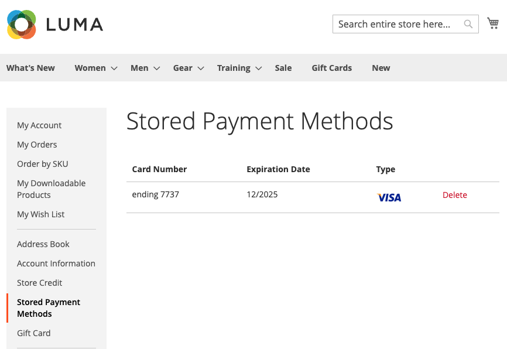
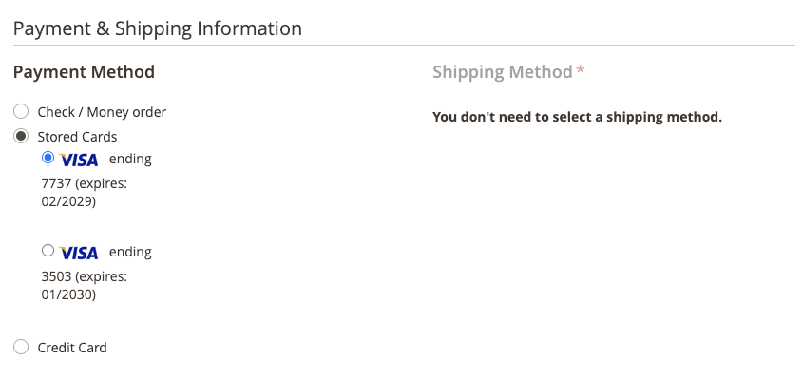

# 信用卡存放

透過信用卡保險存放，將一次性客戶轉換為忠實購物者。 購物者可以在結帳時儲存（或「儲存庫」）他們的信用卡憑證，以便用於日後購買相同或另一個商店的相同商家帳戶。

購物者會使用儲存的代號，以其儲存的信用卡資訊完成未來的結帳。

他們也可以輕鬆地從中刪除其存放的信用卡 [儲存的付款方法](https://docs.magento.com/user-guide/customers/account-dashboard-stored-payment-methods.html) （在他們的我的帳戶中）。

## 啟用存放區

您可以為客戶啟用信用卡保險存放 _和_ Admin中的商家 — 適用於您位於以下位置的商店： [!DNL Payment Services] [設定](settings.md#card-vaulting).

## 在管理員中使用存放區

如果客戶具有先前存放的信用卡，則商家可以使用其存放的付款方式，在「管理員」中建立該客戶的後續訂單。

如果客戶同時擁有現有帳戶，且系統中儲存了先前完成付款的有效權杖，您只能在「管理員」中使用存放卡。

若要在「管理員」中使用客戶的保管式信用卡建立訂單，請執行下列步驟：

1. [建立訂單並新增產品](https://experienceleague.adobe.com/docs/commerce-admin/stores-sales/point-of-purchase/assist/customer-account-create-order.html).
1. 在 _[!UICONTROL Payment & Shipping Information]_，選取&#x200B;**[!UICONTROL Stored Cards]**作為付款方式。
1. 選取所需的儲存型信用卡付款方式。
1. 完成訂單的其他必要步驟後， [提交](https://experienceleague.adobe.com/docs/commerce-admin/stores-sales/point-of-purchase/assist/customer-account-create-order.html?lang=en#step-3%3A-submit-the-order).

   

## 安全性

最少的信用卡資訊會與購物者共用；他們只能看到其存放的信用卡的最後4位數、到期日和品牌。 信用卡資訊會與付款提供者儲存以滿足 [PCI](security.md#PCI-compliance) 法規遵循標準。
