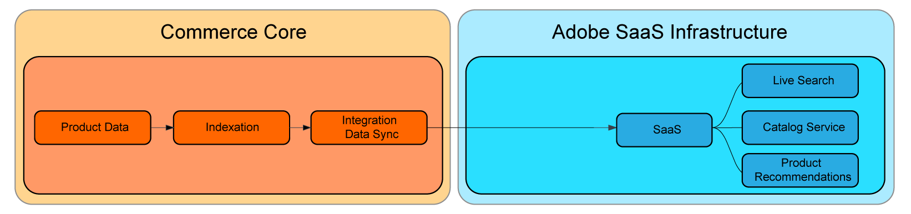

# SaaS價格索引

SaaS定價索引將繁重的運算程式（例如索引和價格計算）從Commerce應用程式移至Adobe的雲端基礎結構，藉此改善網站效能。 此方法可讓商戶快速擴充資源，以加快價格指數化時間，將資料傳送至店面及連線的Commerce服務時，能更快速地反映價格變化。

下圖顯示當Commerce使用 [價格索引](https://experienceleague.adobe.com/en/docs/commerce-operations/configuration-guide/cli/manage-indexers) Commerce應用程式中包含的程式：



啟用SaaS價格索引後，資料流程會變更。 使用下列專案執行價格索引： [Commerce SaaS資料匯出](../data-export/data-synchronization.md).


所有商戶都可以從使用SaaS價格索引中受益，但擁有以下特性專案的商戶可獲得最大的收益：

* **不變價格變更** — 需要重複變更價格以符合策略性目標的商家，例如頻繁促銷活動、季節性折扣或存貨減價。
* **多個網站和/或客戶群組** — 在多個網站（網域/品牌）及/或客戶群組間共用產品目錄的商家。
* **各網站或客戶群組的許多不重複價格** — 具有廣泛共用產品目錄的商家，這些目錄包含跨網站或客戶群組的獨特價格。 例如B2B商傢俱有預先議價的價格，或品牌具有不同的定價策略。

## 使用SaaS價格索引

安裝Adobe Commerce Services時，會自動啟用SaaS價格索引。 它支援所有內建Adobe Commerce產品型別的價格計算。

### 需求

* Adobe Commerce 2.4.4+

### 必要條件

* 下列其中一個Commerce服務必須搭配最新版的Commerce擴充功能安裝：

   * [目錄服務](../catalog-service/overview.md)
   * [即時搜尋](../live-search/overview.md)
   * [產品Recommendations](../product-recommendations/guide-overview.md)


>[!NOTE]
>
>如有需要，可以使用停用Commerce應用程式中的預設價格索引子。 [目錄配接器](catalog-adapter.md).

## 將價格與SaaS價格索引同步

為Adobe Commerce啟用SaaS價格索引後，同步新摘要以更新店面和Commerce Services中的價格：

```bash
bin/magento saas:resync --feed=scopesCustomerGroup
bin/magento saas:resync --feed=scopesWebsite
bin/magento saas:resync --feed=prices
```

### 自訂產品型別的價格

自訂產品型別支援價格計算，例如基本價格、特殊價格、群組價格、目錄規則價格等。

如果您的自訂產品型別使用特定公式來計算最終價格，您可以擴充產品價格摘要的行為。

1. 在上建立外掛程式 `Magento\ProductPriceDataExporter\Model\Provider\ProductPrice` 類別。

   ```xml
   <config xmlns:xsi="http://www.w3.org/2001/XMLSchema-instance"
           xsi:noNamespaceSchemaLocation="urn:magento:framework:ObjectManager/etc/config.xsd">
       <type name="Magento\ProductPriceDataExporter\Model\Provider\ProductPrice">
           <plugin name="custom_type_price_feed" type="YourModule\CustomProductType\Plugin\UpdatePriceFromFeed" />
       </type>
   </config>
   ```

1. 使用自訂公式建立方法：

   ```php
   class UpdatePriceFromFeed
   {
       /**
       * @param ProductPrice $subject
       * @param array $result
       * @param array $values
       *
       * @return array
       */
       public function afterGet(ProductPrice $subject, array $result, array $values) : array
       {
           // Override the output $result with your data for the corresponding products (see original method for details) 
           return $result;
       }
   }
   ```

