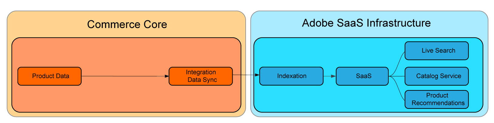

# SaaS價格索引

SaaS價格指數會縮短反映價格變動所需的時間 [Commerce服務](../landing/saas.md) 在它們提交之後。 如此一來，擁有大型複雜目錄、或擁有多個網站或客戶群組的商家，就能持續處理價格變更。

如果您有Headless店面或使用 [catalog-adapter](./catalog-adapter.md) 擴充功能，客戶能停用Adobe Commerce核心價格索引器，以使用SaaS Price Indexer。

運算密集程式（例如指數化和價格計算）已從Commerce核心移至Adobe的雲端基礎結構。 這可讓商家快速擴充資源，以縮短價格指數化時間，並更快速地反映這些變更。

核心索引資料流動到SaaS服務的形式如下：


使用SaaS價格指數時，流程為：



所有商戶都能受益於這些改善，但收益最大的是客戶：

* 不變價格變更：需要重複變更價格以符合策略性目標（例如頻繁促銷、季節性折扣或存貨減價）的商家。
* 多個網站和/或客戶群組：在多個網站（網域/品牌）和/或客戶群組中，擁有共用產品目錄的商家。
* 跨網站或客戶群組的大量不重複價格：具有廣泛共用產品目錄的商家，其中包含跨網站或客戶群組的不重複價格，例如，具有預先議定價格的B2B商家，以及具有不同定價策略的品牌。

使用Adobe Commerce服務的客戶可免費使用SaaS價格索引，且支援所有內建Adobe Commerce產品型別的價格計算。

本指南說明SaaS價格索引的運作原理以及如何啟用。

## 需求

* Adobe Commerce 2.4.4+
* 使用最新版Commerce擴充功能，提供下列至少一種Adobe Commerce服務：

   * [目錄服務](../catalog-service/overview.md)
   * [即時搜尋](../live-search/overview.md)
   * [產品Recommendations](../product-recommendations/guide-overview.md)

Luma和Adobe Commerce Core GraphQL使用者可安裝 [`catalog-adapter`](catalog-adapter.md) 此擴充功能提供Luma和核心GraphQl相容性，並停用Adobe Commerce產品價格索引器。

## 使用狀況

升級具有SaaS價格索引支援的Adobe Commerce執行個體後，請同步新摘要：

```bash
bin/magento saas:resync --feed=scopesCustomerGroup
bin/magento saas:resync --feed=scopesWebsite
bin/magento saas:resync --feed=prices
```

## 自訂產品型別的價格

自訂產品型別支援價格計算，例如基本價格、特殊價格、群組價格、目錄規則價格等。

如果您的自訂產品型別使用特定公式來計算最終價格，您可以擴充產品價格摘要的行為。

1. 在上建立外掛程式 `Magento\ProductPriceDataExporter\Model\Provider\ProductPrice` 類別。

   ```xml
   <config xmlns:xsi="http://www.w3.org/2001/XMLSchema-instance"
           xsi:noNamespaceSchemaLocation="urn:magento:framework:ObjectManager/etc/config.xsd">
       <type name="Magento\ProductPriceDataExporter\Model\Provider\ProductPrice">
           <plugin name="custom_type_price_feed" type="YourModule\CustomProductType\Plugin\UpdatePriceFromFeed" />
       </type>
   </config>
   ```

1. 使用自訂公式建立方法：

   ```php
   class UpdatePriceFromFeed
   {
       /**
       * @param ProductPrice $subject
       * @param array $result
       * @param array $values
       *
       * @return array
       */
       public function afterGet(ProductPrice $subject, array $result, array $values) : array
       {
           // Override the output $result with your data for the corresponding products (see original method for details) 
           return $result;
       }
   }
   ```
