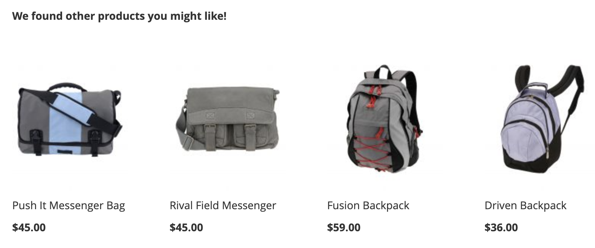
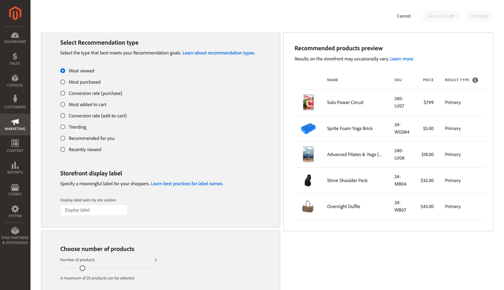
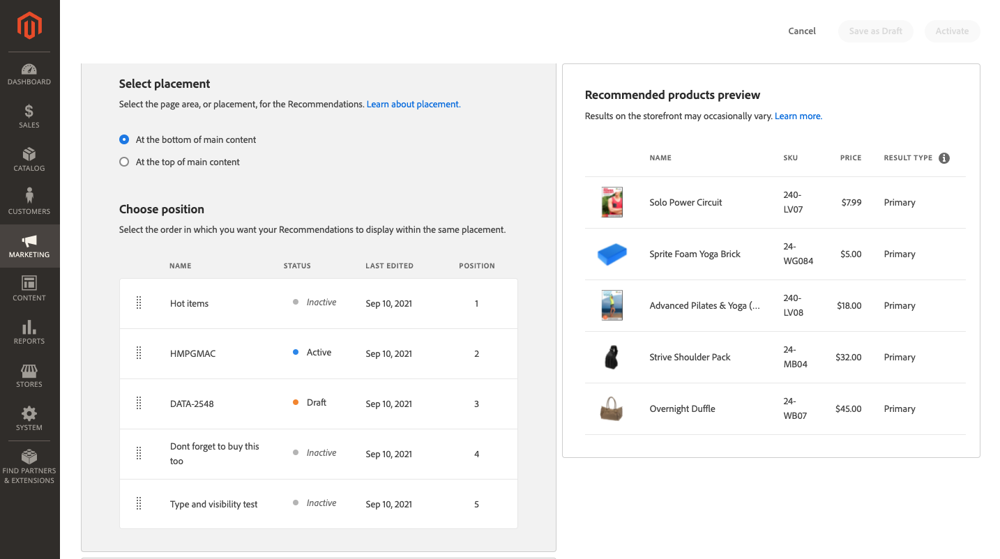
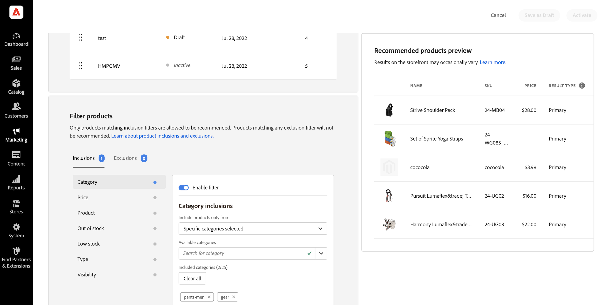

# 建立新建議

建立建議時，請建立 _建議單位_ 包含建議產品 _項目_.

_建議單位_

啟用建議單位時，Adobe Commerce會開始 [收集資料](workspace.md) 以測量曝光數、檢視、點按等。 此 [!DNL Product Recommendations] 表格顯示每個建議單位的量度，協助您做出明智的業務決策。

1. 在 _管理_ 邊欄，轉到 **行銷** > _促銷活動_ > **產品Recommendations** 顯示 _產品Recommendations_ 工作區。

1. 指定 [商店檢視](https://experienceleague.adobe.com/docs/commerce-admin/start/setup/websites-stores-views.html#scope-settings) 顯示建議的位置。

   >[!NOTE]
   >
   > 只能為預設商店檢視建立頁面產生器建議單位。 若要進一步了解如何使用頁面產生器建立產品建議，請參閱 [新增內容 — 產品Recommendations](https://experienceleague.adobe.com/docs/commerce-admin/page-builder/add-content/recommendations.html).

1. 按一下 **建立建議**.

1. 在 _為建議命名_ 部分，輸入內部引用的描述性名稱，如 `Home page most popular`.

1. 在 _選取頁面類型_ 區段中，從下列選項中選取您要顯示建議的頁面：

   - 首頁
   - 類別
   - 產品詳細資料
   - 購物車
   - 確認
   - [頁面產生器](https://experienceleague.adobe.com/docs/commerce-admin/page-builder/add-content/recommendations.html)

   您可以為每個頁面類型建立最多五個作用中建議單位，並為頁面產生器建立最多25個。 達到限制時，頁面類型會變灰。

   
   _建議名稱和頁面位置_

1. 在 _選取建議類型_ 區段，指定 [建議類型](type.md) 您希望在選取的頁面上顯示。 對於某些頁面， [刊登](placement.md) 建議的數量僅限於特定類型。

   某些建議類型會使用購物者的行為資料 [列車機器學習模型](behavioral-data.md) 以建立個人化建議。 為協助您具體了解每個建議類型的訓練進度，本區段會顯示每個類型的準備程度測量。 這些準備度指標是根據以下幾個因素計算：

   - 足夠的結果集大小：在大多數情況下，是否傳回足夠的結果，以避免使用 [備份建議](behavioral-data.md#backuprecs)?

   - 充分的結果集類型：要傳回的產品是否代表目錄中的多種產品？ 此因素的目標是避免讓少數產品成為網站上唯一建議的項目。

   根據上述因素，計算並顯示準備值。 建議類型在就緒值為75%或更高時，即視為已準備好部署。 當建議類型的準備程度至少為50%時，建議類型會視為已部分就緒。 最後，建議類型的就緒值小於50%時，系統會視為未準備好部署。

   
   _建議類型_

1. 在 _店面顯示標籤_ 部分，輸入 [標籤](placement.md#recommendation-labels) 「最暢銷商品」等可供您的購物者檢視之商品。

1. 在 _選擇產品數_ 區段中，使用滑桿來指定您要在建議單位中顯示多少產品。

   預設為 `5`，最大值為 `20`.

1. 在 _選擇投放位置_ 區段中，指定建議單元在頁面上的顯示位置。

   - 在主要內容底部
   - 在主要內容的頂端

1. （選用）若要變更建議的順序，請選取和移動 _選擇位置_ 表格。

   此 _選擇位置_ 區段會顯示為您選取的頁面類型建立的所有建議（如果有的話）。

   
   _頁面上的建議順序_

1. （選用）在 _篩選器_ 部分， [套用篩選器](filters.md) 來控制建議單位中出現的產品。

   
   _建議產品篩選器_

1. 完成時，按一下下列其中一項：

   - **另存為草稿** 編輯建議單位。 您無法修改草稿狀態中建議單元的頁面類型或建議類型。

   - **啟動** 啟用店面上的建議單位。

## 預覽Recommendations {#preview}

此 _建議的產品預覽_ 面板一律可搭配範例選取的產品使用，當這些產品部署至店面時，建議單元中可能會顯示這些產品。

若要在非生產環境中工作時測試建議，您可以從 [不同來源](settings.md). 這可讓商戶在部署至生產環境前，先試驗規則並預覽建議。

| 欄位 | 說明 |
|---|---|
| 名稱 | 產品的名稱。 |
| SKU | 分配給產品的庫存單位 |
| 價格 | 產品的價格。 |
| 結果類型 | 主要 — 指出收集的訓練資料足以顯示建議。 備份 — 表示收集的培訓資料不足，因此使用備份建議來填充插槽。 前往 [行為資料](behavioral-data.md) 進一步了解機器學習模型和備份建議。 |

當您建立建議單位時，請試驗頁面類型、建議類型和篩選器，以立即取得將包含之產品的即時意見。 當您開始了解顯示哪些產品時，可以設定建議單位以符合您的業務需求。

Adobe Commerce [篩選器](filters.md) 建議，以避免在單一頁面上部署多個建議單位時顯示重複產品。 因此，預覽面板中顯示的產品可能與店面中顯示的產品不同。

>[!NOTE]
>
> 您無法預覽 `Recently viewed` 建議類型，因為「管理」中沒有資料。
