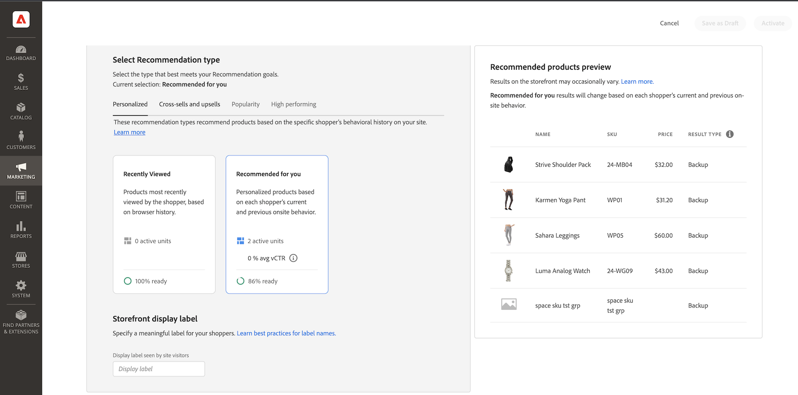
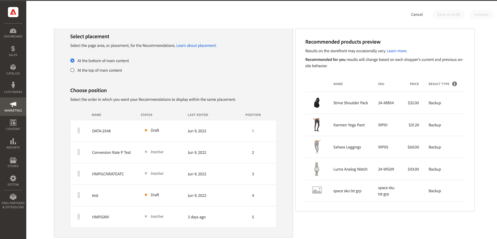

# 建立新建議

建立建議時，您會建立 _推薦單位_ 包含建議產品 _個專案_.

_推薦單位_

當您啟用建議單位時，Adobe Commerce會開始 [收集資料](workspace.md) 以測量曝光數、檢視數、點按數等。 此 [!DNL Product Recommendations] 表格會顯示每個建議單位的量度，以協助您做出明智的業務決策。

1. 在 _管理員_ 側欄，前往 **行銷** > _促銷活動_ > **產品Recommendations** 以顯示 _產品Recommendations_ 工作區。

1. 指定 [存放區檢視](https://experienceleague.adobe.com/docs/commerce-admin/start/setup/websites-stores-views.html#scope-settings) 您希望建議顯示的位置。

   >[!NOTE]
   >
   > 頁面產生器建議單位必須在預設商店檢視中建立，然後才可以在任何地方使用。 若要進一步瞭解如何使用Page Builder建立產品推薦，請參閱 [新增內容 — 產品Recommendations](https://experienceleague.adobe.com/docs/commerce-admin/page-builder/add-content/recommendations.html).

1. 按一下 **建立建議**.

1. 在 _為您的建議命名_ 區段，輸入內部參考的描述性名稱，例如 `Home page most popular`.

1. 在 _選取頁面型別_ 區段，從下列選項中選取您要顯示建議的頁面：

   - 首頁
   - 類別
   - 產品詳細資料
   - 購物車
   - 確認
   - [頁面產生器](https://experienceleague.adobe.com/docs/commerce-admin/page-builder/add-content/recommendations.html)

   您最多可以為每種頁面型別建立5個使用中的建議單位，並為頁面產生器建立25個使用中的建議單位。 當達到限制時，頁面型別會變灰。

   
   _建議名稱和頁面位置_

1. 在 _選取建議型別_ 區段，指定 [建議型別](type.md) 您想要顯示在選取的頁面上。 對於某些頁面， [刊登](placement.md) 個建議受限於特定型別。

   有些建議型別會使用購物者的行為資料來 [訓練機器學習模型](behavioral-data.md) 建置個人化建議。 為了協助您視覺化每個建議型別的培訓進度，本區段顯示每個型別的整備程度。 這些整備程度指標是根據兩個因素計算：

   - 足夠的結果集大小：在大多數案例中是否有足夠的結果可傳回以避免使用 [備份建議](behavioral-data.md#backuprecs)？

   - 足夠的結果集變化：傳回的產品是否代表目錄中的各種產品？ 此因素的目標是避免少數產品成為整個網站唯一建議的專案。

   系統會根據上述因素計算並顯示整備程度值。 當建議型別的整備程度值為75%或以上時，即視為已準備好部署。 當建議型別的整備程度至少為50%時，即視為部分整備。 當建議型別的整備值小於50%時，即視為未準備好部署。

   >[!NOTE]
   >
   >指標可能永遠不會達到100%。

   
   _建議型別_

1. 在 _店面顯示標籤_ 區段，輸入 [標籤](placement.md#recommendation-labels) 您的購物者可看見該專案，例如「最暢銷商品」。

1. 在 _選擇產品數量_ 區段，使用滑桿來指定您要在建議單位中顯示的產品數量。

   預設值為 `5`，最大為 `20`.

1. 在 _選取位置_ 區段，指定建議單位在頁面上的顯示位置。

   - 在主要內容底部
   - 在主要內容的頂端

1. （可選）若要變更建議的順序，請選取並移動建議中的列， _選擇位置_ 表格。

   此 _選擇位置_ 區段會顯示為您選取的頁面型別建立的所有建議（如果有的話）。

   
   _頁面上的建議順序_

1. （選用）在 _篩選器_ 部分， [套用篩選器](filters.md) 控制哪些產品會出現在建議單位中。

   
   _建議產品篩選器_

1. 完成後，按一下下列其中一項：

   - **另存為草稿** 以稍後編輯建議單位。 您無法修改處於草稿狀態的建議單位的頁面型別或建議型別。

   - **啟動** 以啟用店面上的推薦單位。

## 預覽Recommendations {#preview}

此 _建議的產品預覽_ 將面板部署至店面時，面板始終可隨建議單位中可能顯示的產品範例選項一起使用。

若要在非生產環境中工作時測試建議，您可以從擷取建議資料 [不同來源](settings.md). 這可讓商家在部署至生產環境之前，先體驗規則並預覽建議。

| 欄位 | 說明 |
|---|---|
| 名稱 | 產品的名稱。 |
| SKU | 指派給產品的庫存單位 |
| 價格 | 產品的價格。 |
| 結果型別 | 主要 — 表示收集到的訓練資料足夠顯示建議。 備份 — 表示未收集足夠的訓練資料，因此使用備份建議來填滿時段。 前往 [行為資料](behavioral-data.md) 以進一步瞭解機器學習模型和備用建議。 |

當您建立建議單位時，請嘗試使用頁面型別、建議型別和篩選器，以取得即將包含之產品的即時即時回饋。 當您開始瞭解顯示的產品時，可以設定建議單位以符合您的業務需求。

Adobe Commerce [篩選器](filters.md) 建議：可避免在單一頁面上部署多個建議單位時顯示重複的產品。 因此，預覽面板中顯示的產品可能與店面中顯示的產品不同。

>[!NOTE]
>
> 您無法預覽 `Recently viewed` 建議型別，因為管理中無法提供資料。
