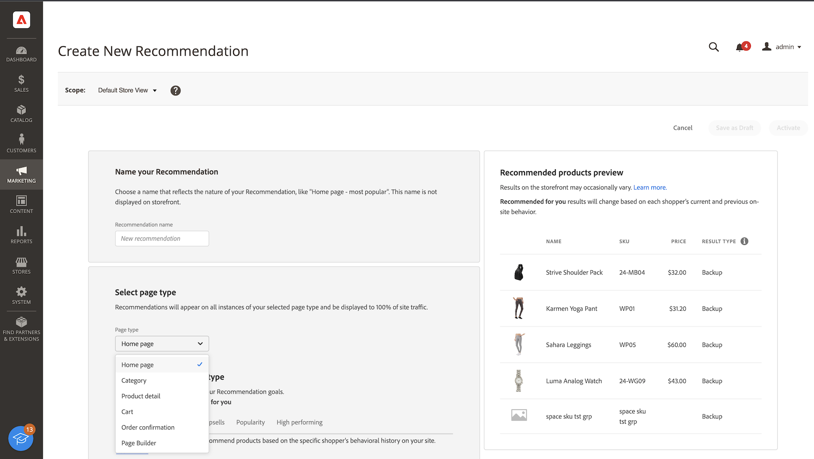

# 建立新建議

建立建議時，將建立 _推薦單元_ 包含推薦產品 _項目_。

_推薦單元_

激活推薦單元後，Adobe Commerce [收集資料](workspace.md) 測量印象、視圖、點擊量等。 的 [!DNL Product Recommendations] 表顯示每個建議單元的度量，以幫助您做出明智的業務決策。

1. 在 _管理_ 邊欄，轉到 **營銷** > _促銷_ > **產品Recommendations** 顯示 _產品Recommendations_ 工作區。

1. 指定 [儲存視圖](https://docs.magento.com/user-guide/configuration/scope.html) 顯示建議的位置。

   >[!NOTE]
   >
   > 只能為預設儲存視圖建立頁面生成器建議單元。 要瞭解有關使用頁面生成器建立產品建議案的詳細資訊，請參閱 [添加內容 — 產品Recommendations](https://docs.magento.com/user-guide/cms/page-builder-add-recommendations.html)。

1. 按一下 **建立建議**。

1. 在 _命名您的建議_ 部分，輸入內部引用的描述性名稱，如 `Home page most popular`。

1. 在 _選擇頁面類型_ 部分，從以下選項中選擇希望顯示建議的頁面：

   - 首頁
   - 類別
   - 產品詳細資訊
   - 購物車
   - 確認
   - [頁面生成器](https://docs.magento.com/user-guide/cms/page-builder-add-recommendations.html)

   對於每個頁面類型，最多可以建立五個活動建議單元，對於頁面生成器，最多可建立25個活動建議單元。 達到限制後，頁面類型將呈灰色顯示。

   
   _建議名稱和位置_

1. 在 _選擇建議類型_ ，指定 [建議類型](type.md) 要顯示在所選頁面上。 對於某些頁面， [放置](placement.md) 建議的範圍限於某些類型。

1. 在 _店面顯示標籤_ ，輸入 [標籤](placement.md#recommendation-labels) 你的購物者可以看到的，比如「暢銷貨」。

   
   _建議類型_

1. 在 _選擇產品數_ 部分，使用滑塊指定要在建議單元中顯示多少個產品。

   預設值為 `5`，最大值為 `20`。

1. 在 _選擇放置_ 部分，指定建議單元在頁面上顯示的位置。

   - 在主要內容的底部
   - 在主要內容的頂部

1. （可選）要更改建議的順序，請選擇和移動 _選擇職位_ 的子菜單。

   的 _選擇職位_ 部分顯示為所選頁面類型建立的所有建議（如果有）。

   
   _建議類型_

1. （可選）在 _篩選器_ 的 [應用篩選器](filters.md) 以控制推薦單元中出現的產品。

   
   _推薦產品篩選器_

1. 完成後，按一下以下選項之一：

   - **另存為草稿** 編輯推薦單元。 您不能修改處於草稿狀態的建議單元的頁面類型或建議類型。

   - **激活** 啟用店面上的推薦單元。

## 預覽Recommendations {#preview}

的 _推薦的產品預覽_ 面板始終可用，其中包含在將其部署到店面時可能出現在推薦單元中的產品示例選擇。

要在非生產環境中工作時test建議，可以從 [不同源](settings.md)。 這允許商家在部署到生產前先試驗規則並預覽建議。

| 欄位 | 說明 |
|---|---|
| 名稱 | 產品的名稱。 |
| SKU | 分配給產品的庫存單位 |
| 價格 | 產品的價格。 |
| 結果類型 | 主要 — 表示收集的培訓資料足以顯示建議。 備份 — 表示收集的培訓資料不足，因此使用備份建議填充插槽。 轉到 [行為資料](behavioral-data.md) 瞭解有關機器學習模型和備份建議的詳細資訊。 |

在建立推薦單元時，請對頁面類型、推薦類型和篩選器進行實驗，以立即獲得有關將包含的產品的即時反饋。 在您開始瞭解出現哪些產品時，您可以配置推薦單元以滿足您的業務需要。

Adobe Commerce [篩選](filters.md) 建議，以避免在單個頁面上部署多個建議單元時顯示重複的產品。 因此，在預覽面板中顯示的產品可能與在店面中顯示的產品不同。

>[!NOTE]
>
> 無法預覽 `Recently viewed` 建議類型，因為資料在管理中不可用。
