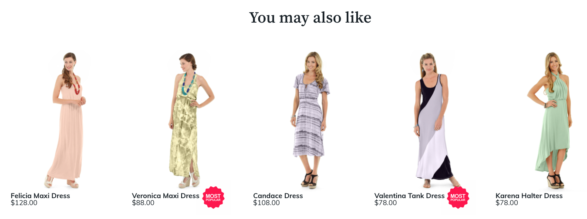

# 自定義

安裝產品Recommendations模組時，Adobe Commerce會建立 `ProductRecommendationsLayout` 的子菜單。 此目錄包含可自定義以更改建議案在儲存面上顯示方式的模板檔案。 具體而言，您可以修改或覆蓋以下模板：

`<your theme>/Magento_ProductRecommendationsLayout/web/template/recommendations.html`

有關修改模板檔案的詳細資訊，請參閱 [模板自定義](https://developer.adobe.com/commerce/frontend-core/guide/templates/walkthrough/) 的上界。

如果修改 `recommendations.html` 檔案中，必須在檔案中保留以下標籤，以確保Adobe Commerce可以從您的儲存前端收集建議度量：

| 標籤 | 使用 |
|---|---|
| `<div data-bind="attr : {'data-unit-id' : unitId }"...</div>` | 收集視圖事件。 |
| `<a data-bind="attr : {'data-sku' : sku, 'data-unit-id'}"...</a>` | 收集按一下事件。 <br/>**注：** 如果添加了任何錨點標籤，則必須包括這些屬性。 |

除 `recommendations.html` 檔案 `ProductRecommendationsLayout` 目錄包含以下子目錄：

| 目錄 | 目的 |
|---|---|
| `layout` | 包含 `*.xml` 每個頁面類型的檔案 |
| `templates` | 包含調用讀取和呈現指令碼的檔案 |
| `web/js` | 包含為儲存提取和呈現建議的JavaScript檔案 |
| `web/template` | 包含的模板 `magento/product-recommendations` 模組 |

## 推薦單元定位

當你 [建立](create.md) 建議，指定 [位置](placement.md) 頁面上的。 推薦單元可以放置在主內容容器的頂部或底部。 但是，可以自定義此放置。 如果建立頁面生成器建議內容類型，請使用頁面生成器工具將建議單元定位在頁面上。 對於所有其他頁面類型，編輯 `*.xml` 建立建議時生成的檔案。

1. 更改為 `layout` 目錄：

   ```bash
   cd `<your theme>/Magento_ProductRecommendationsLayout/layout`
   ```

   下表列出了此目錄中存在的XML檔案：

   | 檔案名 | 頁面 |
   |---|---|
   | `catalog_category_view.xml` | 類別 |
   | `catalog_product_view.xml` | 產品詳細資訊 |
   | `checkout_cart_index.xml` | 購物車 |
   | `checkout_onepage_success.xml` | 簽出 |
   | `cms_index_index.xml` | 首頁 |

   >[!NOTE]
   >
   >中的檔案名 `layout` 如果儲存使用第三方副檔名，則目錄可能不同。

1. 修改 `catalog_product_view.xml` 使推薦單元顯示在產品詳細資訊頁面上的產品影像之後。 在自定義此XML檔案之前，請查看該檔案並瞭解需要修改的部分：

   ```xml
   <?xml version="1.0"?>
   <page xmlns:xsi="http://www.w3.org/2001/XMLSchema-instance" xsi:noNamespaceSchemaLocation="urn:magento:framework:View/Layout/etc/page_configuration.xsd">
       <referenceBlock name="page.wrapper">
           <block class="Magento\Framework\View\Element\Template" before="-" name="product_recommendations_fetcher" template="Magento_ProductRecommendationsStorefront::fetcher.phtml" />
       </referenceBlock>
       <body>
           <referenceBlock name="main.content">
               <block class="Magento\ProductRecommendationsStorefront\Block\Renderer" after="-" name="product_recommendations_product_below_content" template="Magento_ProductRecommendationsStorefront::renderer.phtml">
                   <arguments>
                       <argument name="pagePlacement" xsi:type="string">below-main-content</argument>
                   </arguments>
               </block>
           </referenceBlock>
       </body>
   </page>
   ```

   在上面的代碼段中， `main.content` 引用塊表示建議單元將相對於該元素放置在某個位置。 其 `block` 元素包含 `after="-"` 屬性，它指定在主內容塊之後將在頁面上顯示建議單元。

1. 讓我們通過指定其他內容塊來修改此檔案。

   更改引用塊 `name` 從 `main.content` 至 `product.info.media`。

   ```xml
   <?xml version="1.0"?>
   <page xmlns:xsi="http://www.w3.org/2001/XMLSchema-instance" xsi:noNamespaceSchemaLocation="urn:magento:framework:View/Layout/etc/page_configuration.xsd">
       <referenceBlock name="page.wrapper">
           <block class="Magento\Framework\View\Element\Template" before="-" name="product_recommendations_fetcher" template="Magento_ProductRecommendationsStorefront::fetcher.phtml" />
       </referenceBlock>
       <body>
           <referenceBlock name="product.info.media">
               <block class="Magento\ProductRecommendationsStorefront\Block\Renderer" after="-" name="product_recommendations_product_below_content" template="Magento_ProductRecommendationsStorefront::renderer.phtml">
                   <arguments>
                       <argument name="pagePlacement" xsi:type="string">below-main-content</argument>
                   </arguments>
               </block>
           </referenceBlock>
       </body>
   </page>
   ```

   此更改將導致建議單元出現在產品詳細資訊頁面上的產品影像之後。 如果希望建議單元出現在 `product.info.media`，更改 `after="-"` 屬性 `before="-"`。 的 `pagePlacement` 參數是不應修改的內部參數。

請參閱 [佈局概述](https://developer.adobe.com/commerce/frontend-core/guide/layouts/) 的子菜單。

## 自定義產品屬性

開發人員通常需要訪問店面推薦單元中的定製產品屬性值，以便他們能夠根據這些屬性為產品添加視覺處理。

例如，如果您的商店銷售一些有機產品，則您可能對那些將其指定為 `Organic = Yes`。 您可能需要訪問店面上的此屬性值，以便當這些產品出現在Recommendations時，可以給它們特殊的視覺處理。 同樣，訪問這些定制產品屬性值允許您在站點的演示層中標籤產品或驅動定制邏輯。



要確保在頁面上呈現推薦單元時自定義產品屬性可用，請設定 `Used in Product Listing` 屬性 `Yes` 的 [產品屬性](https://experienceleague.adobe.com/docs/commerce-admin/catalog/product-attributes/create/attribute-product-create.html) 頁。

設定此屬性時，JSON負載包含 `attributes` 包含屬性代碼和值陣列的對象。 然後，您可以根據這些屬性值應用自定義的店面樣式，如添加前面提到的特殊視覺處理或徽章。

>[!NOTE]
>
>JSON負載中可能會顯示產品屬性更改，最多需要一小時。
