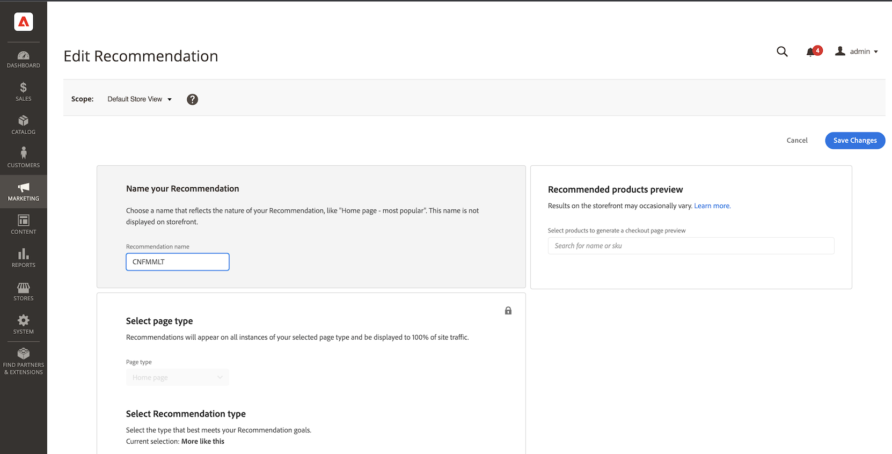
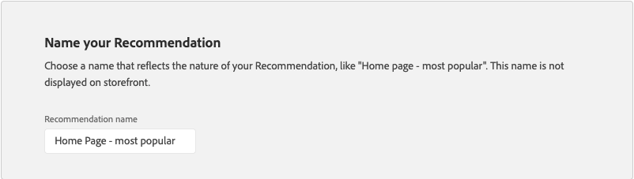
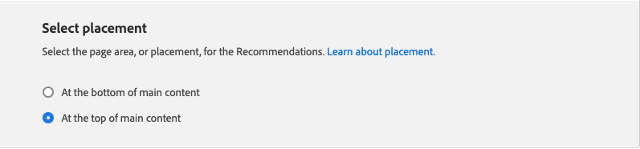
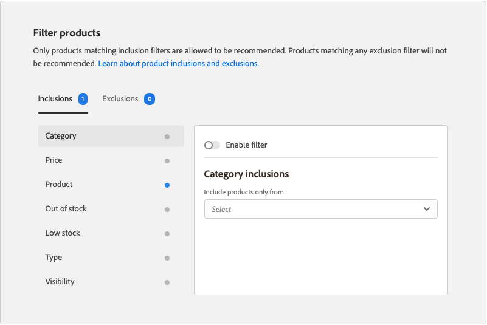

# 編輯建議

「編輯建議案」頁允許您調整組成建議案的各個設定。 除頁面類型和建議類型外，可以編輯所有設定。 可以編輯以下設定：

- [建議名稱](#name)
- [店面標籤](#label)
- [產品數](#number)
- [放置和位置](#placement)
- [篩選產品](#filters)

頁面右側的預覽顯示具有當前設定的建議如何顯示在店面中。 的 _推薦的產品預覽_ 在向下滾動頁面時，仍可見以供參考。 預覽顯示每個返回產品的縮略圖、產品名稱、SKU、價格和結果類型。 結果類型指示是否有足夠的主行為資料來生成建議，或者是否正在使用備份行為資料。

## 編輯建議

1. 在 _管理_ 邊欄，轉到 **營銷** > _促銷_ > **產品Recommendations**。

1. 選擇要編輯的建議。

1. 按一下 **編輯**。 然後，按照下面的說明進行所需更改。

1. 完成後，按一下 **保存更改**。

### 建議名稱 {#name}

選擇一個說明性名稱，以指明建議的目的。 該名稱用於內部引用，不會出現在店面中。

### 店面標籤 {#label}

輸入要用作店面中建議單元標籤的文本。

### 產品數 {#number}

調整滑塊以在推薦單元中顯示多達20個產品。

### 位置和位置 {#placement}

1. 選擇建議單元將出現在店面中的頁面位置。

   - 在主要內容的底部
   - 在主要內容的頂部

   

1. 要更改包含在單元中的建議的順序，請使用 **移動**  控制項將建議拖到位置。

   

### 篩選產品 {#filters}

對產品所做的任何更改 [篩選](filters.md) 反映在 _推薦的產品預覽_。 只允許推薦與包含篩選器匹配的產品。 不建議使用與任何排除過濾器相匹配的產品。

的 _包含_ 和 _排除_ 頁籤列出每種類型的可用篩選器。 在清單中，每個活動過濾器都標有藍點。

- 要顯示每個篩選器的詳細資訊，請按一下篩選器名稱。
- 要更改篩選器狀態，請設定 **啟用篩選器** 切換到 `on` 或 `off` 位置。

過濾器設定描述要包括在建議單元中或排除的產品。 例如， _類別_ 篩選器包含設定告訴系統只包括選定類別中的產品。

