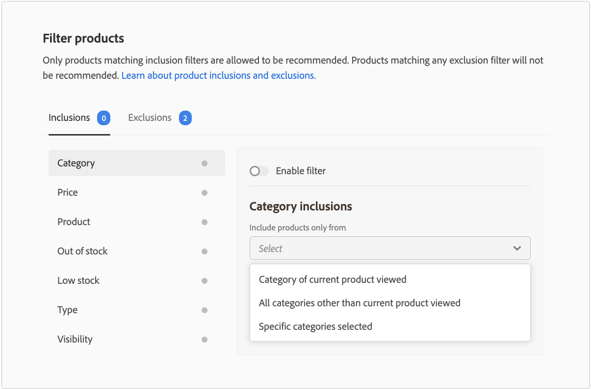

# 篩選產品

Adobe Commerce會自動將無法設定的預設篩選器套用至建議單位。 如果您將多個建議單位部署至頁面，Adobe Commerce會篩選掉單位中重複的任何產品。 只會使用重複產品的第一次參考，以便為建議其他產品騰出空間。 Adobe Commerce也會篩選掉任何先前購買過的產品和購物車中的產品。

當您 [建立](create.md) 建議單位，您可以定義篩選器來控制哪些產品可以顯示在建議中。 這些篩選條件是根據您定義的一組包含或排除條件。 只有符合所有包含條件的產品才會出現在建議中。 不建議使用符合任何排除條件的產品。

您可以設定多個篩選器，並選取每個篩選器頁面上的切換按鈕，只啟用您想要的篩選器。 這可讓您建立篩選的草稿以供日後使用。 每個標籤上會顯示已啟用的篩選器數目。

## 條件

條件可以是靜態或動態。

- 靜態條件會使用現有的產品屬性來決定哪些產品可以出現在單位中。 例如，您可以指定只有價格超過$25美元的庫存產品才會出現在單位中。 靜態條件適用於所有頁面型別。

- 購物者目前內容的動態條件索引鍵，例如目前檢視的類別或產品。 例如，建立要在產品詳細資料頁面上部署的產品建議時，您可以建立條件，以僅建議目前檢視之產品的相對價格範圍內的產品。 動態條件適用於首頁以外的每個頁面型別，以及使用Page Builder放置的建議頁面。

### 邏輯運運算元

邏輯運運算元 `AND` 和 `OR` 用於聯結多個條件。 如果同時使用包含和排除篩選器，系統會先評估包含專案，以判斷所有可能建議使用的產品，然後從清單中移除符合任何排除篩選器的產品。

- `AND`  — 加入兩個包含篩選條件
- `OR`  — 加入兩個排除篩選條件

>[!NOTE]
>
> 包含和排除篩選器會取代3.2.2版及更新版本中的舊版類別排除專案 `magento/product-recommendations` 模組。 請參閱 [發行說明](release-notes.md) 以進一步瞭解Adobe Commerce發行版本。

## 篩選器型別 {#filtertypes}

### 類別

根據產品類別的篩選器會使用直接類別指派及其子類別。 例如，啟用類別的排除條件 `Gear` 不包括指派到的產品 `Gear` 及其所有子類別，例如 `Gear/Bags` 或 `Gear/Fitness Equipment`. 若為B2B商家，類別篩選器會依循任何 [客戶特定產品類別](https://experienceleague.adobe.com/docs/commerce-admin/catalog/categories/category-permissions.html) 您已設定。

Adobe Commerce建議您在部署建議至頁面型別時，使用以下類別篩選設定：

| 頁面 | 篩選依據 |
|---|---|
| 首頁 | 不要篩選產品。 |
| 類別 | 篩選特定類別中的產品。 |
| 產品詳細資料 | 篩選相同類別中的產品。 |
| 購物車 | 篩選購物車中的產品類別。 |
| 訂單確認 | 篩選購買的產品類別。 |

### 產品

產品篩選器會指定哪些特定產品符合或不符合資格，以便顯示在建議中。 您無法選取已停用或無法個別顯示的產品，因為這些產品永遠無法出現在建議中。

### 型別

根據產品型別的篩選器可包含或排除特定型別的所有產品。 支援的型別包括 _簡單_， _可設定_， _虛擬_， _可下載_，或 _禮品卡_. _組合_ 和 _已分組_ 尚未支援產品。

### 可見度

根據可見度篩選產品，例如： _目錄_， _搜尋_，或兩者。

### 價格

根據產品價格的篩選器會使用最終價格來執行比較。 最終價格包含匿名購物者可以使用的任何折扣或特殊價格。 針對B2B商家，顯示的價格會反映 [客戶特定群組定價](https://experienceleague.adobe.com/docs/commerce-admin/catalog/products/pricing/pricing-advanced.html) 您已設定。

### 庫存狀態

下列排除篩選器可用於根據庫存狀態篩選出產品：

- 無庫存 — （僅供排除）不包括無庫存的產品。
- 庫存低 — （僅排除）排除庫存低的產品。 低庫存狀態是根據 _僅剩下X個臨界值_ 中的值 [詳細目錄設定](https://experienceleague.adobe.com/docs/commerce-admin/config/catalog/inventory.html).
