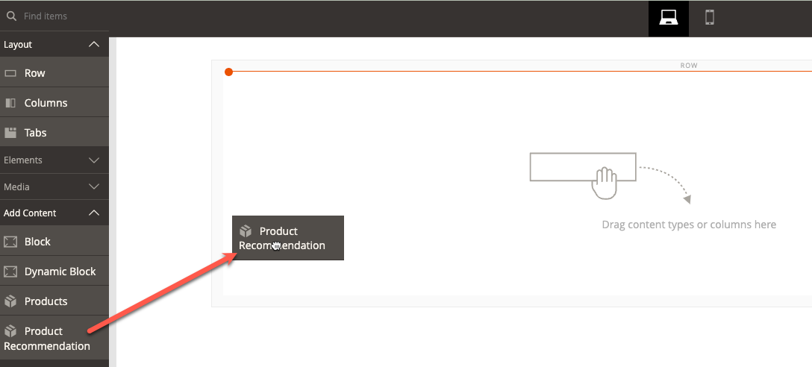
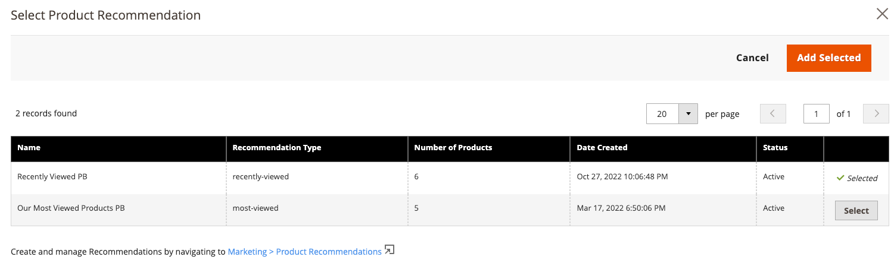

# [!DNL Page Builder] 整合

產品Recommendations可整合到您在站點上部署的任何頁面生成器內容中。

>[!NOTE]
>
> 在本機「頁面生成器」頁面上最多可以有25個建議單元。 非本機頁面生成器頁面最多可包含5個建議單元。 請參閱 [建立新建議](create.md) 的子菜單。

## 將產品Recommendations與頁面生成器內容一起使用

1. 在網站的預設儲存視圖中建立建議單元。 即使您計畫在不同的儲存視圖中使用它們，也必須在預設儲存視圖中建立它們。
1. 在頁面生成器中，選擇「產品」「Recommendations」內容小部件並放在您的站點上。

1. 按一下 **編輯產品建議**
1. 按一下 **選擇**
1. 選擇以前建立的建議單元，然後按一下 **添加選定項**

1. 對頁面生成器內容進行任何其他編輯並保存更改。

在呈現時，建議單元會尊重頁面生成器內容的上下文和範圍。
