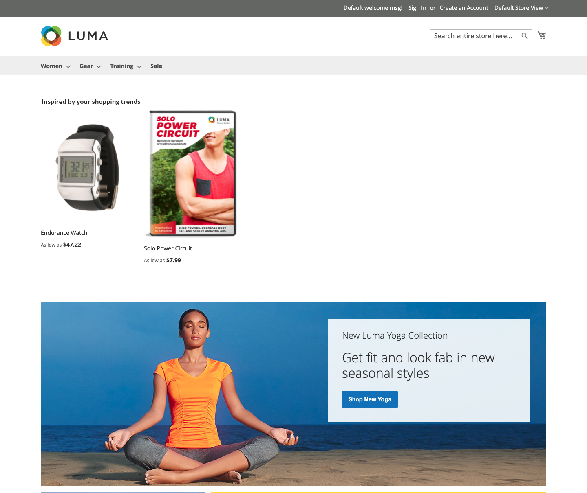
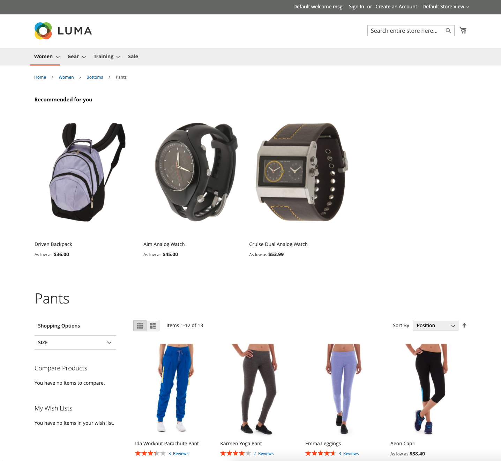

# 放置和標籤

有這麼多建議類型可供選擇，您應在每頁上使用哪些？ 如果您不確定從何處開始，請嘗試以下操作：

| 頁面 | 建議類型 |
|---|---|
| 首頁 | `Recommended for you` |
| 產品頁 | `Viewed this, viewed that` |
| 購物車 | `Bought this, bought that` |

你可以跟蹤 [度量](workspace.md) 並根據需要進行調整。 記住實驗是關鍵。

某些店面頁面會限制您將建議放在何處。 您可以將建議置於以下頁面位置之一。 有關詳細資訊，請參閱下表。

- 在主要內容的頂部 — Recommendations顯示在頂部導航欄下方的主要內容區域上方。
- 在主內容的底部（預設） — Recommendations顯示在主內容區域的下方，並顯示在頁面上的任何其他內容塊之前，例如 _相關產品_。

_首頁頂部的建議_

## 建議標籤

分配給店面中推薦的標籤會影響購物者解釋其與他們的相關性。 以下標籤經常用於每種類型的建議。

_搜索結果頂部的建議_

| 建議類型 | 推薦的標籤 |
|---|---|
| 最多查看  最多添加到購物車 購買量最多 轉換（查看到購物車） 轉換（查看到採購） | 最受歡迎 熱門項目 趨勢 現在流行 最近流行 受此項目(PDP)啟發的熱門項目 暢銷 你可能對 |
| 推薦給您 | 只為你 推薦給您 受您的購物趨勢啟發 |
| 已查看，已查看 | 查看此項目的客戶也已查看 客戶也已查看 相關項目 |
| 看了這個，買了 | 查看此內容的客戶最終購買了 最終購買的客戶 其他人查看此項目後購買什麼？ |
| 買這個，買那個 | 獲取所需的一切 別忘了這些 經常一起買 |
| 更類似 | 此類的更多項目 類似 |
| 泛型 | 您也可能喜歡 購物者也喜歡 類似選項 相關項目 |
| 趨勢 | 趨勢 立即趨勢 最近趨勢 熱項 趨勢相關產品(PDP) |
| 最近查看 | 最近查看 再看看 |

## 按頁支援的建議

下表列出了您可以在其中放置建議案的儲存庫首頁，以及每個頁上允許的建議案類型。

| 頁面 | 佈雷頓Recommendations |
|---|---|
| 首頁 | 在主要內容的頂部 主內容底部（預設） | 最多查看 購買量最多 最多添加到購物車 推薦給您 趨勢 |
| 類別 | 在主要內容的頂部 主內容底部（預設） | 最多查看 購買量最多 最多添加到購物車 推薦給您 趨勢 |
| 產品詳細資訊 | 主內容底部（預設） | 最多查看 購買量最多 最多添加到購物車 看過，看過 看了這個，買了 買這個，買那個 更像這樣 趨勢 視覺相似性 |
| 購物車 | 主內容底部（預設） | 最多查看 購買量最多 最多添加到購物車 看過，看過 看了這個，買了 買這個，買那個 更像這樣 趨勢 |
| 確認 | 主內容底部（預設） | 最多查看 購買量最多 最多添加到購物車 看過，看過 看了這個，買了 買這個，買那個 更像這樣 趨勢 |
| 頁面生成器 | [拖放](https://experienceleague.adobe.com/docs/commerce-admin/page-builder/add-content/recommendations.html) 定位內容類型 | 最多查看 購買量最多 最多添加到購物車 推薦給您 趨勢 |
