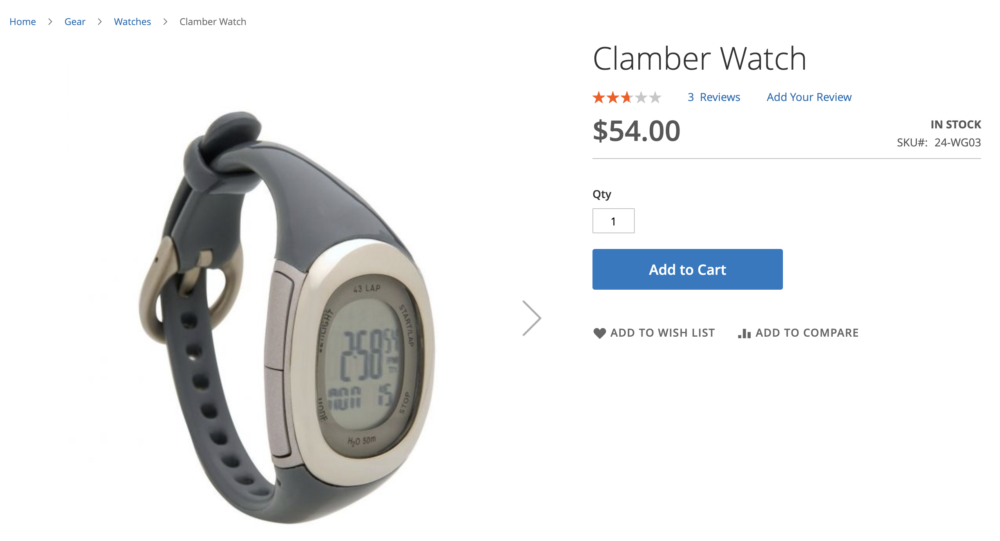
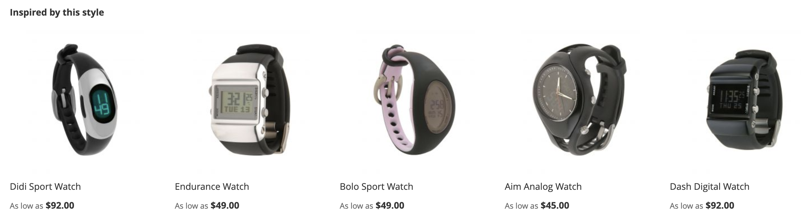

# 建議類型

Adobe Commerce提供了大量建議，您可以將其部署到站點上的各個頁面。 所有建議類型都是資料驅動的。 它們由行為資料、產品屬性資料和度量提供支援。 為便於參考，建議類型按如下方式分組：

- [個性化](#personalized)
- [交叉銷售和追加銷售](#crossup)
- [受歡迎](#popularity)
- [高效能](#highperf)

作為最佳做法，Adobe在使用建議時建議以下准則：

- 分散您的建議類型。 如果客戶一次又一次地建議相同的產品，則會開始忽略建議。

- 不要將相同的建議部署到購物車頁和訂單確認頁。 考慮使用 `Most Added to Cart` 的 `Bought This, Bought That` 的子菜單。

- 保持站點的整潔。 不要在同一頁上部署三個以上的建議單元。

- 如果你的店賣衣服， `More like this` 建議可以建議與所查看產品的性別不匹配的特定性別產品。 請考慮僅對非服裝類別使用此推薦類型。

## 個性化 {#personalized}

這些推薦類型根據您網站上特定購物者的行為歷史記錄推薦產品。

| 類型 | 說明 |
|---|---|
| 推薦給您 | 根據每位購物者當前和以前的現場行為推薦產品。 根據購物者的瀏覽和購買歷史記錄顯示高度相關的建議。 此建議類型在首頁上有效，大多數購物者都可以從網站開始他們的旅程。 對於您網站上尚未生成任何個性化體驗信號的首次購物者，Adobe Commerce會根據「查看次數最多」的推薦類型顯示產品。 然而，當購物者開始與網站上的產品互動時，推薦的產品會根據自己的行為即時調整。  **使用位置：**  — 首頁  — 類別&#x200B;  **建議的標籤：**   — 只為您  — 建議您  — 受您的購物趨勢啟發 |
| 最近查看 | 根據瀏覽器歷史顯示購物者最近查看的產品。 任何刪除的產品都由推薦單元刪除。 如果沒有瀏覽器歷史記錄或應用篩選器規則時沒有足夠的歷史記錄，則不顯示建議單元。 如果結果包含的產品少於配置的產品，則建議單元只顯示返回的產品。  **使用位置：**  — 首頁  — 類別  — 產品詳細資訊  — 購物車  — 確認&#x200B;  **建議的標籤：**  — 最近查看  — 再看看 |

## 交叉銷售和追加銷售 {#crossup}

這些推薦類型是社會證明的，旨在幫助購物者找到他人喜歡的產品或產品，幫助他們找到其他類似的產品

| 類型 | 說明 |
|---|---|
| 看過，看過 | 建議消費者使用當前查看的產品更頻繁地查看產品。  **使用位置：**  — 產品詳細資訊  — 購物車  — 確認&#x200B;  **建議的標籤：**  — 查看此產品的客戶也查看(PDP) |
| 看了這個，買了 | 推薦購買者在查看當前產品後往往購買的產品比例過高。 幫助引導購物者發現他們可能沒有注意到的產品。  **使用位置：**  — 產品詳細資訊  — 購物車  — 確認&#x200B;  **建議的標籤：**  — 查看此最終購買產品的客戶  — 客戶最終購買  — 其他人查看此產品後購買什麼？ |
| 買這個，買那個 | 建議消費者使用當前查看的產品購買更多的產品。 最常用於購物車或產品詳細資訊頁面，以增加相關交叉銷售產品的曝光率，從而增加平均訂單值。 顯示高度相關的產品購物者可以通過聚合其他購物者使用當前產品購買的產品添加到購物車中。  **使用位置：**  — 產品詳細資訊  — 購物車  — 確認&#x200B;  **建議的標籤：**  — 獲取所需的所有內容  — 不要忘記這些  — 經常一起購買 |
| 更像這樣 | 基於類似元資料（如名稱、說明、類別分配和屬性）推薦產品。 通過評估所查看產品的屬性，建議同一類別中的類似產品。 例如，如果購物者在瀏覽瑜伽墊，則建議使用設備類別中的其他產品。 由於此推薦類型不區分性別，因此不建議將其用於服裝、時尚或其他特定於性別的垂直行業。  **使用位置：**  — 產品詳細資訊  — 購物車  — 確認&#x200B;  **建議的標籤：**   — 更多此類產品  — 類似 |
| [視覺相似性](#visualsim) | 推薦與正在查看的產品相似的外觀產品。 如果影像和產品的視覺方面對購物體驗非常重要，則此推薦類型最有用。 |

## 受歡迎 {#popularity}

這些建議類型推薦過去七天內最流行或最趨向的產品。

| 類型 | 說明 |
|---|---|
| 最多查看 | 建議通過計算過去七天內發生查看操作的會話數來查看最多的產品。  **使用位置：**  — 首頁  — 類別  — 產品詳細資訊  — 購物車  — 確認&#x200B;  **建議的標籤：**  — 最受歡迎  — 趨勢  — 當前受歡迎  — 最近受歡迎  — 受此產品(PDP)啟發的流行產品  — 暢銷 |
| 購買量最多 | 推薦過去七天內購買者最頻繁的產品。  **使用位置：**  — 首頁  — 類別  — 產品詳細資訊  — 購物車  — 確認&#x200B;  **建議的標籤：**   — 最受歡迎  — 趨勢  — 當前受歡迎  — 最近受歡迎  — 受此產品(PDP)啟發的流行產品  — 暢銷 |
| 最多添加到購物車 | 推薦購物者在過去七天內最頻繁地添加到購物車中的產品。 此建議類型可用於所有頁面。  **使用位置：**  — 首頁  — 類別  — 產品詳細資訊  — 購物車  — 確認&#x200B;  **建議的標籤：**   — 最受歡迎  — 趨勢  — 當前受歡迎  — 最近受歡迎  — 受此產品(PDP)啟發的流行產品  — 暢銷 |
| 趨勢 | 根據產品在您的站點上的受歡迎程度，推薦產品。  Adobe Sensei將瀏覽和購買資料聚合到您的網站中，以確定和排名哪些產品最近最受您的購物者歡迎。 由於趨勢分析最近的產品勢頭，因此它是具有較高週轉率的目錄的有效推薦類型。 如果目錄更靜態，則除非受眾的購物模式具有高度的可變性，否則它可能不會那麼有用。  在首頁上使用時，趨勢分析會推薦最近在整個站點上很流行的產品。 趨勢不顯示一貫流行的產品，而是最近流行的產品。 例如，如果您有一個宣傳某些產品的電子郵件營銷活動，則電子郵件產生的受歡迎程度提高了宣傳產品被歸類為趨勢產品的可能性。  **使用位置：**  — 首頁  — 類別  — 產品詳細資訊  — 購物車  — 確認&#x200B;  **建議的標籤：**  — 趨勢  — 現在趨勢  — 最近趨勢  — 熱產品  — 趨勢相關產品(PDP) |

## 高效能 {#highperf}

這些建議類型根據成功標準（如載入到購物車或轉換率）推薦效能最佳的產品。

| 類型 | 說明 |
|---|---|
| 查看採購轉換 | 建議具有最高視圖 — 採購轉換率的產品。 在註冊產品視圖的所有購物者會話中，最終註冊購物者購買的比例是多少。  **使用位置：**  — 首頁  — 類別  — 產品詳細資訊  — 購物車  — 確認&#x200B;  **建議的標籤：**   — 大賣家  — 熱門產品  — 您可能對 |
| 查看到購物車的轉換 | 推薦視圖到購物車轉換率最高的產品。 在註冊產品視圖的所有購物者會話中，購物者最終註冊到購物車的比例是多少。  **使用位置：**  — 首頁  — 類別  — 產品詳細資訊  — 購物車  — 確認&#x200B;  **建議的標籤：**   — 暢銷  — 熱門產品  — 您可能對 |
| 購買量最多 | 此建議類型通常稱為「最大賣家」，它計算過去七天內發生訂購活動的會話數。 此建議類型可用於所有頁面。  **使用位置：**  — 首頁  — 類別  — 產品詳細資訊  — 購物車  — 確認&#x200B;  **建議的標籤：**   — 最受歡迎  — 趨勢  — 當前受歡迎  — 最近受歡迎  — 受此產品(PDP)啟發的流行產品  — 暢銷 |
| 最多添加到購物車 | 推薦購物者在過去七天內最頻繁地添加到購物車中的產品。 此建議類型可用於所有頁面。  **使用位置：**  — 首頁  — 類別  — 產品詳細資訊  — 購物車  — 確認&#x200B;  **建議的標籤：**   — 最受歡迎  — 趨勢  — 當前受歡迎  — 最近受歡迎  — 受此產品(PDP)啟發的流行產品  — 暢銷 |

## 視覺相似性 {#visualsim}

的 _視覺相似性_ 建議類型建議將相似的查找產品與正在查看的產品對應。 這種推薦類型在產品的影像和視覺方面是購物體驗的重要組成部分時最為有用。

### 它的工作原理

的 _視覺相似性_ 建議類型為目錄中與當前查看的影像具有視覺相似性的其他產品提供建議。 視覺相似性包括：

- 顏色
- 形狀
- 大小
- 紋理
- 材料
- 樣式

Adobe Sensei使用人工智慧處理和分析目錄中的影像，並構建用於確定視覺相似性的屬性。

>[!NOTE]
>
> 如果您正在非生產環境中測試此建議類型，請確保您的映像URL是可公開訪問的。

>[!NOTE]
>
> 當前，產品映像的大小必須為10 MB或更小。

由於此建議類型不適用於大多數目錄，因此預設情況下不啟用它。 必須顯式啟用此建議類型。

### 啟用可視相似性建議類型

>[!NOTE]
>
> 的 _視覺相似性_ 建議類型在您 [安裝](install-configure.md) 作為可選模組。

1. 在 _管理_ 邊欄，轉到 **營銷** > _促銷_ > **產品Recommendations** 顯示 _產品Recommendations_ 控制項欄。

1. 按一下 **設定** （齒輪表徵圖）以顯示 _設定_ 的子菜單。

1. 在 _視覺Recommendations_ ，選擇 **啟用VisualRecommendations**。

1. 按一下 **保存更改** 的雙曲餘切值。

   的 [建立新建議](create.md) 現在顯示 **視覺相似性** 當頁面類型為 **產品詳細資訊**。

啟用視覺建議後，Adobe Sensei將啟動影像處理。 需要多長時間取決於目錄的大小。

### 使用位置

- 產品詳細資訊

### 建議的店面標籤

- 您也可能喜歡
- 我們找到了其他你可能喜歡的產品
- 受此風格啟發

### 示例

下圖顯示了 _克拉伯手錶_:

以下顯示 _視覺相似性_ 推薦單元 _克拉伯手錶_:

