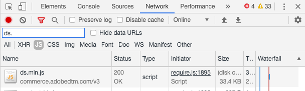
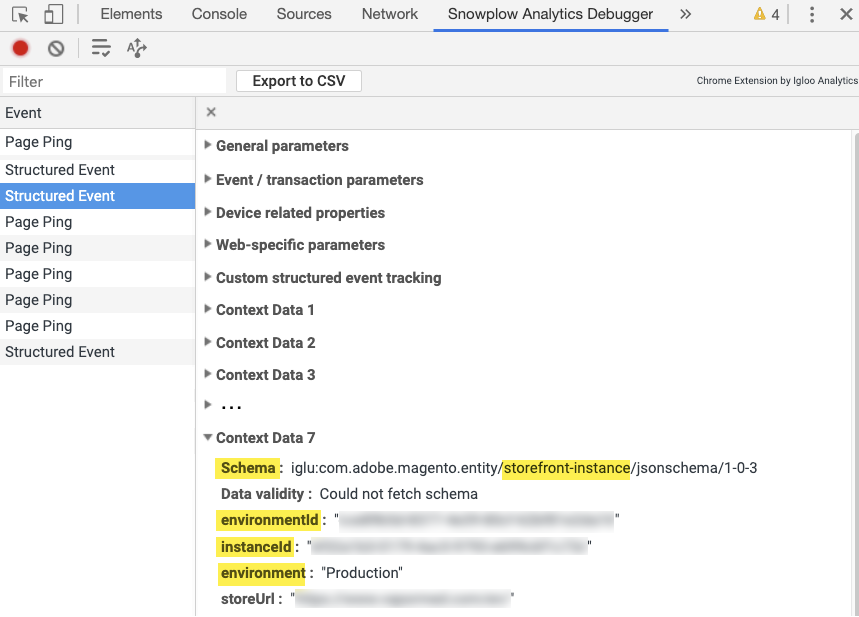

# 驗證事件集合

在 [安裝和配置](install-configure.md) the `magento/product-recommendations` 模組，您可以驗證行為資料是否傳送至Adobe Commerce。 您可以使用Chrome中提供的開發人員工具，或安裝Snowplough Chrome擴充功能。 如果您需要其他幫助，請參閱 [疑難排解 [!DNL Product Recommendations] 模組](https://support.magento.com/hc/en-us/articles/360042224851) 在支援知識庫中。

## 在Chrome中使用開發人員工具進行驗證

若要確保在所有網站頁面上載入事件收集器JS檔案：

1. 在Chrome中，選擇 **自訂和控制Google Chrome** 然後選取 **更多工具** > **開發人員工具**.
1. 選擇 **網路** 標籤，然後選取 **JS** 類型。
1. 篩選 `ds.`
1. 重新載入頁面。
1. 您應該會看到 `ds.js` 或 `ds.min.js` 在 **名稱** 欄。

_事件收集器JS_

若要確保事件在您網站的頁面（首頁、產品、結帳等）上引發：

1. 請務必停用瀏覽器上的任何廣告封鎖程式，並接受網站上的Cookie。
1. 在Chrome中，選擇 **自訂和控制Google Chrome** （瀏覽器右上角的三個垂直點），然後選取 **更多工具** > **開發人員工具**.
1. 選擇 **網路** 標籤和篩選 `tp2`.
1. 重新載入頁面。
1. 您應會在下方看到呼叫 `tp2` 在 **名稱** 欄。

_確認事件正在觸發_

## 使用Snowploogh Chrome擴充功能驗證

安裝 [Chrome專用Snowplough Analytics除錯程式擴充功能](https://chrome.google.com/webstore/detail/snowplow-analytics-debugg/jbnlcgeengmijcghameodeaenefieedm). 此擴充功能會顯示正在收集並傳送至Adobe Commerce的事件。

1. 請務必停用瀏覽器上的任何廣告封鎖程式，並接受網站上的Cookie。

1. 在Chrome中，選擇 **自訂和控制Google Chrome** （瀏覽器右上角的三個垂直點），然後選取 **更多工具** > **開發人員工具**.

1. 選擇 **Snowplough Analytics除錯程式** 標籤。

1. 在 **事件** 欄，選擇 **結構化事件**.

1. 向下捲動，直到您看到 **內容資料 _n_**. 在&#x200B;**結構**.

1. 確認 [SaaS資料空間ID](https://experienceleague.adobe.com/docs/commerce-admin/config/services/saas.html) 已正確設定。

_雪犁過濾器_

>[!NOTE]
>
> 值 `Data validity : NOT FOUND` 在debugger中，表示內部結構。 Snowplough Chrome外掛程式無法使用內部結構來驗證事件。 這對實際功能沒有影響。

## 確認事件正確引發

若要確認用於量度的事件正確引發，請尋找 `impression-render`, `view`，和 `rec-click` Snowplough Analytics偵錯工具中的事件。 請參閱 [事件完整清單](https://experienceleague.adobe.com/docs/commerce-merchant-services/product-recommendations/developer/events.html).

>[!NOTE]
>
> 若 [Cookie限制模式](https://experienceleague.adobe.com/docs/commerce-admin/start/compliance/privacy/compliance-cookie-law.html) 啟用後，Adobe Commerce才會收集行為資料，直到購物者同意為止。 如果停用「Cookie限制模式」，預設會收集行為資料。
