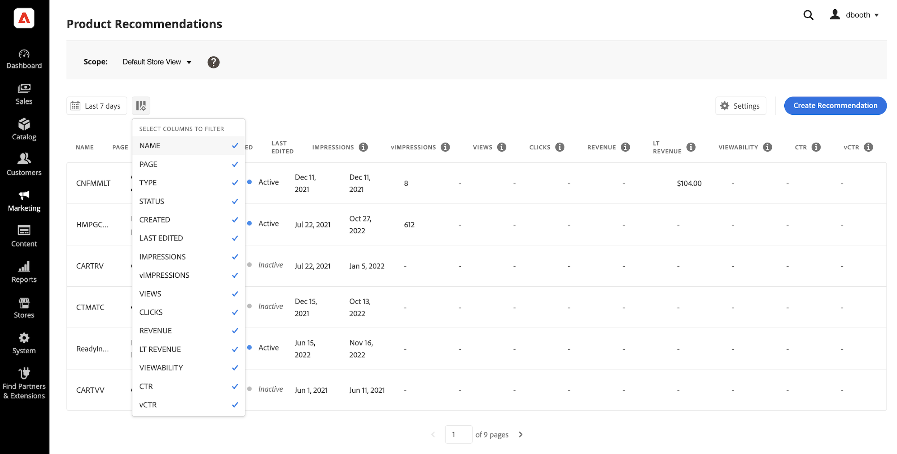

# [!DNL Product Recommendations] 工作區

此 [!DNL Product Recommendations] 工作區會顯示先前設定之建議的清單，以及可幫助您追蹤每個建議是否成功的量度。 清單可設定為計算最後一天、一週或當月的量度。 您可以使用量度，根據檢視或點按建議單位的頻率來建立可行的深入分析，或分析建議的執行成效。

_Recommendations工作區_

## 設定範圍

最初 [範圍](https://experienceleague.adobe.com/docs/commerce-admin/start/setup/websites-stores-views.html) ，則將所有建議設定設為 `Default Store View`. 如果您的Commerce安裝包含多個商店檢視，請設定 **範圍** 至 [存放區檢視](https://experienceleague.adobe.com/docs/commerce-admin/start/setup/websites-stores-views.html#scope-settings) 您的建議適用的位置。

## 設定量度日期範圍

1. 按一下 **行事曆**  控制。

1. 選擇下列其中一項：

   - 過去24小時
   - 過去7天
   - 過去30天

   量度欄中的計算值會變更，以反映目前的日期範圍。

## 顯示/隱藏欄

1. 在左上角，按一下 **顯示/隱藏**  欄。

   可見的欄有藍色勾號。

1. 在功能表中，執行下列任一項作業：

   - 若要顯示隱藏的欄，請按一下任何沒有核取記號的欄名稱。
   - 若要隱藏可見欄，請按一下帶有核取記號的欄名稱。

   表格會重新整理以僅包含所選欄。

   
   _顯示/隱藏欄_

## 設定

這些設定會決定提供建議行為資料的SaaS資料空間。

- 若要變更建議行為資料的來源位置，請選擇不同的SaaS資料空間。

- 若要設定新的SaaS資料空間，請按一下 **編輯設定**. 若要深入瞭解，請參閱 [設定](settings.md).

_Recommendations設定_

## 檢視詳細資料

1. 在表格中，按一下您要檢查的建議。

   
   _首頁轉換率詳細資料_

1. 若要變更建議狀態，請按一下 **啟動** 或 **停用**.

## 編輯建議

在建議詳細資訊頁面中，按一下 **編輯**. 若要進一步瞭解，請前往 [編輯Recommendations](edit.md).

## 建立推薦

在建議詳細資訊頁面中，按一下 **建立**. 若要進一步瞭解，請前往 [建立Recommendations](create.md).

## 工作區控制項

| 控制 | 說明 |
|---|---|
|  | 決定用於量度計算的時間範圍。 選項：24小時/ 7天/ 30天 |
|  | 決定顯示在中的欄 [!DNL Product Recommendations] 表格。 |
| 設定 | 決定擷取建議行為資料的SaaS資料空間，也會啟用視覺相似度建議型別。 |
| 建立建議 | 開啟 [建立新建議](create.md) 頁面。 |

## 欄說明

| 欄 | 說明 |
|---|---|
| 名稱 | 建議的名稱。 |
| 頁面 | 建議出現的頁面。 |
| 型別 | 建議型別。 |
| 狀態 | 建議狀態。 選項：非作用中/作用中/草稿 |
| 已建立 | 建立建議的日期。 |
| 上次編輯時間 | 上次編輯建議的日期。 |
| 曝光數 | 在頁面上載入及轉譯建議單位的次數。 位於瀏覽器檢視區摺疊下方的建議單位會呈現在頁面上，但購物者不會檢視。 在此情況下，演算後的單位會計算為曝光數，但只有在使用者捲動單位進入檢視時，才會計算檢視。 |
| 曝光數 | （可檢視的曝光數）至少註冊一個檢視的建議單位數。 |
| 檢視 | 顯示在購物者瀏覽器檢視區中的建議單位數量。 此事件可在頁面上多次觸發。 |
| 點按次數 | 購物者點按建議單位中專案的次數總和，以及購物者點按 **加入購物車** 建議單位中的按鈕 |
| 收入 | 目前時間範圍之建議所驅動的收入。 |
| Lt收入 | （期限收入）由建議驅動的期限收入。 |
| 可檢視度 | 註冊檢視的建議單位百分比。 |
| Ctr | （點進率）註冊點按之建議的單位曝光次數百分比。 |
| vCtr | （可檢視點進率）註冊點按的建議單位可檢視曝光的百分比。 |
