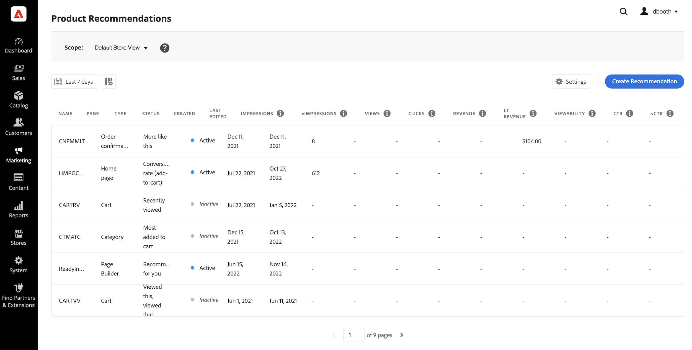

# [!DNL Product Recommendations] 工作區

的 [!DNL Product Recommendations] workspace顯示先前配置的建議的清單，其中包含有助於跟蹤每個建議成功與否的度量。 該清單可配置為計算最後一天、周或月的度量。 您可以使用度量根據建議單元被查看或按一下的頻率建立可操作的洞察力，或分析您的建議執行情況。

_Recommendations工作區_

## 設定範圍

最初 [範圍](https://experienceleague.adobe.com/docs/commerce-admin/start/setup/websites-stores-views.html) 所有建議設定的值 `Default Store View`。 如果您的Commerce安裝包含多個儲存視圖，請設定 **範圍** 到 [商店視圖](https://experienceleague.adobe.com/docs/commerce-admin/start/setup/websites-stores-views.html#scope-settings) 您的建議適用的位置。

## 設定度量日期範圍

1. 按一下 **日曆**  控制項。

1. 選擇以下選項之一：

   - 過去24小時
   - 最後七天
   - 最後三十天

   度量列中的計算值將更改以反映當前日期範圍。

## 顯示/隱藏列

1. 在左上角，按一下 **顯示/隱藏**  的子菜單。

   可見列具有藍色複選標籤。

1. 在菜單中，執行以下任一操作：

   - 要顯示隱藏列，請按一下沒有複選標籤的任何列名。
   - 要隱藏可見列，請按一下帶有複選標籤的任何列名。

   將刷新表，以僅包括選定列。

   
   _顯示/隱藏列_

## 設定

這些設定確定提供建議行為資料的SaaS資料空間。

- 要更改推薦行為資料的發源位置，請選擇不同的SaaS資料空間。

- 要配置新的SaaS資料空間，請按一下 **編輯配置**。 要瞭解更多資訊，請參閱 [設定](settings.md)。

_Recommendations設定_

## 查看詳細資訊

1. 在表中，按一下要檢查的建議案。

   
   _首頁轉換率詳細資訊_

1. 要更改建議的狀態，請按一下 **激活** 或 **停用**。

## 編輯建議

在建議詳細資訊頁面中，按一下 **編輯**。 要瞭解詳細資訊，請轉到 [編輯Recommendations](edit.md)。

## 建立建議

在建議詳細資訊頁面中，按一下 **建立**。 要瞭解詳細資訊，請轉到 [建立Recommendations](create.md)。

## 工作區控制項

| 控制項 | 說明 |
|---|---|
|  | 確定用於度量計算的時間範圍。 選項：24小時/7天/30天 |
|  | 確定在 [!DNL Product Recommendations] 的子菜單。 |
| 設定 | 確定提取建議行為資料的SaaS資料空間，並啟用可視相似性建議類型。 |
| 建立建議 | 開啟 [建立新建議](create.md) 的子菜單。 |

## 列說明

| 列 | 說明 |
|---|---|
| 名稱 | 建議的名稱。 |
| 頁面 | 顯示建議的頁面。 |
| 類型 | 建議類型。 |
| 狀態 | 建議狀態。 選項：非活動/活動/草稿 |
| 已建立 | 建議的建立日期。 |
| 上次編輯時間 | 上次編輯建議的日期。 |
| 印象 | 在頁面上載入和呈現推薦單元的次數。 位於瀏覽器視圖折疊下方的推薦單元在頁面上呈現，但不由購物者查看。 在這種情況下，渲染的單元被計為印象，但僅當用戶將單元滾動到視圖中時才計算視圖。 |
| 印象 | （可查看印象）至少註冊一個視圖的推薦單元數。 |
| 視圖 | 顯示在購物者瀏覽器視區中的推薦單位數。 此事件可在頁面上多次觸發。 |
| 按一下 | 購物者點擊推薦單元中某項的次數和購物者點擊次數的總和 **添加到購物車** 按鈕 |
| 收入 | 受當前時間範圍建議所驅動的收入。 |
| 收入 | (Lifetime Revenue)由建議驅動的Lifetime Revenue。 |
| 可視性 | 為視圖註冊的建議單位的百分比。 |
| CTR | （點擊率）註冊點擊量的建議書的單位印象百分比。 |
| vCtr | （可查看點擊率）註冊點擊的推薦單元的可查看印象百分比。 |
