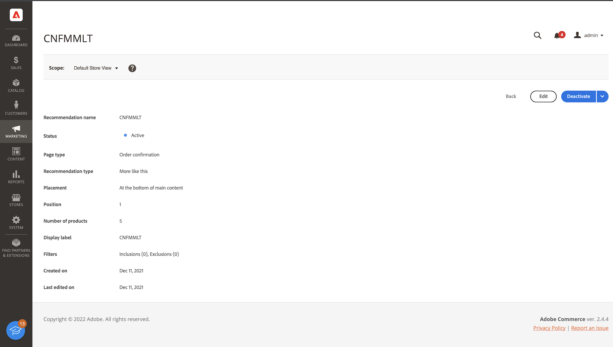

# 工作區

此 [!DNL Product Recommendations] 工作區會顯示先前設定之建議的清單，其中包含可協助您追蹤每個建議成功的量度。 清單可設定為計算最後一天、周或月的量度。 您可以使用量度，根據建議單位被檢視或點按的頻率建立可操作的深入分析，或分析建議的執行成效。

_Recommendations Workspace_

## 設定範圍

最初 [範圍](https://experienceleague.adobe.com/docs/commerce-admin/start/setup/websites-stores-views.html) 設為 `Default Store View`. 如果您的商務安裝包含多個商店檢視，請設定 **範圍** 到 [商店檢視](https://experienceleague.adobe.com/docs/commerce-admin/start/setup/websites-stores-views.html#scope-settings) 建議的位置。

## 設定量度日期範圍

1. 按一下 **日曆**  控制。

1. 選擇以下選項之一：

   - 過去24小時
   - 最近7天
   - 最近30天

   量度欄中的計算值會隨之變更，以反映目前的日期範圍。

## 顯示/隱藏列

1. 在左上角，按一下 **顯示/隱藏**  欄。

   可見列有藍色複選標籤。

1. 在功能表中，執行下列任一操作：

   - 要顯示隱藏列，請按一下任何列名稱，但不帶複選標籤。
   - 要隱藏可見列，請按一下帶有複選標籤的任何列名。

   系統會重新整理表格，僅包含選取的欄。

   
   _顯示/隱藏列_

## 設定

這些設定決定了提供建議行為資料的SaaS資料空間。

- 若要變更建議行為資料的來源，請選擇不同的SaaS資料空間。

- 要配置新的SaaS資料空間，請按一下 **編輯配置**. 若要進一步了解，請參閱 [設定](settings.md).

_Recommendations設定_

## 查看詳細資訊

1. 在表格中，按一下您要檢查的建議。

   
   _首頁轉換率詳細資料_

1. 若要變更建議的狀態，請按一下 **啟動** 或 **停用**.

## 編輯建議

從建議詳細資訊頁面，按一下 **編輯**. 若要進一步了解，請前往 [編輯Recommendations](edit.md).

## 建立建議

從建議詳細資訊頁面，按一下 **建立**. 若要進一步了解，請前往 [建立Recommendations](create.md).

## 工作區控制項

| 控制 | 說明 |
|---|---|
|  | 決定用於量度計算的時間範圍。 選項：24小時/7天/30天 |
|  | 決定 [!DNL Product Recommendations] 表格。 |
| 設定 | 確定SaaS資料空間，在其中提取建議 — 行為資料，並啟用可視相似性建議類型。 |
| 建立建議 | 開啟 [建立新建議](create.md) 頁面。 |

## 欄說明

| 欄 | 說明 |
|---|---|
| 名稱 | 建議的名稱。 |
| 頁面 | 顯示建議的頁面。 |
| 類型 | 建議類型。 |
| 狀態 | 建議狀態。 選項：非活動/活動/草稿 |
| 已建立 | 建立建議的日期。 |
| 上次編輯 | 上次編輯建議的日期。 |
| 曝光數 | 在頁面上載入和呈現建議單位的次數。 位於瀏覽器檢視區折下方的建議單位會在頁面上呈現，但不會由購物者檢視。 在此情況下，呈現的單位會計為曝光，但只有當使用者捲動該單位以檢視時，才會計為檢視。 |
| vImpressions | （可檢視曝光次數）至少註冊一個檢視的建議單位數。 |
| 檢視 | 顯示在購物者瀏覽器檢視區中的建議單位數。 此事件可在頁面上引發多次。 |
| 點按次數 | 購物者點按建議單位中項目的次數與購物者點按次數的總和 **新增至購物車** 建議單元中的按鈕 |
| 收入 | 由目前時間範圍的建議所驅動的收入。 |
| 收入 | （期限收入）由建議驅動的期限收入。 |
| 可檢視性 | 註冊檢視的建議單位百分比。 |
| Ctr | （點進率）註冊點按之建議的單位曝光百分比。 |
| vCtr | （可檢視點進率）註冊點按之建議單位的可檢視曝光次數百分比。 |
