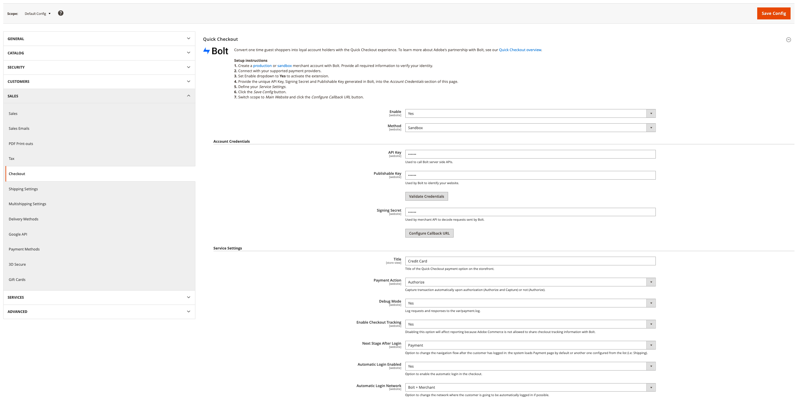

# [!DNL Quick Checkout] 設定

[!DNL Quick Checkout] 針對Adobe Commerce和Magento Open Source提供設定檢視，以及設定擴充功能所需的所有資訊。

若要存取這些組態設定：

1. 在 _管理_ 邊欄，轉到 **商店** > _設定_ > **設定**.
1. 在左側面板中，展開 **銷售** 選取 **結帳**.

   

請參閱 [入門](../quick-checkout/onboarding.md) 主題，以了解如何設定 [!DNL Quick Checkout] Adobe Commerce。

## 啟用擴充功能

| 欄位 | 範圍 | 說明 |
|---|---|---|
| [!UICONTROL Enable] | 網站 | 啟用或禁用 [!DNL Quick Checkout] 的URL。 選項： [!UICONTROL Yes] / [!UICONTROL No] |
| [!UICONTROL Method] | 網站 | 為 [!DNL Quick Checkout]. 選項： [!UICONTROL Sandbox] / [!UICONTROL Production] |

{style=&quot;table-layout:auto&quot;}

## 帳戶憑證

| 欄位 | 範圍 | 說明 |
|---|---|---|
| [!UICONTROL API key] | 網站 | 後端用來與互動的私密金鑰 [!DNL Bolt] API。 |
| [!UICONTROL Publishable key] | 網站 | 前端用來與 [!DNL Bolt] API。 |
| [!UICONTROL Signing secret] | 網站 | 用於對從接收到的請求進行簽名驗證 [!DNL Bolt]. |

{style=&quot;table-layout:auto&quot;}

## 服務設定

| 欄位 | 範圍 | 說明 |
|---|---|---|
| [!UICONTROL Title] | 商店檢視 | 在結帳期間，在「付款方法」視圖中添加要顯示為此付款選項標題的文本。 選項： [!UICONTROL text field] |
| [!UICONTROL Payment Action] | 網站 | 此 [付款動作](https://docs.magento.com/user-guide/configuration/sales/payment-methods.html#payment-actions){target="_blank"} 指定的付款方法。 選項： [!UICONTROL Authorize] / [!UICONTROL Authorize and Capture] |
| [!UICONTROL Debug Mode] | 網站 | 啟用或停用除錯模式。 選項： [!UICONTROL Yes] / [!UICONTROL No] |
| [!UICONTROL Enable checkout tracking] | 網站 | 定義Adobe Commerce是否允許與Bolt共用結帳追蹤資訊。 預設為啟用。 如果停用，則會影響報表。 選項： [!UICONTROL Yes] / [!UICONTROL No] |
| [!UICONTROL Next Stage After Login Mode] | 網站 | 變更客戶登入後的導覽流程。 選項： [!UICONTROL Payment] / [!UICONTROL Shipping] |
| [!UICONTROL Automatic Login Enabled] | 網站 | 定義 [!DNL Quick Checkout] 允許在結帳期間自動登入。 預設為啟用。 選項： [!UICONTROL Yes] / [!UICONTROL No] |
| [!UICONTROL Automatic Login Network] | 網站 | 選取客戶自動登入的網路。 預設啟用Bolt。 選項： [!UICONTROL Bolt + Merchant] / [!UICONTROL Bolt] |

{style=&quot;table-layout:auto&quot;}
